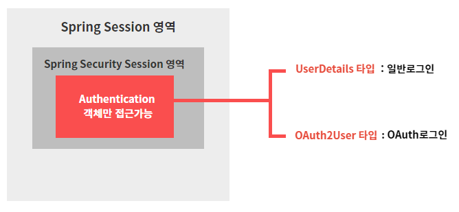

# 8강. Authentication객체가 가질 수 있는 2가지 타입
## 8-1. 7강 내용 정리
```java
// PrincipalOauth2UserService.class

@Service
public class PrincipalOauth2UserService extends DefaultOAuth2UserService{
	
	// 구글로부터 받은 userRequest 데이터에 대한 후처리가 되는 함수
	@Override
	public OAuth2User loadUser(OAuth2UserRequest userRequest) throws OAuth2AuthenticationException {
		System.out.println("getClientRegistration : " + userRequest.getClientRegistration()); 
		System.out.println("getAccessTokenValue : " + userRequest.getAccessToken().getTokenValue());
		System.out.println("getAttributes : " + super.loadUser(userRequest).getAttributes());
		
        // 추가해두기
		OAuth2User oauth2User = super.loadUser(userRequest);
		
		return super.loadUser(userRequest);
	}
}
```
- OAuth로그인 진행과정
    1. 구글로그인 버튼클릭
    2. 구글로그인창 생성
    3. 구글로그인 완료
    4. code를 리턴(OAuth-client라이브러리 이용)
    5. AccessToken 요청
    6. AccessToken 받음 <U>**: 여기까지가 userRequest정보에 해당함**</U>
    7. userRequest정보는 어떻게 사용해야하나 ? (로그인 후처리)
    8. DefaultOAuth2UserService의 loadUser() 함수를 호출
    9. (8)에 함수에다 userRequest정보를 넘겨서 구글로부터 회원프로필을 받아옴 : <U>**이것이 loadUser()함수의 역할 !**</U>

## 8-2. 일반로그인 vs OAuth로그인 비교 테스트
- ## 8-2-1. IndexController에 메소드 추가 : testLogin()
    ```java
    @GetMapping("/test/login")
	public @ResponseBody String testLogin(
			Authentication authentication, 
			@AuthenticationPrincipal UserDetails userDetails) { 
		System.out.println("============ /test/login ============");
		PrincipalDetails principalDetails = (PrincipalDetails) authentication.getPrincipal(); // 다운캐스팅
		System.out.println("authentication : " + principalDetails.getUser());
		
		System.out.println("userDetails : " + userDetails.getUsername());
		
		return "세션 정보 확인하기";
	}
    ```
    - ### testLogin()
        - **일반로그인**시 사용되는 메소드
        - 
            ```java
            파라미터 : Authentication authentication // DI(의존성주입)

            PrincipalDetails principalDetails = (PrincipalDetails) authentication.getPrincipal(); 
		    System.out.println("authentication : " + principalDetails.getUser());
            ```            
            - authentication.getPrincipal() 리턴타입이 Object이므로 앞서 만들어두었던 PrincipalDetails클래스로 형변환(다운캐스팅)을 해준다.
            - 형변환이 가능한 이유는 authentication안에 들어갈 수 있는건 UserDetails타입이라는 것을 앞서 배웠었다. 그렇기에 UserDetails를 상속받고 있는 PrincipalDetails로 형변환이 가능한 것!
            - 다운캐스팅한 authentication.getPrncipal() 정보를 principalDetails변수에 담아, .getUser()로 찍어본다.
            - 이때 .getUser()는 PrincipalDetails클래스를 생성할때 필드로 넣어뒀던 private User user; 의 getter 메소드임.
            - **정리**
                - 파라미터로 받는 Authentication객체 안에 principal을 조회하고자 한다.
                - authentication.getPrincipal()의 리턴타입은 Object이므로 PrincipalDetails로 다운캐스팅을 해준다.
                - 다운캐스팅한 principal정보를 .getUser()를 통해 조회한다.
        - 
            ```java
            파라미터 : @AuthenticationPrincipal UserDetails userDetails

            System.out.println("userDetails : " + userDetails.getUsername());
            ```
            - @AuthenticationPrincipal 어노테이션을 이용하면 세션정보에 접근할 수 있다.
            - @AuthenticationPrincipal는 UserDetails타입을 갖고 있음. 이때 우리는 UserDetails타입을 상속받은 PrincipalDetails가 있으므로, UserDetails를 PrincipalDetails로 대체 가능 !
            - UserDetails를 PrincipalDetails로 대체하면, userDetails.getUsername()이 아니라 userDetails.getUser()가 가능함 !
            - 
                ```java
                @GetMapping("/test/login")
                public @ResponseBody String testLogin(
                        Authentication authentication, 
                        @AuthenticationPrincipal PrincipalDetails userDetails) { // UserDetails를 PrincipalDetails로 변경
                    ···
                    System.out.println("userDetails : " + userDetails.getUser()); // getUsername()이 아니라 getUser()가 가능해짐!
                }
                ```
        - ※정리※
            - <U>일반사용자 로그인시,</U> 로그인한 사용자의 정보를 확인하는 방법 2가지
            - (1) Authentication객체를 Dependency Injection한뒤, PrincipalDetails로 다운캐스팅하여 User Object를 조회할 수 있다.
            - (2) @AuthenticationPrincipal 어노테이션을 통해서 User Object를 조회할 수 있다.
        - 최종코드
            ```java
            @GetMapping("/test/login")
            public @ResponseBody String testLogin(
                    Authentication authentication, // DI (의존성주입)
                    @AuthenticationPrincipal PrincipalDetails userDetails) { 
                System.out.println("============ /test/login ============");
                // 방법 1.
                PrincipalDetails principalDetails = (PrincipalDetails) authentication.getPrincipal(); // 다운캐스팅
                System.out.println("authentication : " + principalDetails.getUser());
                
                // 방법 2.
                System.out.println("userDetails : " + userDetails.getUser());
                
                return "세션 정보 확인하기";
            }
            ```
            ```bash
            ============ /test/login ============
            authentication : User(id=1, username=ssar, password=$2a$10$lV/vBJlBevj/foDZNy3peeCXmSAGUmSIKqyA.oxx7jBABaQiz5N.m, email=test@abc.com, role=ROLE_USER, provider=null, providerId=null, createDate=2023-07-14 16:26:21.551)
            userDetails : User(id=1, username=ssar, password=$2a$10$lV/vBJlBevj/foDZNy3peeCXmSAGUmSIKqyA.oxx7jBABaQiz5N.m, email=test@abc.com, role=ROLE_USER, provider=null, providerId=null, createDate=2023-07-14 16:26:21.551)
            ```
            - 방법1을 사용하든, 방법2를 사용하든 똑같은 유저Object를 가져오는 것을 확인할 수 있다.
        - 그렇다면, <U>구글로그인</U>을 한 후에 localhost:8080/test/login으로 접근해보자.

            
        
            ```
            [에러로그]
            java.lang.ClassCastException: org.springframework.security.oauth2.core.user.DefaultOAuth2User cannot be cast to test.security.config.auth.PrincipalDetails
            ```
            - 에러로그를 확인해보면 OAuth로그인시에는 UserDetails타입(PrincipalDetails타입)으로 캐스팅이 불가능하다고 뜬다.
            - 그렇다면, OAuth로그인시 해당 로그인 유저정보를 조회할 메소드를 하나 더 만들어주자.
- ## 8-2-2. IndexController에 메소드 추가 : testOAuthLogin()
    ```java
    @GetMapping("/test/oauth/login")
    public @ResponseBody String testOAuthLogin(
            Authentication authentication,
            @AuthenticationPrincipal OAuth2User oauth) {
        System.out.println("============ /test/oauth/login ============");
        // 방법 1.
        OAuth2User oauth2User = (OAuth2User) authentication.getPrincipal(); 
        System.out.println("authentication : " + oauth2User.getAttributes());

        // 방법 2.
        System.out.println("oauth2User : " + oauth.getAttributes());
        
        return "OAuth 세션 정보 확인하기";
    }
    ```
    - ### testOAuthLogin()
        - **oauth로그인**시 사용되는 메소드
        - 
            ```java
            파라미터 : Authentication authentication // DI (의존성주입)

            OAuth2User oauth2User = (OAuth2User) authentication.getPrincipal(); 
            System.out.println("authentication : " + oauth2User.getAttributes());
            ```
            - Oauth로그인시에 authentication이 UserDetails타입(principalDetails타입)으로 캐스팅이 불가능했으므로, OAuth2User타입으로 다운캐스팅 해준다.
            - 다운캐스팅한 principal정보를 .getAttributes()로 꺼내어 조회한다.
        - 
            ```java
            파라미터 : @AuthenticationPrincipal OAuth2User oauth

            System.out.println("oauth2User : " + oauth.getAttributes());
            ```
            - @AuthenticationPrincipal 어노테이션을 이용해서 OAuth2User타입으로 세션정보를 받아온다.
            - 받아온 세션정보를 .getAttributes()로 꺼내어 조회한다.
        - ※정리※
            - <U>Oauth로그인시,</U> 로그인한 사용자의 정보를 확인하는 방법 2가지
            - (1) Authentication객체를 Dependency Injection한뒤, OAuth2User로 다운캐스팅하여 User Object를 조회할 수 있다.
            - (2) @AuthenticationPrincipal 어노테이션을 통해서 User Object를 조회할 수 있다.
            - 
                ```bash
                ============ /test/oauth/login ============
                authentication : {sub=109696850338476008763, name=Eun Ji Kim, given_name=Eun Ji, family_name=Kim, picture=https://lh3.googleusercontent.com/a/AAcHTtfbjzXXvWBeUAKeNktxrPmH4OO1ySfz4obudeY3Y2YI=s96-c, email=rladmswl1707@gmail.com, email_verified=true, locale=ko}
                oauth2User : {sub=109696850338476008763, name=Eun Ji Kim, given_name=Eun Ji, family_name=Kim, picture=https://lh3.googleusercontent.com/a/AAcHTtfbjzXXvWBeUAKeNktxrPmH4OO1ySfz4obudeY3Y2YI=s96-c, email=rladmswl1707@gmail.com, email_verified=true, locale=ko}
                ```
                어떤 방법을 사용하든 똑같은 유저Object를 가져오는 것을 확인할 수 있다.
- ### 8-2-3. testLogin() vs testOauthLogin()
    - 최종코드
        ```java
        @GetMapping("/test/login")
        public @ResponseBody String testLogin(
                Authentication authentication, // DI (의존성주입)
                @AuthenticationPrincipal PrincipalDetails userDetails) { 
            System.out.println("============ /test/login ============");
            // 방법1.
            PrincipalDetails principalDetails = (PrincipalDetails) authentication.getPrincipal(); // 다운캐스팅
            System.out.println("authentication : " + principalDetails.getUser());
            
            // 방법2.
            System.out.println("userDetails : " + userDetails.getUser());
            
            return "세션 정보 확인하기";
        }
        
        @GetMapping("/test/oauth/login")
        public @ResponseBody String testOAuthLogin(
                Authentication authentication, // DI (의존성주입)
                @AuthenticationPrincipal OAuth2User oauth) {
            System.out.println("============ /test/oauth/login ============");
            // 방법1.
            OAuth2User oauth2User = (OAuth2User) authentication.getPrincipal(); // 다운캐스팅
            System.out.println("authentication : " + oauth2User.getAttributes());
            
            // 방법2.
            System.out.println("oauth2User : " + oauth.getAttributes());
            
            return "OAuth 세션 정보 확인하기";
        }
        ```
    - 비교하기
        - testLogin()은 Authentication을 받아서(DI) UserDetails(PrincipalDetails)로 다운캐스팅 해주었고,
            - → Authentication객체에 UserDetails타입이 들어갈 수 있다
        - testOAuthLogin()은 Authentication을 받아서(DI) OAuth2User로 다운캐스팅 해주었다.
            - → Authentication객체에 OAuth2User타입이 들어갈 수 있다
    - 결론
        - Authentication객체에는 UserDetails타입과 OAuth2User타입 모두가 들어갈 수 있다.
        
        
        
        1. 서버가 갖고 있는 세션 영역 내에서, 스프링 시큐리티는 자신만의 세션을 따로 갖고 있다.
        2. 시큐리티가 관리하는 세션 안에 들어갈 수 있는 타입은 Authentication객체밖에 없다.
            - 시큐리티 세션안에 Authentication객체가 들어온 순간이 바로 로그인이 완료된 것 !
            - 로그인과 동시에 세션안에 Authentication객체가 들어갔으니(스프링 컨테이너가 Authentication을 관리하기 시작), 로그인한 사용자가 "/test/login" 또는 "/test/oauth/login" 요청을 하면, 방금 우리가 컨트롤러에 작성해둔 것처럼 Authentication을 DI할 수 있었던 것 !
        3. Authentication 객체 안에 들어갈 수 있는 2개의 타입
            - UserDetails 타입 : 일반적인 로그인을 할때 만들어짐
            - OAuth2User 타입 : OAuth로그인(소셜로그인)을 할때 만들어짐
- ### 8-2-4. PrincipalDetails 수정
    - 일반적인 로그인을 했을때는 <U>@AuthenticationPrincipal PrincipalDetails userDetails</U> 이 필요하고, OAuth로그인을 했을때는 <U>@AuthenticationPrincipal OAuth2User oauth</U>가 필요한 상황. 
    - 메소드를 각 로그인 상황에 맞게 2개씩 만들기에는 번거롭고... 어떻게 해결할까?
    - Authentication 안에 들어갈 수 있는 UserDetails와 OAuth2User 모두를 상속받는 클래스를 만들어서, 해당 클래스 객체를 Authentication에 넣어주면 됨 !
        - 우리는 이미 UserDetails를 상속받는 PrincipalDetails클래스가 있으므로 이것을 활용 !
        - 이때 Authentication안에 PrincipalDetails클래스 객체를 넣어주는 건, PrincipalDetailsService클래스의 loadUserByUsername() 함수가 호출될때 자동으로 진행되니까 신경 쓸필요 없음.(section0의 4-3-3 참고)
        - PrincipalDetails 클래스를 아래 코드와 같이 수정한다.
        ```java
        @Data
        public class PrincipalDetails implements UserDetails, OAuth2User{ //OAuth2User 추가 
            ···
            // OAuth2User 인터페이스 메소드 재정의
            @Override
            public Map<String, Object> getAttributes() {
                return null;
            }

            @Override
            public String getName() {
                return null;
            }
        }
        ```
        - OAuth2User를 함께 implements해주고
        - OAuth2User인터페이스의 메소드들을 override해준다.
        - <U>**이제 일반로그인이든 OAuth로그인이든 PrincipalDetails타입으로 묶어서 받을 수 있음.**</U>
        
        