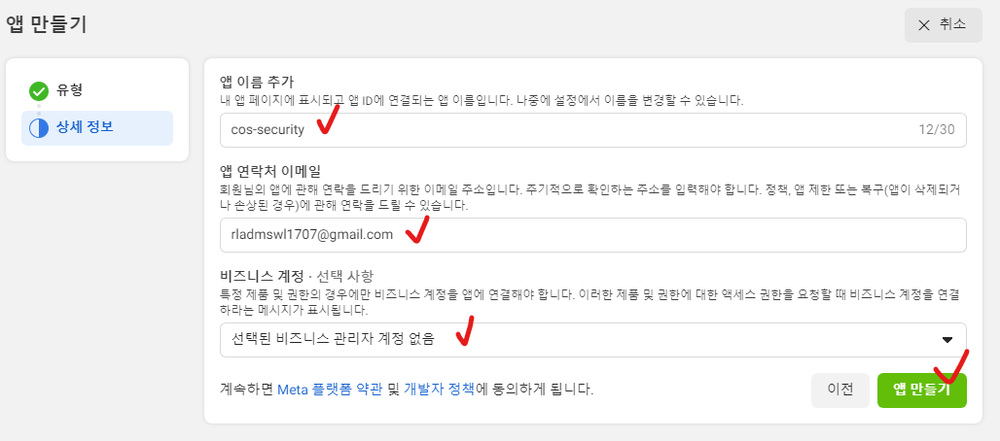
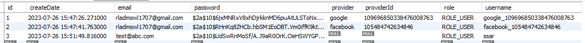

# 10강. 페이스북 로그인 완료
## 10-1. 페이스북 API 콘솔에 접속 (https://developers.facebook.com/?locale=ko_KR)

## 10-2. 새 앱 추가하기
### 10-2-1. 앱 만들기 선택


### 10-2-2. 앱에 필요한 기능 및 유형 선택


### 10-2-3. 상세정보 입력



### 10-2-4. 앱에 제품 추가 : Facebook 로그인 선택


### 10-2-5. Facebook 로그인 설정


### 10-2-6. 생성한 앱 정보 확인


## 10-3. 프로젝트에 페이스북 로그인 설정 추가
### 10-3-1. application.yml 추가
-   
    ```yml
    facebook:
        client-id: (10-2-6. 앱ID)
        client-secret: (10-2-6. 앱 시크릿 코드)
        scope:
        - email
        - public_profile (구글과 달리 profile은 이렇게 적어야함)
    ```
    - scope 명은 facebook에서 제공하는 [개발자 문서](https://developers.facebook.com/docs/facebook-login/web)를 참고하여 동일하게 작성해준다.

        

## 10-4. 페이스북 로그인시 userRequest와 oauth2User.getAttributes 확인
### 10-4-1. PrincipalOauth2UserService.class의 loadUser() 함수
```java
@Override
public OAuth2User loadUser(OAuth2UserRequest userRequest) throws OAuth2AuthenticationException {
    System.out.println("getClientRegistration : " + userRequest.getClientRegistration()); // 확인할 부분
    System.out.println("getAccessTokenValue : " + userRequest.getAccessToken().getTokenValue()); // 확인할 부분
    
    OAuth2User oauth2User = super.loadUser(userRequest);
    System.out.println("getAttributes : " + oauth2User.getAttributes()); // 확인할 부분
    
    String provider = userRequest.getClientRegistration().getRegistrationId();
    String providerId = oauth2User.getAttribute("sub");
    String username = provider+"_"+providerId;
    String password = bCryptPasswordEncoder.encode("겟인데어");
    String email = oauth2User.getAttribute("email");
    String role = "ROLE_USER";
    
    User userEntity = userRepsoitory.findByUsername(username);
    if(userEntity == null) {
        System.out.println("구글 로그인이 최초입니다.");
        userEntity = User.builder()
                            .username(username)
                            .password(password)
                            .email(email)
                            .role(role)
                            .provider(provider)
                            .providerId(providerId)
                            .build();
        userRepsoitory.save(userEntity);
    }else {
        System.out.println("구글 로그인을 이미 한 적이 있습니다. 당신은 자동회원가입이 되어 있습니다.");
    }
    
    return new PrincipalDetails(userEntity, oauth2User.getAttributes());
}
```

### 10-4-2. loginForm.html에 페이스북 로그인 추가
```html
<body>
    <h1>로그인 페이지</h1>
    <hr/>
    <form action="/login" method="POST">
        <input type="text" name="username" placeholder="Username" /><br />
        <input type="password" name="password" placeholder="Password" /><br /> 
        <button>로그인</button>
    </form>
    <a href="/oauth2/authorization/google">구글 로그인</a>
    <a href="/oauth2/authorization/facebook">페이스북 로그인</a> <!-- 추가해주기 -->
    <a href="/joinForm">회원가입을 아직 하지 않으셨나요??</a>
</body>
```
- "/oauth2/authorization/facebook"
    - oauth2-client 라이브러리 이용시 /oauth2/authorization/[google | facebook 등] 으로 링크 고정

### 10-4-3. localhost:8080/loginForm 에서 페이스북 로그인 선택
    


### 10-4-4. 로그인 결과 확인
```
getClientRegistration : ClientRegistration{registrationId='facebook', clientId='1013750139814423', clientSecret='bff7c8d11e48fe27160b054e9cb7df2d', clientAuthenticationMethod=org.springframework.security.oauth2.core.ClientAuthenticationMethod@86baaa5b, authorizationGrantType=org.springframework.security.oauth2.core.AuthorizationGrantType@5da5e9f3, redirectUri='{baseUrl}/{action}/oauth2/code/{registrationId}', scopes=[email, public_profile], providerDetails=org.springframework.security.oauth2.client.registration.ClientRegistration$ProviderDetails@538f8512, clientName='Facebook'}
getAccessTokenValue : EAAOaABj5ghcBOZBBndXGZCZA4EoWb2Wz4TNCi3JZBSHWzH1vdZA1YsTyhX9o1gbRYjuwgZBnHRwGDYYbx6LgJZAjeYz2xUfZB2vZCmxLSlfC4JPnMuaHGPQvZAYzSVLMFeZACBTccWWW6EAaZAujbx5Jd47grKQVRSUIAGZCkTv8GzRNZAWpCbfZBYzU7mAnxVSBb5prhITOMWlrmTRL7Ni63RQLh6xvVA6XZAGqO92eGDfUaP0AZAFtl8dvn4VrnEbDI8iBV
getAttributes : {id=105484742634846, name=김은지, email=rladmswl1707@gmail.com}
Hibernate: select user0_.id as id1_0_, user0_.createDate as createda2_0_, user0_.email as email3_0_, user0_.password as password4_0_, user0_.provider as provider5_0_, user0_.providerId as provider6_0_, user0_.role as role7_0_, user0_.username as username8_0_ from User user0_ where user0_.username=?
구글 로그인이 최초입니다.
Hibernate: insert into User (createDate, email, password, provider, providerId, role, username) values (?, ?, ?, ?, ?, ?, ?)
``` 
- 페이스북 로그인시 출력결과를 확인해보면
    1. getClientRegistration : facebook
    2. getAccessTokenValue : 토큰정보
    3. getAttributes : id, name, email 정보
- 이렇게 위의 3가지 정보가 출력된다. 또한,
    ```sql
    select user0_.id as id1_0_, user0_.createDate as createda2_0_, user0_.email as email3_0_, user0_.password as password4_0_, user0_.provider as provider5_0_, user0_.providerId as provider6_0_, user0_.role as role7_0_, user0_.username as username8_0_ from User user0_ where user0_.username=?
    ```
    위 쿼리문을 통해 OAuth로그인한 사용자가 최초인지 아닌지 유무를 판단하고,   
    현재 페이스북 로그인은 최초이므로
    ```
    구글 로그인이 최초입니다.
    ```
    라는 문장이 출력된다.   
    작성해둔 loadUser()함수는 최초 로그인시 자동회원가입이 되도록 구성해두었으므로,
    ```sql
    insert into User (createDate, email, password, provider, providerId, role, username) values (?, ?, ?, ?, ?, ?, ?)
    ```
    insert쿼리를 날려서 해당 사용자 정보를 DB에 저장한다.
- 그렇다면, DB에 저장된 사용자정보를 확인해보자.
        
    
    
    확인해보면 providerId와 username에 null값이 포함되어있다. 그 이유는,
    ```java
    // 자바코드
    String provider = userRequest.getClientRegistration().getRegistrationId(); // facebook 
    String providerId = oauth2User.getAttribute("sub"); // 이 부분 주목 !
    
    String username = provider+"_"+providerId;
    ```
    ```java
    // 페이스북 제공 사용자 프로필정보
    getAttributes : {id=105484742634846, name=김은지, email=rladmswl1707@gmail.com}
    ```
    에서 알 수 있듯이, 페이스북에는 sub이라는 key값이 없으므로 null값이 들어간 것이다. 페이스북에는 sub가 아니라 id라는 key명을 사용해주어야 한다.
    
    ### ※ 결론적으로, 페이스북 로그인은 정상작동하지만 로그인 제공사가 변경될 때마다 속성 key값이 달라지므로 유지보수 측면에서 좋지 않은 코드이다. → 즉, 리팩토링이 필요하다 ! ※

## 10-5. PrincipalOauth2UserService 코드 리팩토링
### 10-5-1. OAuth2USerInfo 인터페이스 및 구현체 생성


1. config/oauth 밑에 provider패키지 생성
2. OAuth2UserInfo 인터페이스 생성
    ```java
    public interface OAuth2UserInfo {
	
        String getProviderId(); // google의 pk, facebook의 pk, ...
        String getProvider(); // google, facebook, ...
        String getEmail();
        String getName();

    }
    ```
3. GoogleUserInfo 구현체 생성
    ```java
    public class GoogleUserInfo implements OAuth2UserInfo {
	
        private Map<String, Object> attributes; // oauth2User.getAttributes()
        
        public GoogleUserInfo(Map<String, Object> attributes) {
            this.attributes = attributes;
        }

        @Override
        public String getProviderId() {
            return (String)attributes.get("sub");
        }

        @Override
        public String getProvider() {
            return "google";
        }

        @Override
        public String getEmail() {
            return (String)attributes.get("email");
        }

        @Override
        public String getName() {
            return (String)attributes.get("name");
        }

    }
    ```
4. FacebookUserInfo 구현체 생성
    ```java
    public class FacebookUserInfo implements OAuth2UserInfo {
	
        private Map<String, Object> attributes; //oauth2User.getAttributes()
        
        public FacebookUserInfo(Map<String, Object> attributes) {
            this.attributes = attributes;
        }
        
        @Override
        public String getProviderId() {
            return (String)attributes.get("id");
        }

        @Override
        public String getProvider() {
            return "facebook";
        }

        @Override
        public String getEmail() {
            return (String)attributes.get("email");
        }

        @Override
        public String getName() {
            return (String)attributes.get("name");
        }

    }
    ```

### 10-5-2. PrincipalOauth2UserService 리팩토링
1. PrincipalOauth2UserService의 loadUser()함수 리팩토링
    ```java
    @Override
	public OAuth2User loadUser(OAuth2UserRequest userRequest) throws OAuth2AuthenticationException {
		System.out.println("getClientRegistration : " + userRequest.getClientRegistration());
		System.out.println("getAccessTokenValue : " + userRequest.getAccessToken().getTokenValue());
		
		OAuth2User oauth2User = super.loadUser(userRequest);
		System.out.println("getAttributes : " + oauth2User.getAttributes());
		
        /** <추가하기> **/
		Map<String, Object> attributes = oauth2User.getAttributes();
		String registrationId = userRequest.getClientRegistration().getRegistrationId();
		OAuth2UserInfo oAuth2UserInfo = null;
		
		if(registrationId.equals("google")) {
			System.out.println("구글 로그인 요청");
			oAuth2UserInfo = new GoogleUserInfo(attributes);
		} 
		else if(registrationId.equals("facebook")) {
			System.out.println("페이스북 로그인 요청");
			oAuth2UserInfo = new FacebookUserInfo(attributes);
		} 
		else {
			System.out.println("우리는 구글과 페이스북 로그인만 지원합니다.");
		}
        /** </추가하기> **/
		
        /** <수정하기> **/
		String provider = oAuth2UserInfo.getProvider();
		String providerId = oAuth2UserInfo.getProviderId();
		String username = provider+"_"+providerId;
		String password = bCryptPasswordEncoder.encode("겟인데어");
		String email = oAuth2UserInfo.getEmail();
		String role = "ROLE_USER";
        /** </수정하기> **/
		
		User userEntity = userRepsoitory.findByUsername(username);
		if(userEntity == null) {
			System.out.println("OAuth로그인이 최초입니다.");
			userEntity = User.builder()
								.username(username)
								.password(password)
								.email(email)
								.role(role)
								.provider(provider)
								.providerId(providerId)
								.build();
			userRepsoitory.save(userEntity);
		}else {
			System.out.println("OAuth로그인을 이미 한 적이 있습니다. 당신은 자동회원가입이 되어 있습니다.");
		}
		
		return new PrincipalDetails(userEntity, oauth2User.getAttributes());
	}
    ```

### 10-5-3. 결과조회
1. localhost:8080/logoinForm → 구글 로그인 실행
2. localhost:8080/logoinForm → 페이스북 로그인 실행
3. localhost:8080/logoinForm → 일반 회원가입 진행
3. DB 확인
    
    - OAuth회원가입 유저의 경우 provider 컬럼을 통해 어떤 제공사를 이용했는지를 구분할 수 있다.
    - 일반 회원가입 유저의 경우 provider가 비워진채로 저장된다.
