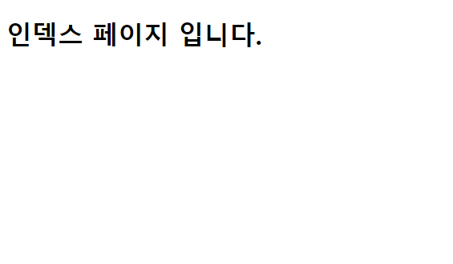

# 11강. 네이버 로그인 완료
## 11-1. OAuth2-Client Provider로 NAVER등록하기
### 11-1-1. 서론
- 우리가 사용중인 OAuth2-Client 라이브러리는 전세계적으로 사용되는 범용 포털사이트에 대해서만 provider(기본 제공사)로 지정하고 있다.
    - 각 나라에서 사용되는 모든 포털사이트를 전부 제공해주자니, 지원해줘야 할 attribute 속성 값이 너무 다양하기 때문에 이는 현실적으로 불가능.
- OAuth2-Client 라이브러리가 제공하는 Provider(제공사)는 다음과 같다.
    - Google
    - FaceBook
    - Twitter
    - 등 ···
- 11강에서 구현하려는 네이버 로그인을 위해서는 우선 NAVER를 OAuth2-Client라이브러리에 제공사로 등록해주어야 한다.

### 11-1-2. application.yml 추가
- security-oauth2-client-registration 하위에 naver설정을 추가한다.
    ```
    naver:
        client-id: (아직모름)
        client-secret: (아직모름)
        scope:
        - name
        - email
        client-name: Naver
        authorization-grant-type: authorization_code
        redirect-uri: http://localhost:8080/login/oauth2/code/naver
    ```
    - NAVER는 기본제공사가 아니므로, 앞서 google과 facebook 설정시와는 작성내용이 조금 다르다.
        - scope : 네이버 개발자 API 문서에 안내된 이름 그대로 사용
        - authorization-grant-type : 인증을 허가 받는 유형. 우리는 Authorization Code 방식을 이용
        - redirect-uri : 인증코드를 받는 기본주소
            - 기본제공사로 설정되어있는 google과 facebook등은 OAuth-Client 라이브러리 사용시 해당 uri주소값이 고정되어 있다.
                - google : http://localhost:8080/login/oauth2/code/google
                - facebook : http://localhost:8080/login/oauth2/code/facebook
                - (고정되어 있는 주소이다 보니, 기본 제공사는 설정파일에 redirect-uri를 굳이 적을 필요가 없다. 어차피 default값이 적용되니까 !)
            - 하지만 Naver는 기본 제공사가 아니므로, "http://localhost:8080/login/oauth2/code/"라는 기본주소 뒤에 자유롭게 작성이 가능하다. 
                - 그러나 되도록이면 기본 제공사와 동일하게 "http://localhost:8080/login/oauth2/code/" + "naver" 라고 적을 것을 추천한다.

---
#### ※ [참고] Authorization-Grant-Type 5가지※
- OAuth 2.0은 토큰을 기반으로 리소스에 접근한다.   
토큰을 발행하는 유형은 OAuth 2.0에 들어서 5가지로 나뉜다.
1. Authorization Code 방식
    - 인가받은 code값을 토대로 토큰을 요청함.

    

2. Implicit 방식
    - Client의 요청과 동시에 토큰 값을 응답함.

    
    
3. Client Credentials 방식
    - 사용자의 승인(approval)과정이 생략.
    - 서비스(client)는 이미 그 자체만으로 토큰 발행을 요청할 수 있는 주체이며, 토큰을 요청하기만 하면 Authorization Server는 토큰을 발행해줌.

    

4. Resource Owner Password Credentials 방식
    - Resource Owner와 Client의 password, secret을 모아 토큰발행을 요청함.

    
    
5. Refresh Token 방식
    - Authorization Code, Client Credentials Grant Type 방식에서만 사용가능한 토큰
    - 최초 인가를 받은 후 발급되는 Refresh Token은 Access Token을 재발행 요청할때 사용된다.

    

[[출처] a.k.a 나는 어쩌다 인증을 하게 되었나.](https://blinders.tistory.com/65)

---

### 11-1-3. 네이버 개발자 센터 접속 (https://developers.naver.com/main/)

### 11-1-4. 애플리케이션 등록 (API 이용신청)


- 애플리케이션 이름 : cos-security
- 사용 API : 네이버 로그인
    - 제공 정보 : 회원가입, 연락처 이메일 주소
- 로그인 오픈 API 서비스 환경
    - 환경 추가 : PC 웹
    - 서비스 URL : http://localhost:8080
    - 네이버 로그인 Callback URL : application.yml에 적어준 redirect-uri와 동일하게 적어주기

### 11-1-5. 애플리케이션 정보 확인


### 11-1-6. application.yml에 client-id, client-secret 추가
```
naver:
    client-id: client-id 추가
    client-secret: client-secret 추가
    scope:
    - name
    - email
    client-name: Naver
    authorization-grant-type: authorization_code
    redirect-uri: http://localhost:8080/login/oauth2/code/naver
```

### 11-1-7. 저장 후 실행시 에러발생
- naver는 OAuth-Client에서 제공하는 기본 제공사가 아니므로 에러가 발생한다.
```
UnsatisfiedDependencyException: ··· nested exception is java.lang.IllegalStateException: Provider ID must be specified for client registration 'naver'
···
Caused by: java.lang.IllegalStateException: Provider ID must be specified for client registration 'naver'

→ naver라는 registration은 없다!
```

### 11-1-8. naver를 provider로 등록하기
- application.yml
    ```
    security:
        oauth2:
        client:
            registration:
            ···
                naver:
                    client-id: client-id 추가
                    client-secret: client-secret 추가
                    scope:
                    - name
                    - email
                    client-name: Naver
                    authorization-grant-type: authorization_code
                    redirect-uri: http://localhost:8080/login/oauth2/code/naver

            # provider 추가하기
            provider:
            naver:
                authorization-uri: https://nid.naver.com/oauth2.0/authorize
                token-uri: https://nid.naver.com/oauth2.0/token
                user-info-uri: https://openapi.naver.com/v1/nid/me
                user-name-attribute: response
    ```
    - authorization-uri : 해당 주소로 요청시, 네이버 로그인 창이 생성됨

        

    - token-uri : 인증 토큰을 받기 위해선 해당 주소로 요청

        

    - user-info-uri : 로그인한 사용자의 프로필 정보를 받기 위해선 해당 주소로 요청

        

    - user-name-attribute : 회원정보를 json으로 받는데, response라는 key값으로 네이버가 리턴해줌.

        

        - user-info-uri를 이용하여 사용자의 프로필 정보를 받아올 때, response 안에 모든 정보가 담겨있음을 확인할 수 있다.

    - [참고] [네이버 개발자 API 문서](https://developers.naver.com/docs/login/devguide/devguide.md#2-2-1-%EC%86%8C%EC%85%9C-%EB%A1%9C%EA%B7%B8%EC%9D%B8)

## 11-2. Naver로그인 실행하기
### 11-2-1. loginForm.html에 네이버 로그인 추가하기
```html
<body>
    <h1>로그인 페이지</h1>
    <hr/>
    <form action="/login" method="POST">
        <input type="text" name="username" placeholder="Username" /><br />
        <input type="password" name="password" placeholder="Password" /><br />
        <button>로그인</button>
    </form>
    <a href="/oauth2/authorization/google">구글 로그인</a>
    <a href="/oauth2/authorization/facebook">페이스북 로그인</a>
    <a href="/oauth2/authorization/naver">네이버 로그인</a>
    <a href="/joinForm">회원가입을 아직 하지 않으셨나요??</a>
</body>
```
- /oauth2/authorization/naver : OAuth-Client 라이브러리 사용시 따라야 할 기본주소. ("/oauth2/authorization/"뒤에 registrationId(google, facebook, twitter, ... , naver)를 작성해주어야 한다)
- 사용자가 네이버 로그인 링크를 클릭했을때 실제로 호출되는 주소는 앞서 application.yml에 작성했던 authorization-uri 주소가 호출된다.

### 11-2-2. localhost:8080/loginForm 접속 후 네이버 로그인 실행하기


- (11-1-2)에서 application.yml과 (11-1-4)에서 제공정보(scope)로 설정해두었던 이름과 이메일 주소가 필수 제공 항목으로 조회되는 걸 확인할 수 있다. 


```
getClientRegistration : ClientRegistration{registrationId='naver', clientId='SkSOrqboYsXZK0wHWzLk', clientSecret='D4DmGCQbif', clientAuthenticationMethod=org.springframework.security.oauth2.core.ClientAuthenticationMethod@4fcef9d3, authorizationGrantType=org.springframework.security.oauth2.core.AuthorizationGrantType@5da5e9f3, redirectUri='http://localhost:8080/login/oauth2/code/naver', scopes=[name, email], providerDetails=org.springframework.security.oauth2.client.registration.ClientRegistration$ProviderDetails@5fd1aa9c, clientName='Naver'}
getAccessTokenValue : AAAAPFNyXNjZu6b6YQxMaBg1dnH4sKG46NnDnB_humX7QXSYLMhcfY8q-wI4uEY11GQoEZardJDyz89--aPxlauTP90
getAttributes : {resultcode=00, message=success, response={id=vDKkYGMQnadXewU1jOhW4_kgXbIrUxgiO2BGAx7TPF4, email=rladmswl1707@naver.com, name=김은지}}
우리는 구글과 페이스북 로그인만 지원합니다.
```
- 네이버 로그인 구현객체가 없어 500에러가 발생했다.
- 하지만 로그인은 정상적으로 실행되어, 네이버 로그인 서버에서 userRequest정보를 잘 받아왔음을 확인할 수 있다.
    
- 
    ```
    getAttributes : {resultcode=00, message=success, response={id=vDKkYGMQnadXewU1jOhW4_kgXbIrUxgiO2BGAx7TPF4, email=rladmswl1707@naver.com, name=김은지}}
    ```
    - getAttributes를 확인해보면 response라는 key값 안에 사용자 프로필정보(id, email, name)가 담겨있음을 확인할 수 있다.   
    11-1-8 에서 user-name-attribute: response 로 설정했던 이유가 바로 이것때문 !

### 11-2-3. PrincipalOauth2USerService의 loadUser() 함수 수정하기
```java
@Override
	public OAuth2User loadUser(OAuth2UserRequest userRequest) throws OAuth2AuthenticationException {

        ···
        else if(registrationId.equals("naver")) {
			System.out.println("네이버 로그인 요청");
			oAuth2UserInfo = new NaverUserInfo((Map)attributes.get("response")); // getAttribute정보 안에 들어있는 "response" 키 값만 전달하기 위해
		}
        else {
			System.out.println("우리는 구글, 페이스북, 네이버 로그인만 지원합니다.");
		}
        ···

    }
```

### 11-2-4. NaverUserInfo.class 생성하기
- 앞서 네이버 로그인시 콘솔에 출력된 userRequest정보를 참고하여 Naver로그인 구현객체를 생성해본다.
    ```
    response={id=vDKkYGMQnadXewU1jOhW4_kgXbIrUxgiO2BGAx7TPF4, email=rladmswl1707@naver.com, name=김은지}
    ```
    - 각 정보의 key값은 id, email, name 이다.

```java
public class NaverUserInfo implements OAuth2UserInfo {

    private Map<String, Object> attributes; // oauth2User.getAttributes()
                                            // response={id=vDKkYGMQnadXewU1jOhW4_kgXbIrUxgiO2BGAx7TPF4, email=rladmswl1707@naver.com, name=김은지}

    public NaverUserInfo(Map<String, Object> attributes) {
        this.attributes = attributes;
    }
    
    @Override
    public String getProviderId() {
        return (String)attributes.get("id"); // vDKkYGMQnadXewU1jOhW4_kgXbIrUxgiO2BGAx7TPF4
    }

    @Override
    public String getProvider() {
        return "naver";
    }

    @Override
    public String getEmail() {
        return (String)attributes.get("email"); // rladmswl1707@naver.com
    }

    @Override
    public String getName() {
        return (String)attributes.get("name"); // 김은지
    }
}
```

### 11-2-5. 네이버 로그인 실행하기




- 로그인이 정상적으로 실행되어, defaultSuccessUrl로 설정된 인덱스 페이지로 이동하였고, DB에도 네이버 로그인 유저정보가 잘 저장된 것을 확인할 수 있다.
