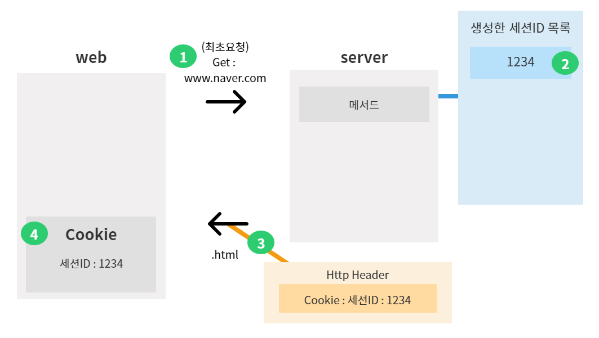

# 12강. [세션] JWT를 이해하기전 세션에 대해 알아보자
## 12-1. 최초 요청시 만들어지는 세션 ID

1. 웹 브라우저가 서버에게 <U>**최초 요청**</U>을 수행한다. (www.naver.com)
2. 요청을 받은 서버는 해당 주소에 맞는 컨트롤러의 메서드를 찾아서 www.naver.com에 해당하는 .html파일을 리턴한다.
3. 이때 서버는 응답으로 보내는 .html파일에다가 Http Header를 함께 달아서 전송한다.
    - 3-1. Http Header에는 Cookie라는 게 담겨있는데, Cookie에는 (Java일 경우)세션ID가 포함되어 있다. 
4. 웹 브라우저는 응답 Header에서 받아온 세션ID정보를 웹 브라우저의 Cookie영역에다 자동저장해둔다.

## 12-2. 세션 ID의 역할

1. 최초요청으로 인해 세션ID값을 갖게 된 웹 브라우저가 다시 한 번 서버에게 요청을 수행한다. (www.naver.com)   
<U>**이때 요청과 함께 세션ID값을 담은 Header를 같이 전송한다.**</U>

2. 요청을 받은 서버는 요청과 함께 전달받은 세션ID가 <U>**생성한 세션ID목록**</U>에 있는 세션ID인지 확인한다.
    - 2-1. 세션ID를 위조하여 요청이 오는 것을 방지하기 위해, 서버는 자신이 생성한 세션ID에 대한 목록을 만들어 이를 관리한다.
    - 2-2. 요청과 함께 세션ID를 전달받았을 경우, 서버는 생성한 세션ID 목록에서 자신이 만든 세션ID가 맞는지 비교를 통해 해당 요청이 최초인지 아닌지를 구분한다.

3. 자신이 생성한 세션ID가 맞는지 확인 후, 요청에 맞는 .html파일과 확인이 완료된 세션ID를 다시 응답 Header에 담아 웹 브라우저로 반환한다.

#### ※ 세션ID가 없으면 서버측은 해당 웹 브라우저가 최초 요청인지 아닌지를 구분하지 못함
- 서버는 최초 요청시에는 세션ID를 발급해준다.
- 그 외 요청시에는 Header에 가져온 세션ID를 생성한 세션ID목록에서 확인한 후 그대로 다시 반환해준다.

## 12-3. 세션 ID의 소멸
1. 서버에서 세션ID값을 강제로 삭제하는 경우
    - 1-1. 서버에서 관리하고 있던 생성한 세션ID 목록 내용을 강제 초기화 시키는 경우, 세션 ID가 소멸된다.
2. 사용자가 웹 브라우저를 전부 다 종료시키는 경우
    - 2-1. 웹 브라우저를 모두 닫을 경우, 웹 브라우저가 갖고 있던 쿠키 내용이 지워지므로 세션 ID가 소멸된다.
    - 2-2. 이 경우, 서버에서 관리중인 세션ID 목록에는 해당 세션 내용이 남아있다. 
    - 2-3. 하지만 이후 웹 브라우저 요청 시, Header에 세션ID를 담아가지 않으므로(남아있는 세션 ID가 없음) 서버는 이를 최초 요청으로 인식하고 새로운 세션 ID를 발급해 줄 것이다.
3. 특정 시간이 지났을 경우
    - 3-1. 특정 시간은 보통 30분이 통상적이다.
    - 3-2. 특정 시간이 지나면 서버에선 세션ID 정보를 삭제한다.

## 12-4. 세션방식의 활용 : 로그인

1. 웹 브라우저가 서버에게 최초 요청을 수행한다. (www.naver.com)
2. 서버는 해당 주소에 맞는 메서드를 실행시키고, 세션ID목록에 새로운 세션ID를 생성한다.
3. 서버는 요청에 맞는 응답과 함께 응답 Header에 (2)에서 생성한 세션ID를 함께 보낸다.
4. 응답을 받은 웹 브라우저는 응답헤더에 있던 세션ID정보를 Cookie영역에다 저장해둔다.

5. 서버로부터 세션ID를 발급받은 웹 브라우저가 발급받은 세션ID와 함께 로그인 요청을 보낸다.
6. 요청을 받은 서버는 같이 온 세션 ID정보를 생성한 세션 ID목록과 비교한다.
7. 서버 자신이 생성한 세션ID가 맞다고 확인된 경우, 사용자가 입력한 로그인 정보가 맞는지 DB를 통해 조회한다.
8. DB로부터 올바른 로그인 정보임을 확인받는다.
9. 서버는 세션ID목록에서 **해당 요청의 세션ID정보 내 저장소**에다 방금 DB에서 조회한 유저정보를 담아둔다.
10. 로그인 정보가 정상으로 확인된 후, 서버는 로그인 완료 페이지와 함께, 요청시 받았던 세션ID정보도 웹 브라우저에게 그대로 반환한다.

11. 로그인 완료 후, 사용자는 인증이 필요한 페이지(예를 들어 유저정보)에 대한 요청을 수행한다.
12. 서버는 해당 요청이 갖고 온 세션ID를 이용하여 세션 목록에서 해당 세션 ID를 찾고, 해당 세션이 가지고 있는 개별 저장소에 유저정보가 있음을 확인한다. → 로그인한 유저인지 확인
13. 로그인 한 사용자임을 확인한 후, 사용자가 요청한 유저정보를 DB에서 조회한다.
14. 조회한 유저정보를 가져온다.
15. 요청한 유저정보와 .html페이지를 응답함과 동시에, 응답헤더에 세션ID를 다시 담아 그대로 반환한다.
16. 이러한 로직이 계속해서 반복된다.

### 정리
1. 세션을 통해서 사용자 인증이 가능하다.
2. 민감정보 요청시 세션값이 있는지를 확인하여 인증된 사용자에게만 민감정보 전달이 가능하다.

## 12-5. 세션방식의 문제 : 로드밸런싱 환경

- 아래와 같은 로드밸런싱 환경에서 세션 방식을 사용할 경우 발생할 수 있는 문제점에 대해 알아보자.
    - 서버 1대당 최대 가용인원은 100명이다.
    - 현재 동시접속 인원은 300명이다.
    - 로드밸런서는 동시접속 인원의 요청을 모두 처리하기 위해 서버 2대(서버B, C)를 추가로 증설하였다.

#### 12-5-1. 클라이언트A는 서버B로 최초 요청하여 세션ID를 발급받고, 로그인 요청을 한다.

#### 12-5-2. 이어서 클라이언트A는 또 다른 요청을 하게 되는데, 서버B가 바쁜 관계로 로드밸런싱이 적용되어 서버C에게 요청을 하게된다.

#### 12-5-3. 서버C에게는 클라이언트A에 대한 정보가 전혀 없으므로, 클라이언트A의 요청을 최초 요청이라고 판단하여 새로운 세션ID를 발급해준다.

### ※ 결국 클라이언트A는 로드밸런싱에 의해 새로운 서버에게 요청을 할 때 마다, 매번 새로운 세션 ID를 발급받고 로그인을 통해 인증과정을 거쳐야만 한다. ※

#### 12-5-4. 해결방안
1. Stacking Server 이용
    - Stacking Server를 이용하여 각 클라이언트가 최초 요청한 서버하고만 계속해서 요청과 응답을 주고받을 수 있도록 하는 방법.
    - 해당 서버 사용시, 로드밸런싱은 먹히지 않음
2. 개별 서버가 가지고 있는 세션 정보를 전부 복제
    - 위 예시에서 서버B가 가지고 있던 클라이언트A에 대한 정보를 나머지 서버A, C에게도 복제시키는 방법
3. 세션이 아닌 DB에 정보를 저장해두고, 개별 서버들이 함께 공유해서 사용
    - 세션은 서버가 들고있는 메모리에 접근해서 데이터를 가져오는 것으로 속도가 매우 빠름(RAM 접근)
    - DB에서 정보를 가져올 경우는 IO발생하여 속도가 현저히 느려짐(HDD 접근)
4. (3)에서 DB가 아니라 메모리 공유 서버를 사용
    - 메모리이므로 IO가 발생하지 않아 시간을 단축시킬 수 있음(HDD가 없고 RAM만 존재)
    - 대표적으로 Redis 서버가 있다.
5. **✅ JWT 사용하기**
    - *세션의 고질적인 문제점을 모두 해결할 수 있다 !*
