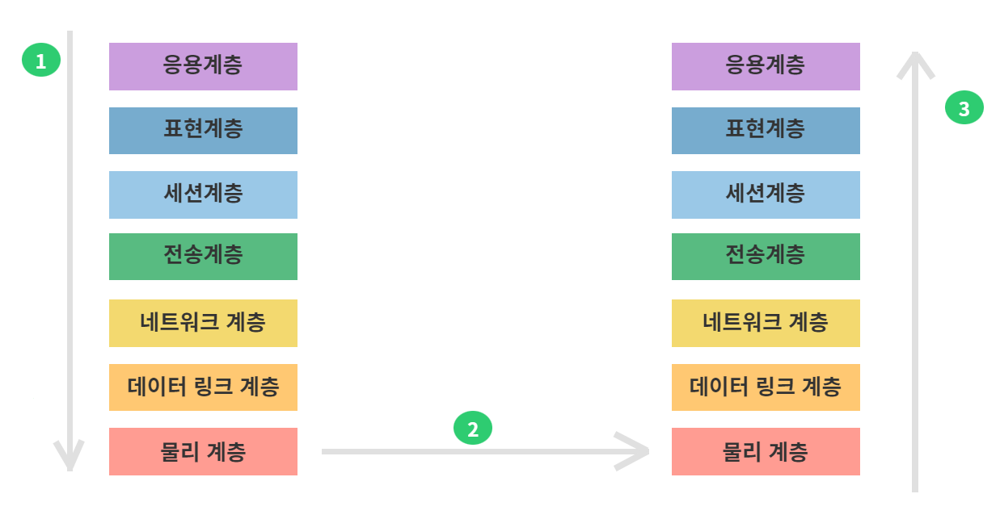
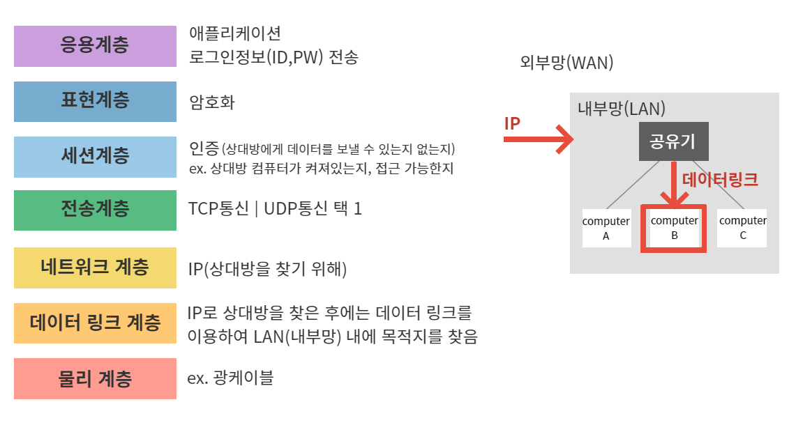
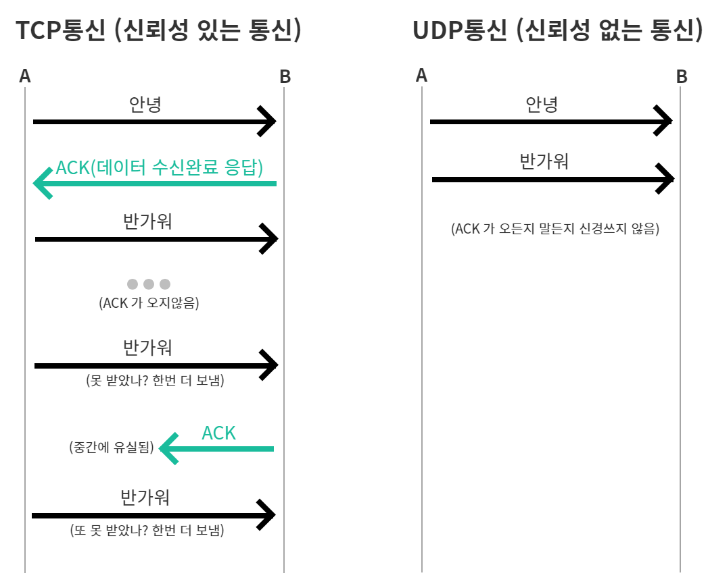

# 13강. [통신] JWT를 이해하기전 TCP에 대해서 알아보자
## 13-1. 웹 통신 : OSI 7계층

1. 통신을 하기 위해서는 항상 응용계층에서부터 물리계층까지 쭉 내려와서
2. 물리계층에서 실제로 데이터 전송이 이뤄지고
3. 상대방의 물리계층에 도착하여 응용계층까지 쭉 올라가서 통신이 이뤄짐

## 13-2. TCP vs UDP 통신

<table>
    <thead>
        <tr>
            <th>TCP 통신</th>
            <th>UDP 통신</th>
        </tr>
    </thead>
    <tbody>
        <tr>
            <td>신뢰성 있는 통신</td>
            <td>신뢰성 없는 통신</td>
        </tr>
        <tr>
            <td>내가 보낸 데이터가 잘 갔는지 항상 확인</td>
            <td>내가 보낸 데이터가 잘 갔는지는 확인하지 않음. 보내고 싶은 데이터를 무작위로 보내버림</td>
        </tr>
        <tr>
            <td>데이터가 유실될 가능성이 없음</td>
            <td>데이터가 중간에 유실될 가능성 있음</td>
        </tr>
        <tr>
            <td>속도가 느림</td>
            <td>속도가 빠름</td>
        </tr>
        <tr>
            <td>활용 : 웹 통신(로그인)</td>
            <td>활용 : 전화, 동영상 파일 전송 (중간에 데이터가 유실되더라도 앞뒤 데이터로 추측이 가능한 경우. 즉, 사람이 이해할 수 있는 것들은 UDP 통신 이용가능)</td>
        </tr>
    </tbody>
</table>