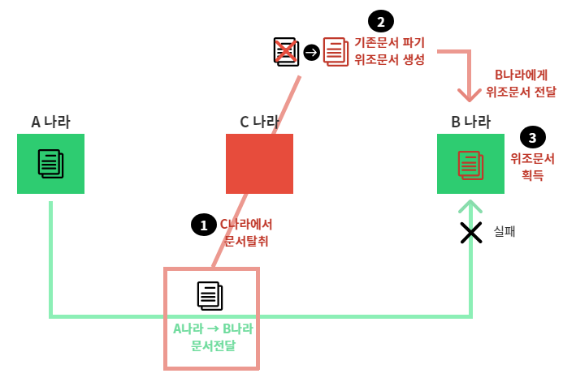
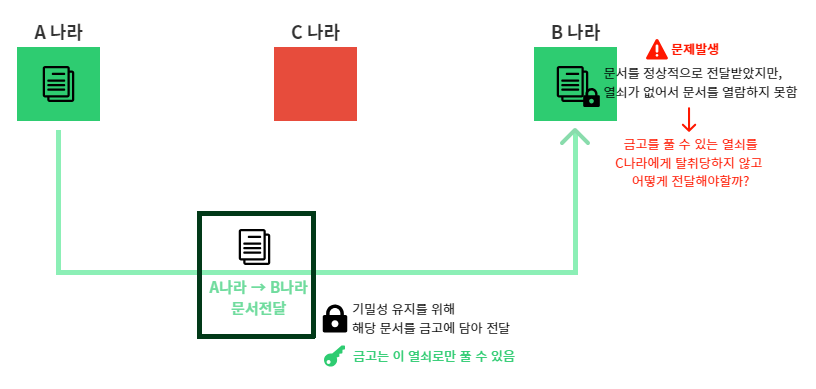

# 14강. [보안] JWT를 이해하기전 CIA에 대해서 알아보자
## 14-1. CIA란
### 14-1-1. CIA, 정보보안의 3요소
1. Confidentiality 기밀성
    - 자산이 인가(authorization)된 당사자에 의해서만 접근하는 것을 보장
2. Integrity 무결성
    - 자산이 인가된 당사자에 의해서, 인가된 방법으로만 변경 가능
3. Availability 가용성
    - 자산이 적절한 시간에 인가된 당사자에게 접근 가능
    - 자산이 정상적으로 사용 또는 제공 가능

### 14-1-2. CIA 위반사례
    

1. 문서가 중간에 탈취된 순간, 기밀성이 깨짐
    - 인가된 당사자(B나라)가 아닌 C나라에서 접근했으므로
2. 기존 문서를 파기하고 위조문서가 생성된 순간, 무결성이 깨짐
    - 인가된 당사자(B나라)가 아닌 C나라에서 인가되지 않은 방법으로 변경했으므로
3. 위조된 문서를 B나라가 획득한 순간, 가용성이 깨짐
    - 자산(문서)이 정상적으로 제공된 것이 아니므로

## 14-2. CIA 유지
- 정보보안을 위해선 CIA를 지켜야만 한다.
- Confidentiality, Integrity, Availability 를 지킬 수 있는 각각의 방법에 대해 알아보자.

### 14-2-1. CIA를 유지하기 위해 해결해야할 문제 2가지
1. 열쇠 전달 문제

    

    - 데이터 전달시, 이를 암호화시켜 기밀성을 유지시킴
    - 이때 수신하는 곳에서 암호화를 풀 수 있는 Key가 없으면 데이터 열람이 불가능
    - 그렇다면, 암호화를 풀 수 있는 Key를 중간에 탈취당하지 않고 보내는 방법 필요

2. 자산이 누구로부터 왔는지 확인, 인증 문제

    

    - 앞서 (14-1-2)에서 확인한 CIA 위반 사례처럼, B나라가 위조된 문서를 받더라도 해당 문서에 보낸이가 명시되어 있다면 이것이 위조문서인지 확인가능
    - 따라서, 전달되는 데이터(자산)를 발신한 사람이 누구인지를 확인할 수 있어야 함 → 위/변조에 대응할 수 있도록

    ### ※ 위 두가지 문제를 해결하면, 정보보안 이슈를 해결할 수 있다.