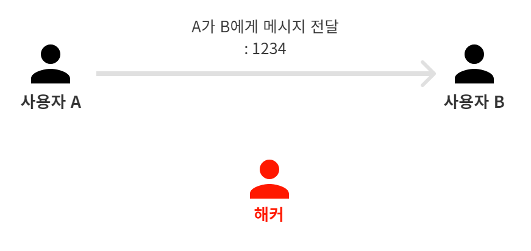
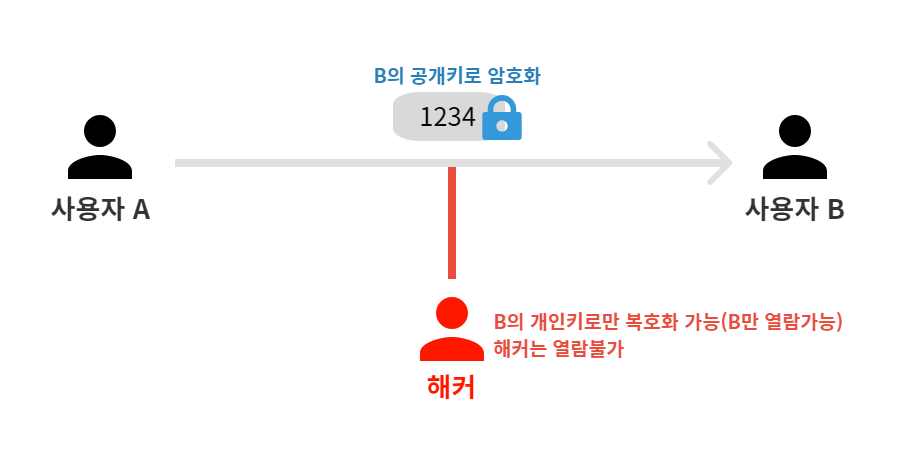
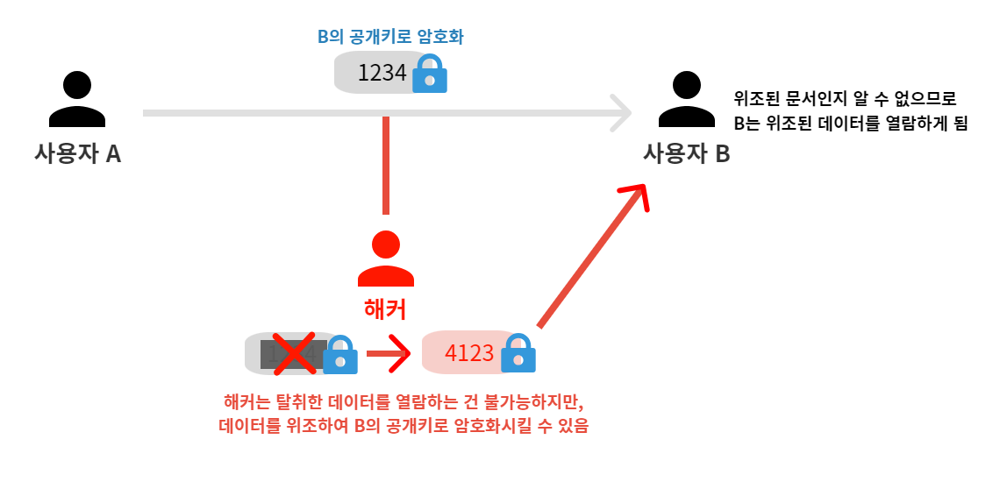
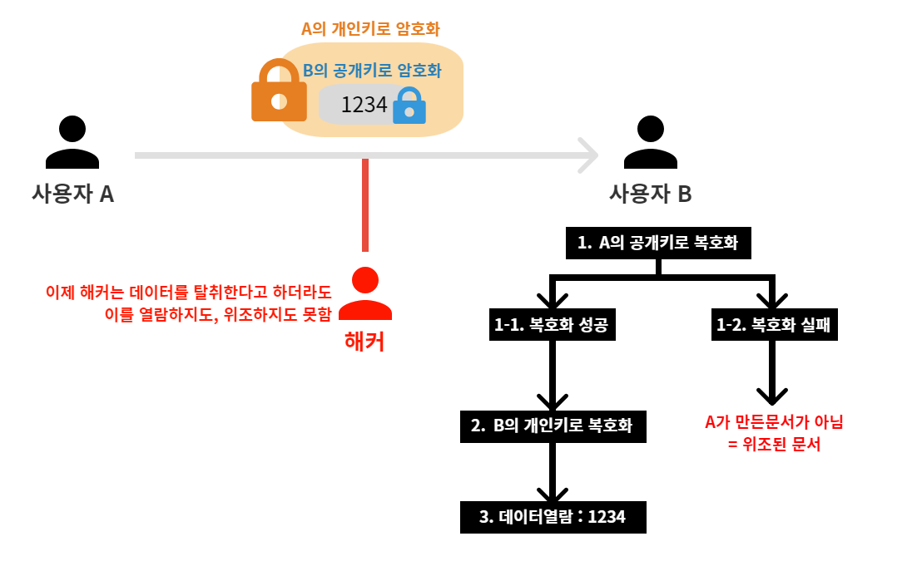

# 15강. [보안] JWT를 이해하기전 RSA에 대해서 알아보자
## 15-1. 서론
- 앞서 14강에서 보안 이슈를 해결하기 위해 처리해야할 문제 2가지가 있었다.
    1. 열쇠 전달 문제(암호화)
    2. 인증 문제(인증)

- 위 두가지 문제를 한번에 해결할 수 있는 방법 → RSA 암호화

## 15-2. RSA이란
### 15-2-1. RSA 암호화
- 공개키 암호시스템의 하나
- 암호화뿐만 아니라 전자서명(인증)이 가능한 최초의 알고리즘
- 두 개의 키를 사용 
    1. public key : 공개키
    2. private key : 개인키
    - 공개키로 암호화(encrypt)된 데이터 → 개인키로 복호화(decrypt) 가능
    - 반대로, 개인키로 암호화(encrypt)된 데이터 → 공개키로 복호화(decrypt) 가능

### 15-2-2. 활용 예시
#### 1. 사용자A가 사용자B에게 1234라는 메시지를 전달하고자 한다.
- 해당 메시지는 해커에게 열람될 수 있고, : 기밀성 위배
- 위/변조가 쉽고, : 무결성 위배
- 위/변조된 정보를 사용자B에게 전달할 수 있다. : 가용성 위배

#### 2. 기밀성을 유지하기 위해 사용자A는 사용자B의 공개키로 해당 메시지를 암호화하여 전송한다.
- B의 공개키로 암호화된 메시지는 B의 개인키로만 복호화가 가능하다
- 해커는 정보를 탈취하더라도 복호화에 필요한 B의 개인키가 없으므로, 내용을 확인할 수 없다. → 기밀성 유지
- 두 가지 문제 중 첫번째 문제(열쇠 전달 문제)가 해결되었다.

#### 3. 인증 문제 발생
- 해커는 탈취한 데이터를 조회하지는 못하지만, 해당 데이터를 위/변조하여 B의 공개키로 암호화할 수 있다.
- 이렇게 위/변조된 데이터를 B에게 전송한다. B는 해당 데이터가 누가 만든 데이터인지를 알 수 없다.

#### 4. 인증 문제 해결
- (3)과 같은 일이 발생하지 않기 위해 사용자A는 메시지를 우선 B의 공개키로 암호화하고, 이를 A의 개인키로 다시 한번 암호화한다.
- A의 개인키는 사용자A 본인만 갖고 있으므로, 사용자A의 개인키로 암호화된 데이터는 사용자A가 보낸 데이터임을 증명해준다.
- 이를 전달받은 사용자B는 우선 A의 공개키로 첫번째 복호화를 하고, 이어서 B의 개인키로 두번째 복호화를 하여 데이터를 조회할 수 있다.
- 첫번째 복호화에서 A의 공개키로 복호화가 되지 않는다면, 이것은 위조된 문서임이 확실해진다.
- 해커는 이제 더이상 탈취한 데이터를 열람하지도, 위/변조하지도 못한다.

