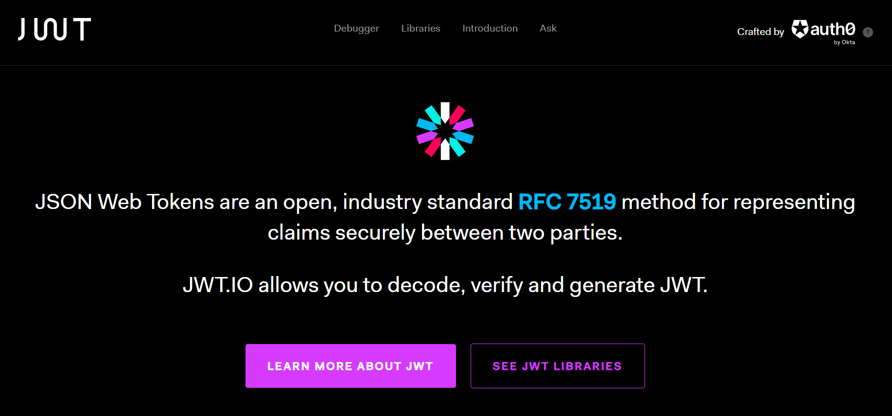

# 16강. JWT를 이해하기전 RFC문서란
## 16-1. RFC문서
- 약속된 규칙을 정의해둔 문서
- 프로토콜이라고 부름
- 네트워크가 계속해서 커지면서 그에 따른 RFC문서도 계속해서 늘어남
- 이러한 네트워크들이 모여 만들어진 것이 바로 WWW(World Wide Web, 인터넷)이다. 즉, 인터넷이란 RFC문서로 이뤄져있음
    - 인터넷을 이루고 있는 RFC문서(약속)들을 **http 프로토콜**이라 부람
- 현재 네트워크망이 매우 비대해졌으므로, 새로운 RFC문서를 만들기 위해선 이에 대한 동의가 필요하다.
    - 따라서 새로운 규약들이 나오는 속도는 점차 느려지고 있음

## 16-2. JWT
[jwt.io](https://jwt.io/)

- JWT에 대한 규칙들은 RFC 7519번 문서에 정의되어 있다.
- 우리는 JWT를 통해 확장성이 좋은 서버를 구축할 수 있다.
