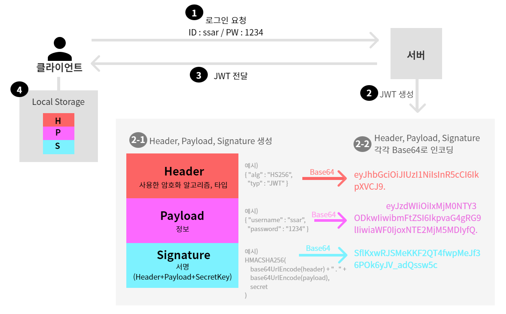

# 17강. JWT 구조 이해
- JWT는 당사자간에 정보를 JSON객체로 안전하게 전송하기 위한 컴팩트하고 독립적인 방식을 정의하는 개방형 표준이다.
- JWT를 암호화하여 당사자간에 비밀을 주고받을 수도 있지만, 가장 중요한건 서명된 토큰!
    - 내가 만든 JWT는 "내가 쓴게 맞아"라는 서명의 용도로 이용가능

- JWT구조
    - Header : 헤더
        - 사용한 알고리즘, 타입
    - Payload : 정보
    - Signature : 서명
        - 헤더, 정보, 개인키 세가지를 HMACSHA256으로 암호화

