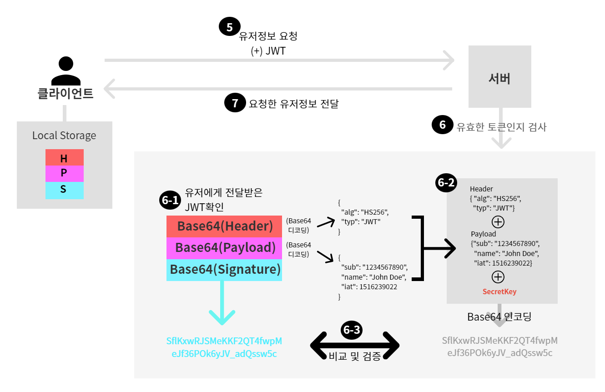
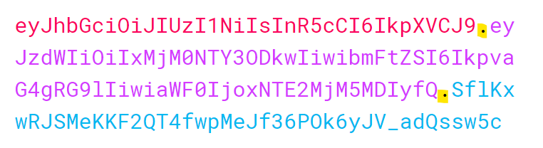

# 17강. JWT 구조 이해
## 17-1. JWT 개념
- JWT는 당사자간에 정보를 JSON객체로 안전하게 전송하기 위한 컴팩트하고 독립적인 방식을 정의하는 개방형 표준이다.
- JWT를 암호화하여 당사자간 암호화 된 데이터를 주고받을 수도 있지만, JWT는 이러한 암호화의 기능보다는 '서명'이 보다 주된 기능이다.
    - ex. 내가 만든 JWT를 통해 "이건 내가 만든게 맞아"라는 서명의 용도로 이용이 가능하다.

- JWT구조
    - Header : 헤더
        - 사용한 알고리즘, 타입 등을 명시한다.
    - Payload : 정보
    - Signature : 서명
        - "(1)헤더, (2)정보, (3)서버의 Secret Key" 이 세가지를 합쳐 암호화 되어있다.

## 17-2. JWT 생성 및 이용
- JWT 생성    
    

    - (1) 클라이언트가 서버에게 로그인 요청을 보낸다. (ID : ssar / PW : 1234)
    - (2) **로그인 인증이 완료된 후,** 서버는 앞서 세션방식처럼 세션을 만드는 것이 아니라 JWT를 만든다. → **※인증이 완료된 후에 JWT생성※**
        - (2-1) JWT의 구조 : Header, Payload, Signature
            - Header : 사용한 암호화 알고리즘, 타입 명시
            - Payload : 로그인 정보
            - Signature : "Header + Payload + (서버만 알고 있는) Secret Key" 이 세가지 정보를 헤더에 명시해준 알고리즘으로 암호화한다.
        - (2-2) 생성한 Header, Payload, Signature 각각을 Base64로 인코딩해준다. (참고로, Base64는 디코딩이 가능한 암호화 방식이다.)
        - (2-3) 예시
        
    - (3) 생성한 JWT를 클라이언트에게 전달한다.
    - (4) 클라이언트는 전달받은 JWT를 local storage와 같은 영역에 저장해둔다.

- JWT 이용
    

    - (5) Local Storage에 앞서 발급받은 JWT를 저장해둔 유저는, 서버에게 유저정보를 요청함과 동시에 저장해둔 JWT를 함께 전송한다.(인증이 필요한 요청을 전송한다.)
    - (6) 서버는 유저가 보내준 JWT가 유효한 토큰인지를 검사한다.
        - (6-1) 우선 유저에게 전달받은 JWT를 확인하고, Base64로 인코딩되어있는 Header와 Payload를 Base64로 다시 디코딩한다.
        - (6-2) 디코딩된 Header와 Payload정보, 그리고 서버가 가지고 있는 SecretKey를 합쳐 Header에 명시되어 있는 암호화방식으로 인코딩하여(기본적으로 HMACSHA256을 사용함. 앞서 배운 RSA도 JWT토큰 암호화방식으로 사용가능) Signature를 다시 만들어본다.
        - (6-3) 6-2에서 만든 Signature와 유저에게 전달받은 JWT내 Signature가 동일한 값이면, 해당 토큰은 유효한 토큰(해당 서버가 만든게 맞음)으로 검증할 수 있다.
    - (7) 유저가 보내준 JWT가 유효한 토큰임을 확인한 뒤, 유저가 요청한 정보를 전달한다.

## 17-3. 정리
- JWT는 Header, Payload, Signature 각각이 . (온점)으로 구분되어있다.
    
    - 또한 각각은 복호화하기 쉬운 Base64로 암호화되어 있으므로, 이는 JWT가 암호화로서의 기능이 아닌 서명으로서의 기능을 맡고있음을 확인할 수 있다.
    - JWT는 데이터가 유효한지 아닌지에 대한 데이터 무결성을 **검증**하는 용도로 사용된다.

- 앞서 세션방식의 문제점이었던 로드밸런싱 서버의 경우에도, JWT를 이용한다면 서버에 저장되어 있는 세션을 이용하는 것이 아니라 JWT 토큰 검증만 하면 되기때문에 아무런 문제가 없다.
    - 단지 서버끼리 SecretKey 정보만 공유하고 있으면 될 뿐!

- JWT는 Secret Key를 가지고 있는 서버만 만들 수 있음. 그렇지 않은 경우 유효한 토큰으로 검증되지 못함. → 보안 우수