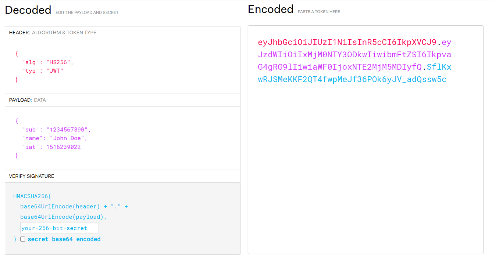

# 17강. JWT 구조 이해
## 17-1. JWT 개념
- JWT는 당사자간에 정보를 JSON객체로 안전하게 전송하기 위한 컴팩트하고 독립적인 방식을 정의하는 개방형 표준이다.
- JWT를 암호화하여 당사자간 암호화 된 데이터를 주고받을 수도 있지만, JWT는 이러한 암호화의 기능보다는 '서명'이 보다 주된 기능이다.
    - ex. 내가 만든 JWT를 통해 "이건 내가 만든게 맞아"라는 서명의 용도로 이용이 가능하다.

- JWT구조
    - Header : 헤더
        - 사용한 알고리즘, 타입 등을 명시한다.
    - Payload : 정보
    - Signature : 서명
        - "(1)헤더, (2)정보, (3)서버의 Secret Key" 이 세가지를 합쳐 암호화 되어있다.

## 17-2. JWT 생성 및 이용

1. 클라이언트가 서버에게 로그인 요청을 보낸다. (ID:ssar / PW:1234)
2. **로그인 인증이 완료된 후,** 서버는 앞서 세션방식처럼 세션을 만드는 것이 아니라 JWT를 만든다. → **인증완료 후 JWT생성**
    - 2-1. JWT의 구조 : Header, Payload, Signature
        - Header : 사용한 암호화 알고리즘, 타입 명시
        - Payload : 로그인 정보
        - Signature : "Header + Payload + (서버만 알고 있는) Secret Key" 이 세가지 정보를 헤더에 명시해준 알고리즘으로 암호화한다.
    - 2-2. 생성한 Header, Payload, Signature 각각을 Base64로 인코딩해준다.
    - 2-3. 예시
        

3. 생성한 JWT를 클라이언트에게 전달한다.
4. 클라이언트는 전달받은 JWT를 local storage와 같은 영역에 저장해둔다.