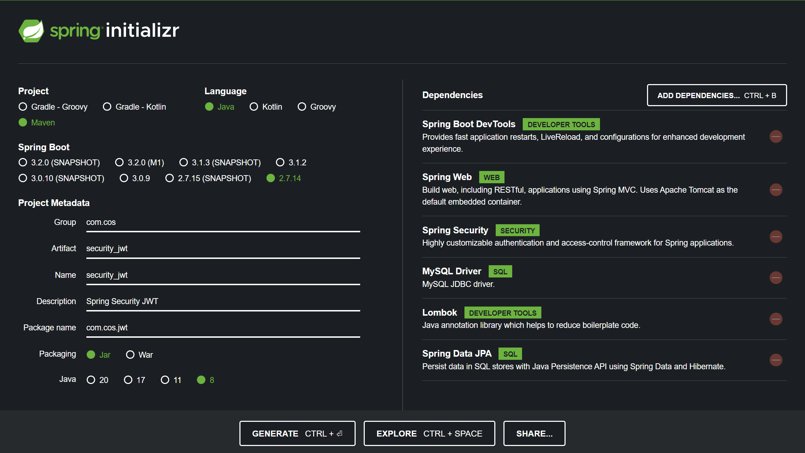

# 18강. JWT 프로젝트 세팅
## 18-1. 프로젝트 생성


## 18-2. pom.xml에 dependency 추가
- JWT를 직접 Base64와 HS256등으로 인코딩해서 만들어도 되지만, 그걸 만들어주는 라이브러리를 활용할 예정
    ```xml
    <!-- https://mvnrepository.com/artifact/com.auth0/java-jwt -->
    <dependency>
        <groupId>com.auth0</groupId>
        <artifactId>java-jwt</artifactId>
        <version>3.10.2</version>
    </dependency>    
    ```

## 18-3. [참고] JWT 직접 생성 방법
### 1. 우선 HEADER, PAYLOAD를 작성한다.
- HEADER
    ```
    {
        "alg": "HS256",
        "typ": "JWT"
    }
    ```
- PAYLOAD
    ```
    {
        "sub": "1234567890",
        "name": "John Doe",
        "iat": 1516239022
    }
    ```

### 2. 앞서 작성한 HEADER와 PAYLOAD를 이용하여 SIGNATURE를 작성한다.
- HEADER를 Base64로 인코딩 → base64UrlEncode(header)
- PAYLOAD를 Base64로 인코딩 → base64UrlEncode(payload)
- SIGNATURE
    ```
    (
        base64UrlEncode(header) + "." +
        base64UrlEncode(payload),
        secret
    )
    ```

### 3. 작성한 SIGNATURE를 HEADER에 설정한 알고리즘인 HS256으로 암호화한다.
- SIGNATURE
    ```
    HMACSHA256 (
        base64UrlEncode(header) + "." +
        base64UrlEncode(payload),
        secret
    )
    ```

### 4. 만들어둔 HEADER, PAYLOAD(본문), SIGNATURE를 각각 Base64로 암호화 한 후 온점으로 구분하여 합친다.
- JWT
    ```
    base64UrlEncode(header).
    base64UrlEncode(payload).
    base64UrlEncode(signature)
    ```
    ```
    eyJhbGciOiJIUzI1NiIsInR5cCI6IkpXVCJ9.   eyJzdWIiOiIxMjM0NTY3ODkwIiwibmFtZSI6IkpvaG4gRG9lIiwiaWF0IjoxNTE2MjM5MDIyfQ.   SflKxwRJSMeKKF2QT4fwpMeJf36POk6yJV_adQssw5c
    ```