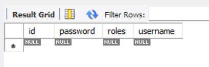

# 20강. JWT를 위한 security설정
## 20-1. Model 생성
```java
package com.cos.jwt.model;

import java.util.ArrayList;
import java.util.Arrays;
import java.util.List;

import javax.persistence.Entity;
import javax.persistence.GeneratedValue;
import javax.persistence.GenerationType;
import javax.persistence.Id;

import lombok.Data;

@Data
@Entity
public class User {
	
	@Id
	@GeneratedValue(strategy = GenerationType.IDENTITY) // IDENTITY => Auto Increment
	private long id;
	private String username;
	private String password;
	private String roles; // USER, ADMIN
	
	// Role이 2개이상일 경우 이런식으로 처리하는 것도 하나의 방법
	public List<String> getRoleList(){
		if(this.roles.length() > 0) {
			return Arrays.asList(this.roles.split(","));
			
		}
		return new ArrayList<>();
	}
}
```
- Arrays클래스
    - 배열을 다루기 위한 다양한 메소드가 포함되어 있음
    - asList() 메소드 : 전달받은 배열을 고정 크기의 리스트로 변환하여 반환.
    - [참고] http://www.tcpschool.com/java/java_api_arrays

- 테이블 생성 확인



## 20-2. 시큐리티 설정 : SecurityConfig
```java
package com.cos.jwt.config;

import org.springframework.context.annotation.Bean;
import org.springframework.context.annotation.Configuration;
import org.springframework.security.config.annotation.web.builders.HttpSecurity;
import org.springframework.security.config.annotation.web.configuration.EnableWebSecurity;
import org.springframework.security.config.http.SessionCreationPolicy;
import org.springframework.security.web.SecurityFilterChain;

@Configuration // IoC
@EnableWebSecurity // 시큐리티 설정 활성화
public class SecurityConfig {
	
	@Bean
	public SecurityFilterChain filterChain(HttpSecurity http) throws Exception{
		http.csrf().disable();
		http.sessionManagement().sessionCreationPolicy(SessionCreationPolicy.STATELESS)
		.and()
		.formLogin().disable()
		.httpBasic().disable()
		.authorizeRequests()
		    .antMatchers("/api/v1/user/**")
            .access("hasRole('ROLE_USER') or hasRole('ROLE_MANAGER') or hasRole('ROLE_ADMIN')")
            .antMatchers("/api/v1/manager/**")
            .access("hasRole('ROLE_MANAGER') or hasRole('ROLE_ADMIN')")
            .antMatchers("/api/v1/admin/**")
            .access("hasRole('ROLE_ADMIN')")
            .anyRequest().permitAll();
		
		return http.build();
	}
}
```
1. 
    ```java
    http.csrf().disable();
    ```
    : **JWT 로그인 시 필수 설정값**

2. 
    ```java
    http.sessionManagement().sessionCreationPolicy(SessionCreationPolicy.STATELESS)
    ```
    : **JWT 로그인 시 필수 설정값**   
    : STATELESS => 기존세션방식을 사용하지 않고, 무상태성 서버로 만들겠다. (세션방식을 사용하지 않겠다.)

3. 
    ```java
    .formLogin().disable()
    ```
    : **JWT 로그인 시 필수 설정값**   
    : formLogin = Spring Security에서 제공하는 인증방식. JWT서버니까 formLogin을 사용하지 않겠다.

4. 
    ```java
    .httpBasic().disable() 
    ```
    : 기본적인 http로그인 방식은 사용하지 않겠다.

5. 
    ```java
    .authorizeRequests()
		.antMatchers("/api/v1/user/**")
		.access("hasRole('ROLE_USER') or hasRole('ROLE_MANAGER') or hasRole('ROLE_ADMIN')")
		.antMatchers("/api/v1/manager/**")
		.access("hasRole('ROLE_MANAGER') or hasRole('ROLE_ADMIN')")
		.antMatchers("/api/v1/admin/**")
		.access("hasRole('ROLE_ADMIN')")
		.anyRequest().permitAll();
    ```
    : "/api/v1/user/**" 는 ROLE_USER, ROLE_MANAGER, ROLE_ADMIN 모든 권한 접근가능   
    : "/api/v1/manager/**" 는 ROLE_MANAGER, ROLE_ADMIN 권한만 접근가능   
    : "/api/v1/admin/**" 는 ROLE_ADMIN 권한만 접근가능   
    : 그 외 다른 요청은 권한 상관없이 아무나 접근 가능

#### ※ csrf 비활성화, 세션 비활성화, form로그인 비활성화 이렇게 3가지는 전부 JWT를 구현하기 위해 필수적으로 설정해야 하는 요소이다.
#### ※ 이 밖에 필수적으로 설정해야하는 값이 한가지 더 남아있다. => CorsConfig

## 20-3. CorsConfig 설정
```java
package com.cos.jwt.config;

import org.springframework.context.annotation.Bean;
import org.springframework.context.annotation.Configuration;
import org.springframework.web.cors.CorsConfiguration;
import org.springframework.web.cors.UrlBasedCorsConfigurationSource;
import org.springframework.web.filter.CorsFilter;

@Configuration
public class CorsConfig {

	@Bean
	public CorsFilter corsFilter() {
		UrlBasedCorsConfigurationSource source = new UrlBasedCorsConfigurationSource();
		CorsConfiguration config = new CorsConfiguration();
		config.setAllowCredentials(true);  
		config.addAllowedOrigin("*");
		config.addAllowedHeader("*");
		config.addAllowedMethod("*");
		source.registerCorsConfiguration("/api/**", config);
		
		return new CorsFilter(source);
	}
}
```
1. 
    ```java
    config.setAllowCredentials(true);
    ```
    : 내 서버가 응답을 할 때 해당 응답을 javascript에서 처리할 수 있게 할지 설정.   
    : ajax등으로 서버에 요청이 오면, 이에 대한 응답을 javascript에서 처리할 수 있게 할 지 설정. 만약 false로 설정해두면 ajax등으로 서버에 요청을 보내면 응답이 오지 않음.

2. 
    ```java
    config.addAllowedOrigin("*");
    ```
    : 모든 ip에 응답을 허용하겠다고 설정

3. 
    ```java
    config.addAllowedHeader("*");
    ```
    : 모든 header에 응답을 허용하겠다고 설정

4. 
    ```java
    config.addAllowedMethod("*");
    ```
    : 모든 요청(post, get, put, delete, patch)을 허용하겠다고 설정

5. 
    ```java
    source.registerCorsConfiguration("/api/**", config);
    ```
    : cors설정값을 source에다가 등록하기   
    : "/api/**" 에 해당하는 요청은 모두 cors설정값을 따르도록 한다.

- 이렇게 cors설정이 끝났으면 이를 filter에 등록해준다. 

## 20-4. Filter에 cors설정 등록하기
```java
package com.cos.jwt.config;

import org.springframework.context.annotation.Bean;
import org.springframework.context.annotation.Configuration;
import org.springframework.security.config.annotation.web.builders.HttpSecurity;
import org.springframework.security.config.annotation.web.configuration.EnableWebSecurity;
import org.springframework.security.config.http.SessionCreationPolicy;
import org.springframework.security.web.SecurityFilterChain;
import org.springframework.web.filter.CorsFilter;

import lombok.RequiredArgsConstructor;

@Configuration
@EnableWebSecurity
@RequiredArgsConstructor // 생성자 자동주입을 위해 어노테이션 추가
public class SecurityConfig {
	
	private final CorsFilter corsFilter; // DI
	
	@Bean
	public SecurityFilterChain filterChain(HttpSecurity http) throws Exception{
		http.csrf().disable();
		http.sessionManagement().sessionCreationPolicy(SessionCreationPolicy.STATELESS)
		.and()
		.addFilter(corsFilter) // 필터에 cors설정값 등록
		.formLogin().disable()
		.httpBasic().disable()
		.authorizeRequests()
			.antMatchers("/api/v1/user/**")
			.access("hasRole('ROLE_USER') or hasRole('ROLE_MANAGER') or hasRole('ROLE_ADMIN')")
			.antMatchers("/api/v1/manager/**")
			.access("hasRole('ROLE_MANAGER') or hasRole('ROLE_ADMIN')")
			.antMatchers("/api/v1/admin/**")
			.access("hasRole('ROLE_ADMIN')")
			.anyRequest().permitAll();
		
		return http.build();
	}
}
```
1. 
    ```java
    .addFilter(corsFilter)
    ```
    : **JWT 로그인시 필수 설정값**   
    : 방금 만들어둔 CorsConfig를 필터에 등록시켜준다.   
    : 이제 더 이상 내 서버는 CrossOrigin정책을 사용하지 않을 것이며, 모든 요청을 허용하겠다고 설정   
    : 다른 방법으로는 컨트롤러에 @CrossOrigin 어노테이션을 붙이는 방법도 있지만 이건 사용자의 인증이 필요없을 경우에만 사용이 가능하다. 인증이 필요할 경우는 지금과 같이 시큐리티 필터에 직접 등록을 해주어야만 한다.