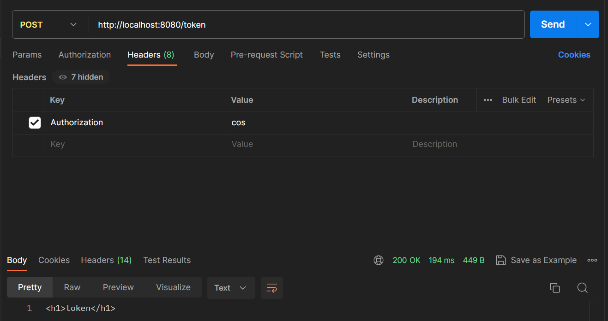
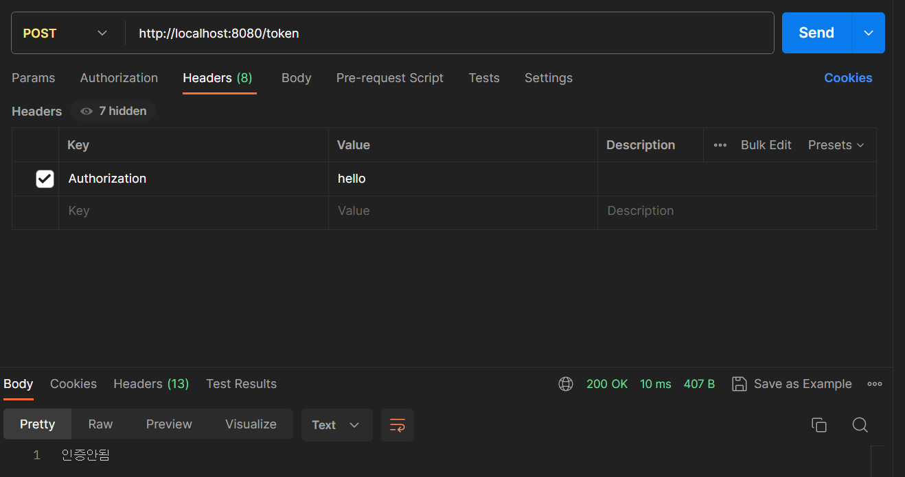
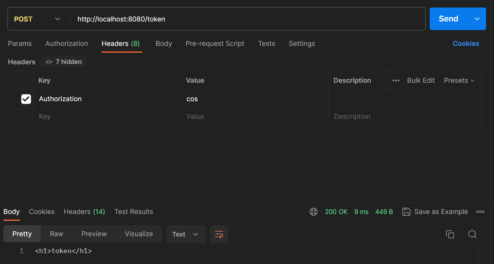

# 23강. JWT 임시 토큰 만들어서 테스트 해보기
## 23-1. 서론
- 앞선 22강에서 Filter를 등록해보았고, 이러한 필터를 이용하여 JWT 토큰처리를 하기로 했었다.
- JWT 토큰 처리를 하기 전, 이번 23강에서는 간단하게 토큰을 만들어서 그 토큰으로 테스트를 해보기로 한다.

## 23-2. 요청 테스트
### 23-2-1. Controller에 POST메소드 추가
```java
@RestController
public class RestApiController {
	
	@GetMapping("home")
	public String home() {
		return "<h1>home</h1>";
	}
	
	@PostMapping("token") // 추가
	public String token() { 
		return "<h1>token</h1>";
	}
}
```

### 23-2-2. MyFilter3 코드 추가
```java
public class MyFilter3 implements Filter{

    @Override
    public void doFilter(ServletRequest request, ServletResponse response, FilterChain chain)
            throws IOException, ServletException {
        
        HttpServletRequest req = (HttpServletRequest)request;
        HttpServletResponse res = (HttpServletResponse)response; 
        
        if(req.getMethod().equals("POST")) {
            System.out.println("POST 요청됨");
            String headerAuth = req.getHeader("Authorization");
            System.out.println(headerAuth);
        }
        System.out.println("필터3");
        chain.doFilter(req, res);
    }
}
```
- SelvetRequest와 ServletResponse를 각각 HttpServletRequest와 HttpServletResponse로 다운캐스트 한 다음, 이를 필터에 넣어준다.
- 그리고 요청 메소드가 'GET'이 아닌 'POST'일 경우에, 해당 요청 header에서 'Authorization' 이라는 키 값을 찾아 이를 출력해본다.

### 23-2-3. 포스트맨 이용, 결과 확인하기


- 콘솔 결과
    ```
    POST 요청됨
    cos
    필터3
    ```
    - 포스트맨으로 "/token" 요청시, 헤더 Authorization 키 값에 담아둔 cos가 출력되었음을 확인할 수 있다.

### 23-2-4. 임시 토큰 테스트
1. 위 결과를 통해 어떠한 요청이 왔을때, 해당 요청 Header에 담겨온 값이 무엇인지를 판별할 수 있음을 알게 되었다.
2. 그렇다면 요청 Header에 어떤 특정한 값이 있을때만 필터에 담아주고(인증완료), 그렇지 않다면 더 이상 인증을 못하게 막고 컨트롤러 진입조차 못하게끔 테스트를 진행해본다.

### 23-2-5. MyFilter3 코드수정
```java
public class MyFilter3 implements Filter{

	@Override
	public void doFilter(ServletRequest request, ServletResponse response, FilterChain chain) throws IOException, ServletException {
		
		HttpServletRequest req = (HttpServletRequest)request;
		HttpServletResponse res = (HttpServletResponse)response; 
		
		if(req.getMethod().equals("POST")) {
			System.out.println("POST 요청됨");
			String headerAuth = req.getHeader("Authorization");
			System.out.println(headerAuth);
			System.out.println("필터3");
			
			if(headerAuth.equals("cos")) { // 조건문추가
				chain.doFilter(req, res);
			}
			else {
				PrintWriter out = res.getWriter();
				out.print("인증안됨");
			}
		}
	}
}
```
- 요청헤더에 담긴 값이 'cos'일 경우에만 해당 요청과 응답을 필터에 담아주고, 그렇지않다면 '인증안됨'이라는 글자를 반환하도록 코드를 수정하였다.

### 23-2-6. 포스트맨으로 결과확인
- 요청헤더(Authorization)에 담긴 값이 hello일 경우, 인증안됨 메시지를 응답받았다.
    

- 요청헤더(Authorization)에 담긴 값이 cos일 경우, '/token'컨트롤러로 접근하여 반환값인 '\<h1\>token\</h1\>'을 응답받았다.
    

## 23-3. 시큐리티 설정에 필터추가
1. 방금 생성한 필터는 요청헤더에 담긴 값으로 인증여부와 컨트롤러 접근여부를 결정해준다.
2. 이는 시큐리티가 동작하기 전에 이뤄져야할 설정이므로, 시큐리티 설정에 해당 필터를 추가해준다.
    - 2-1. 시큐리티가 동작하기 전에 필터를 이용해서 인증된 요청과 그렇지 않은 요청을 걸러내야 하기때문

```java
@Configuration
@EnableWebSecurity
@RequiredArgsConstructor
public class SecurityConfig {
    
    private final CorsFilter corsFilter;
    
    @Bean
    public SecurityFilterChain filterChain(HttpSecurity http) throws Exception{
        http.addFilterBefore(new MyFilter3(), SecurityContextPersistenceFilter.class); // 추가
        http.csrf().disable();
        http.sessionManagement().sessionCreationPolicy(SessionCreationPolicy.STATELESS)
        .and()
        .addFilter(corsFilter)
        .formLogin().disable()
        .httpBasic().disable()
        .authorizeRequests()
            .antMatchers("/api/v1/user/**")
            .access("hasRole('ROLE_USER') or hasRole('ROLE_MANAGER') or hasRole('ROLE_ADMIN')")
            .antMatchers("/api/v1/manager/**")
            .access("hasRole('ROLE_MANAGER') or hasRole('ROLE_ADMIN')")
            .antMatchers("/api/v1/admin/**")
            .access("hasRole('ROLE_ADMIN')")
            .anyRequest().permitAll();
        
        return http.build();
    }
}
```
3. 시큐리티가 동작하기 이전에 해당 필터를 먼저 거쳐야하므로 **addFilterBefore()** 를 이용하여 방금 생성해둔 Filter를 등록해준다.
4. 이제, 필터를 통해 인증된 요청만이 시큐리티를 거쳐 요청한 컨트롤러까지 진입할 수 있게 되었다.

## 23-4. to do
1. 토큰 만들기
    - 1-1. 현재는 'cos'를 임시 토큰으로 설정해두었지만, 이제 실제 토큰을 만들어주어야 함.
    - 1-2. ID, PW가 정상적으로 들어와서 로그인이 완료되면 실제 토큰을 만들어 이를 응답해주어야 함.
2. 로그인이 정상적으로 이뤄져서 토큰을 만들어 응답해주면, 해당 사용자는 앞으로 요청을 할 때마다 요청헤더 Authorization에 value값으로 토큰을 가지고 올 것.
3. 요청을 받았을때 요청헤더에 토큰이 담겨오면, 해당 토큰이 내가 만들어준 토큰이 맞는지 검증하는 과정 또한 필요함. (RSA, HS256방식 등으로 토큰 검증)