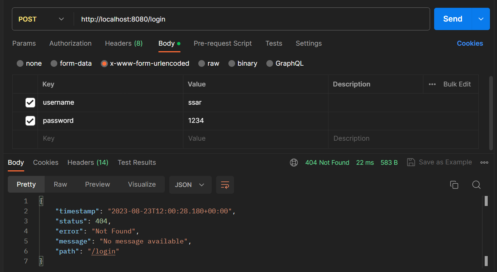
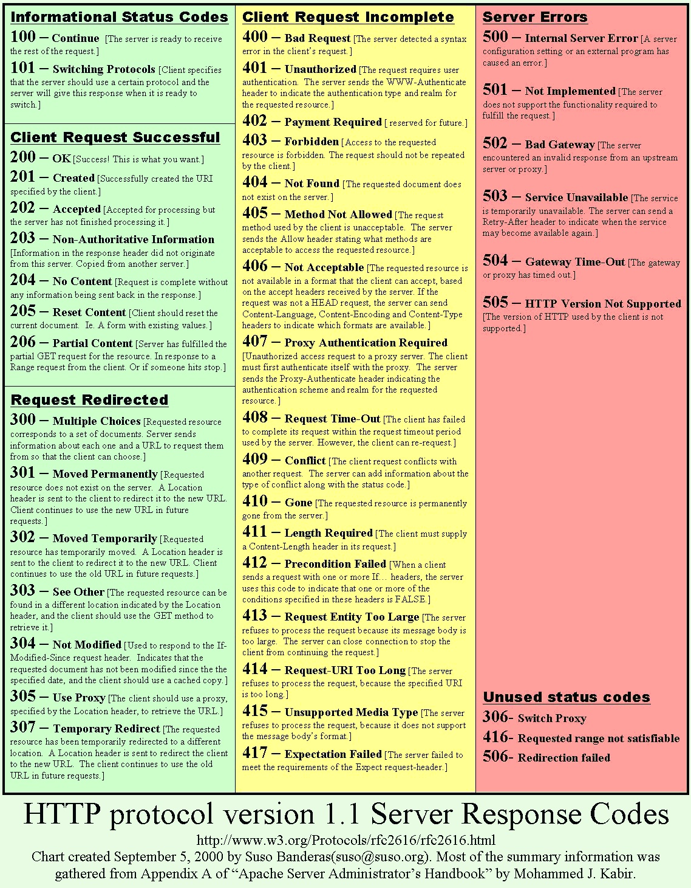
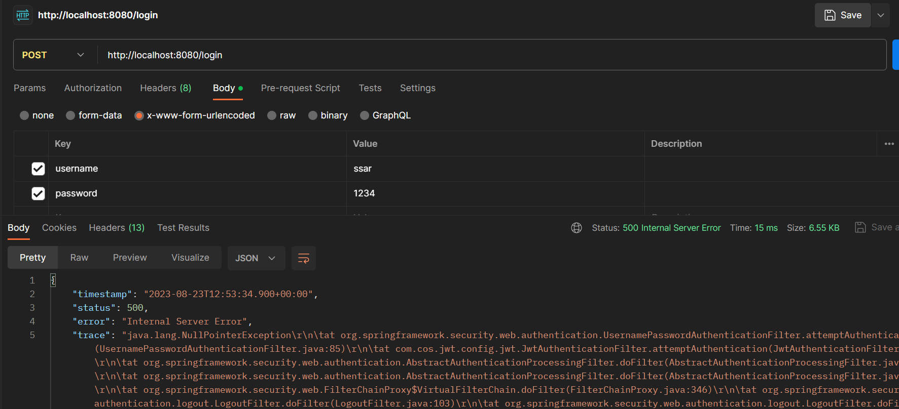
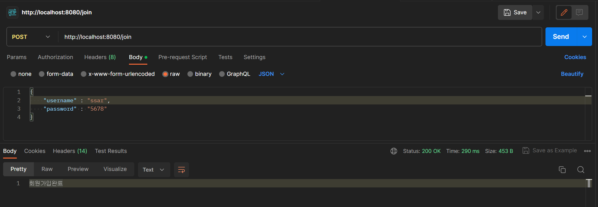

# 24강. JWT를 위한 로그인 시도

- 강의에 앞서 이전에 SecurityConfig에서 등록해준 필터부분은 주석처리 해준다.
    ```java
    @Configuration
    @EnableWebSecurity
    @RequiredArgsConstructor
    public class SecurityConfig {
        
        private final CorsFilter corsFilter;
        
        @Bean
        public SecurityFilterChain filterChain(HttpSecurity http) throws Exception{
            // 주석처리해주기
    //      http.addFilterBefore(new MyFilter3(), SecurityContextPersistenceFilter.class);
            http.csrf().disable();
            http.sessionManagement().sessionCreationPolicy(SessionCreationPolicy.STATELESS)
            .and()
            .addFilter(corsFilter)
            .formLogin().disable()
            .httpBasic().disable()
            .authorizeRequests()
                .antMatchers("/api/v1/user/**")
                .access("hasRole('ROLE_USER') or hasRole('ROLE_MANAGER') or hasRole('ROLE_ADMIN')")
                .antMatchers("/api/v1/manager/**")
                .access("hasRole('ROLE_MANAGER') or hasRole('ROLE_ADMIN')")
                .antMatchers("/api/v1/admin/**")
                .access("hasRole('ROLE_ADMIN')")
                .anyRequest().permitAll();
            
            return http.build();
        }
    }
    ```

## 24-1. UserDetails와 UserDetailsService 구현하기
### 24-1-1. PrincipalDetails
```java
@Data
public class PrincipalDetails implements UserDetails{
	
	private User user;
	
	public PrincipalDetails(User user) {
		this.user = user;
	}

	@Override
	public Collection<? extends GrantedAuthority> getAuthorities() {
		Collection<GrantedAuthority> authorities = new ArrayList<>();
		user.getRoleList().forEach(role -> {
			authorities.add(() -> role);
		});
		return authorities;
	}

	@Override
	public String getPassword() {
		return user.getPassword();
	}

	@Override
	public String getUsername() {
		return user.getUsername();
	}

	@Override
	public boolean isAccountNonExpired() {
		return true;
	}

	@Override
	public boolean isAccountNonLocked() {
		return true;
	}

	@Override
	public boolean isCredentialsNonExpired() {
		return true;
	}

	@Override
	public boolean isEnabled() {
		return true;
	}

}
```

### 24-1-2. UserRepository
```java
public interface UserRepository extends JpaRepository<User, Long>{
	public User findByUsername(String username);
}
```

### 24-1-3. PrincipalDetailsService
```java
@Service
@RequiredArgsConstructor
public class PrincipalDetailsService implements UserDetailsService{
	
	private final UserRepository userRepo;
	
	@Override
	public UserDetails loadUserByUsername(String username) throws UsernameNotFoundException {
        System.out.println("PrincipalDetailsService의 loadUserByUsername()");
		User user = userRepo.findByUsername(username);
		
		return new PrincipalDetails(user);
	}

}
```
1. 보통의 시큐리티 설정이었다면 "/login"주소가 시큐리티 로그인 Default주소임으로, "http://localhost:8080/login" URL에서 PrincipalDetailsService가 동작한다.
2. 우리는 JWT를 사용하기 위해 시큐리티 설정에서 formLogin을 disable처리해주었다. 따라서 스프링 시큐리티 기본 로그인 URL인 "/login"또한 동작하지 않는다.
3. 결론은 현재 PrincipalDetailsService클래스는 http://localhost:8080/login 주소에서 동작하지 않는다.
4. 로그인시 동작 확인 테스트
    

    - formLogin을 disable했기때문에, 기본 시큐리티 로그인 URL인 /login 요청에 대해서 404 에러가 발생하는 것을 확인할 수 있다. (404 = Not Found)
        

## 24-2. 필터만들기
- 시큐리티 기본 로그인방식인 formLogin을 disable하면서 "/login"주소가 동작하지 않으므로, 로그인한 유저 객체인 UserDetails객체가 생성되지 않고 있다.
- 그렇다면 로그인이 정상적으로 실행될 수 있도록 필터를 추가해주도록 한다.

### 24-2-1. UsernamePasswordAuthenticationFilter 추가하기
```java
@RequiredArgsConstructor
public class JwtAuthenticationFilter extends UsernamePasswordAuthenticationFilter{

}
```
- UsernamePasswordAuthenticationFilter 필터
    1. 스프링 시큐리티에서 제공하는 필터
    2. formLogin방식 사용시, "/login"요청과 함께 POST메소드로 username과 password가 오면 동작하는 필터
    3. **※※※ 하지만 현재는 SecurityConfig에서 formLogin을 disable했기때문에, "/login" 요청과 함께 username, password가 왔더라도 동작하지 않았던 것! → 404에러 발생 ※※※**
    4. 우리는 JWT를 이용하므로 formLogin방식은 여전히 필요없지만, UsernamePasswordAuthenticationFilter 필터는 필요한 상황
    5. 따라서 SecurityConfig에 해당 필터를 등록해주어야 한다.

### 24-2-2. SecurityConfig에 UsernamePasswordAuthenticationFilter 필터 등록
```java
@Configuration
@EnableWebSecurity
@RequiredArgsConstructor
public class SecurityConfig {
	
	private final CorsFilter corsFilter;
	
	AuthenticationManager authenticationManager;
	
	@Bean
	public SecurityFilterChain filterChain(HttpSecurity http) throws Exception{
		http.csrf().disable();
		http.sessionManagement().sessionCreationPolicy(SessionCreationPolicy.STATELESS) 
		.and()
		.addFilter(corsFilter)
		.formLogin().disable()
		.httpBasic().disable()
         // UsernamePasswordAuthenticationFilter 필터를 등록
		.addFilter(new JwtAuthenticationFilter(authenticationManager))
		.authorizeRequests()
			.antMatchers("/api/v1/user/**")
			.access("hasRole('ROLE_USER') or hasRole('ROLE_MANAGER') or hasRole('ROLE_ADMIN')")
			.antMatchers("/api/v1/manager/**")
			.access("hasRole('ROLE_MANAGER') or hasRole('ROLE_ADMIN')")
			.antMatchers("/api/v1/admin/**")
			.access("hasRole('ROLE_ADMIN')")
			.anyRequest().permitAll();
		
		return http.build();
	}
}
```
1. JwtAuthenticationFilter 필터가 꼭 전달해야할 파라미터가 있는데 바로 AuthenticationManager 이다.
2. UsernamePasswordAuthenticationFilter (= JwtAuthenticationFilter) 는 로그인을 진행하는 필터인데  AuthenticationManager를 통해 로그인을 진행하기 때문
3. 위와같이 코드를 작성하면 에러가난다. JwtAuthenticationFilter 에서 AuthenticationManager 를 받고있지 않기때문.
4. 다음과 같이 JwtAuthenticationFilter에다 생성자를 추가한다.

### 24-2-3. JwtAuthenticationFilter 생성자 추가 및 구현
```java
@RequiredArgsConstructor
public class JwtAuthenticationFilter extends UsernamePasswordAuthenticationFilter{
	
	private final AuthenticationManager authenticationManager;

	@Override
	public Authentication attemptAuthentication(HttpServletRequest request, HttpServletResponse response)
			throws AuthenticationException {
		System.out.println("JwtAuthenticationFilter : 로그인 시도중");

		return super.attemptAuthentication(request, response);
	}
}
```
1. @RequiredArgsConstructor 어노테이션을 통해 상수로 선언된 authenticationManager를 주입받는 생성자를 추가해준다.
2. 또한 "/login"요청을 받았을때 로그인 시도를 위해 실행되는 함수인 attemptAuthentication()를 오버라이드해준다.
3. 실제로 로그인 요청시 attemptAuthentication() 함수가 동작하는지 테스트를 위해 Sysout출력문을 찍어둔다.
4. 로그인 테스트
    - 포스트맨으로 localhost:8080/login 요청을 보내자, 다음과같이 500에러가 발생했다.
    

    - 하지만 IDE콘솔창을 확인해보면, 작성했던 출력문을 조회할 수 있다.
    

5. 이를 통해, "/login"요청이 오면 UsernamePasswordAuthenticationFilter필터가 해당 요청을 낚아채서 attemptAuthentication()함수가 자동으로 실행됨을 알 수 있다.
6. 그렇다면 이제 attemptAuthentication() 함수에서 해아할 것은 다음과 같다.
    - 6-1. 우선 사용자의 로그인 요청을 낚아채어 username과 password를 받아온다.
    - 6-2. 받아온 사용자 인증정보를 이용해서 해당 정보가 정상인지 로그인 시도를 해본다. (이때 사용되는 것이 AuthenticationManager!)
    - 6-3. 로그인 정보가 정상임이 확인되었을때, UserDetailsService를 구현한 PrincipalDetailsService가 호출되어 loadUserByUsername() 함수가 실행된다.
    - 6-4. loadUserByUsername() 함수가 실행되어 반환된 PrincipalDetails객체(유저정보가 담긴)를 권한관리를 위해 시큐리티 세션에 담아준다. 
        - ※ 만약 사용자의 권한별로 접근제어를 할 필요가 없다면 굳이 시큐리티 세션에 담아주지 않아도 된다. 시큐리티 세션에 유저정보를 담는 이유는 **only 권한관리**를 위해서일 뿐 ! ※
    - 6-4. 정상적으로 로그인이 완료되었으니, 우리는 JWT토큰을 만들어 사용자에게 응답해주면 된다.

## (+) 회원가입 로직 추가
### 1. SecurityJwtApplication에 BCryptPasswordEncoder 추가
```java
@SpringBootApplication
public class SecurityJwtApplication {

	@Bean
	public BCryptPasswordEncoder bCryptPasswordEncoder() {
		return new BCryptPasswordEncoder();
	}
	
	public static void main(String[] args) {
		SpringApplication.run(SecurityJwtApplication.class, args);
	}

}
```

### 2. RestApiController에 회원가입 로직 추가
```java
@Autowired
private UserRepository userRepo;

@PostMapping("/join")
public String join(@RequestBody User user) {
    user.setPassword(bCryptPasswordEncoder.encode(user.getPassword()));
    user.setRoles("ROLE_USER");
    userRepo.save(user);
    
    return "회원가입완료";
}
```

### 3. 포스트맨으로 테스트하기
