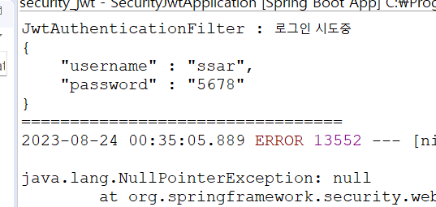

# 25강. JWT를 위한 강제 로그인 진행
## 25-1. attemptAuthentication() 함수에서 구현할 내용
1. 사용자의 로그인 요청 낚아채어 username과 password를 받아오기
2. 받아온 로그인 정보로 AuthenticationManager 이용하여 로그인 시도 해보기
3. 로그인 정보가 정상일때 PrincipalDetailsService가 호출되어 loadUserByUsername()이 실행됨 → 그 반환 값인 PrincipalDetails객체(유저정보가 담긴)를 권한관리를 위해 시큐리티 세션에 담기
4. 정상적으로 로그인 완료되었으니 JWT토큰만들어 사용자에게 응답

## 25-2. JwtAuthenticationFilter - attemptAuthentication() 함수 구현하기
### 25-2-1. 첫번째, 로그인 정보 가져오기(1)
- 코드
	```java
	@Override
	public Authentication attemptAuthentication(HttpServletRequest request, HttpServletResponse response)
			throws AuthenticationException {
		System.out.println("JwtAuthenticationFilter : 로그인 시도중");
		
		// username, password 받아오기
		try {
			BufferedReader br = request.getReader();
			
			String input = null;
			while((input = br.readLine()) != null) {
				System.out.println(input);
			}
			
		} catch (IOException e) {
			e.printStackTrace();
		}
		System.out.println("=================================");
		return super.attemptAuthentication(request, response);
	}
	```
- 로그인 요청 테스트
    1. form-unlencoded방식(웹)으로 로그인 정보 담아 요청하기
        

        

    2. JSON방식으로 로그인 정보 담아 요청하기
        

        

1. 포스트맨으로 로그인 요청을 해보면 콘솔에 로그인 정보가 정상적으로 출력되는 것을 확인할 수 있다.
2. 그런데 로그인 방식은 매우 다양하므로(웹, 안드로이드, 리액트, ...) request에서 받아온 로그인 데이터 형태가 제각각일 수 있다. (위 사진 참조)
	- 2-1. 따라서 원래는 다양한 형태의 로그인 데이터를 가공할 수 있도록 파싱하는 과정이 필요하다.
	- 2-2. 우리는 JSON으로 로그인 요청을 한다고 가정하고, JSON형태의 로그인 데이터를 파싱하기로 한다.

### 25-2-2. 첫번째, 로그인 정보 가져오기(2) : JSON 로그인정보를 파싱하여 username과 password 가져오기
- 코드
	```java
	@Override
	public Authentication attemptAuthentication(HttpServletRequest request, HttpServletResponse response) throws AuthenticationException {
		System.out.println("JwtAuthenticationFilter : 로그인 시도중");
		
		try {
	// 			주석처리
	//			BufferedReader br = request.getReader();
	//			
	//			String input = null;
	//			while((input = br.readLine()) != null) {
	//				System.out.println(input);
	//			}
			
			// 1. username, password 받아서
			ObjectMapper om = new ObjectMapper(); // JSON데이터를 파싱해줌
			User user = om.readValue(request.getInputStream(), User.class);
			System.out.println(user);
			
		} catch (IOException e) {
			e.printStackTrace();
		}
		System.out.println("=================================");
		
		return null;
	}
	```
	1. ObjectMapper를 이용하면 JSON데이터를 쉽게 파싱할 수 있다.
	2. User 인스턴스에 담긴 내용을 출력해본다.
		> User(id=0, username=ssar, password=1234, roles=null)
		- 이제 담긴 정보를 이용하여 로그인 시도를 해본다.

### 25-2-3. 두번째, 받아온 로그인 정보로 AuthenticationManager 이용, 로그인 시도하기
- 코드
	```java
	@Override
	public Authentication attemptAuthentication(HttpServletRequest request, HttpServletResponse response) throws AuthenticationException {
		System.out.println("JwtAuthenticationFilter : 로그인 시도중");
		
		try {
	// 			주석처리
	//			BufferedReader br = request.getReader();
	//			
	//			String input = null;
	//			while((input = br.readLine()) != null) {
	//				System.out.println(input);
	//			}
			
			// 1. username, password 받아서
			ObjectMapper om = new ObjectMapper(); // JSON데이터를 파싱해줌
			User user = om.readValue(request.getInputStream(), User.class);
			System.out.println(user);

			// 2. 정상인지 로그인 시도 해보기. authenticationManager로 로그인 시도를 하면
			// PrincipalDetailsService가 호출되어 loadUserByUsername()함수가 실행됨.
			UsernamePasswordAuthenticationToken authenticationToken =
					new UsernamePasswordAuthenticationToken(user.getUsername(), user.getPassword()); // ID, PW

			// 2-1. loadUserByUsername()함수가 실행되어 반환된 PrincipalDetails객체(유저정보가담긴)를 시큐리티 세션에 담고(권한관리를 위해서)
			// PrincipalDetailsService의 loadUserByUsername() 함수가 실행된 후 정상이면 authentication이 리턴됨(로그인정보)
			// authentication에 값이 담기면 DB에 있는 username과 password가 일치한다는 의미
			Authentication authentication = 
					authenticationManager.authenticate(authenticationToken);
			
			PrincipalDetails principalDetails = (PrincipalDetails)authentication.getPrincipal();
			System.out.println("로그인 완료됨 : " + principalDetails.getUser().getUsername()); // 로그인이 정상적으로 되었다는 뜻.
			// authentication객체를 session영역에 저장을 해야하고 그 방법이 return 해주면 됨.
			// 리턴의 이유는 권한 관리를 security가 대신 해주기 때문에 편하려고 하는거임
			// 굳이 JWT토큰을 사용하면서 세션을 만들 이유가 없음. 근데 단지 권한처리때문에 session에 넣는거
			
			// 세션에 넣기전에 마지막으로 할 일은 JWT토큰을 만들어야 함 !!

			// 4. JWT토큰을 만들어서 응답해주면 됨

			return authentication;

		} catch (IOException e) {
			e.printStackTrace();
		}
		System.out.println("=================================");
		
		return null;
	}
	```
	1. 로그인 시도를 하기 위해선 토큰을 만들어야 함. (UsernamePasswordAuthenticationToken)
		- 시큐리티에서 제공하는 formLogin을 사용하면 자동적으로 진행되는 과정이나, 우리는 formLogin을 사용하지 않으므로 직접 구현해주어야 한다.
	2. UsernamePasswordAuthenticationToken을 만들어서 첫번째 파라미터로 username(ID), 두번째 파라미터로 password를 담는다.
		> UsernamePasswordAuthenticationToken authenticationToken =
					new UsernamePasswordAuthenticationToken(user.getUsername(), user.getPassword());
	3. 로그인 정보를 담은 토큰으로 로그인 시도를 해본다.   
	 authenticationManager를 전송하면, PrincipalDetailsService가 호출되어 loadUserByUsername()함수가 실행된다.   
	 (이때, loadUserByUsername()함수는 username만 필요로 한다. 같이 보낸 password는 스프링에서 자동적으로 처리해주므로 신경쓸 필요 없음)
		> authenticationManager.authenticate(authenticationToken);
	4. loadUserByUsername()함수가 실행되어 로그인 정보가 정상임이 확인되면 PrincipalDetails객체(로그인정보)가 반환되는데, 반환된 PrincipalDetails는 authentication변수에 담긴다.
		> Authentication authentication = 
					authenticationManager.authenticate(authenticationToken);
	5. 결국 authentication변수에 값이 담겨있다면, 사용자가 보낸 로그인 요청이 DB에 있는 값과 일치한다는 의미와 동일하다.
	6. authentication변수에 값이 있는지 출력해본다.
		> PrincipalDetails principalDetails = (PrincipalDetails)authentication.getPrincipal();   
		System.out.println("로그인 완료됨 : " + principalDetails.getUser().getUsername());
	7. 결과 확인
		
		> JwtAuthenticationFilter : 로그인 시도중   
User(id=0, username=ssar, password=1234, roles=null)   
PrincipalDetailsService의 loadUserByUsername()   
Hibernate: select user0_.id as id1_0_, user0_.password as password2_0_, user0_.roles as roles3_0_, user0_.username as username4_0_ from User user0_ where user0_.username=?   
로그인 완료됨 : ssar