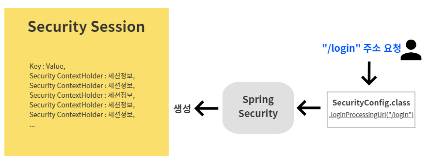
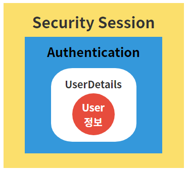
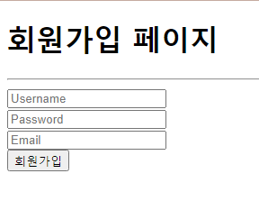
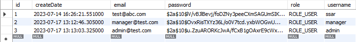
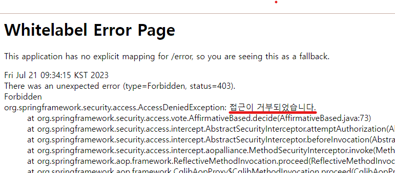

# 1강. 환경설정
## 1-1. MySQL Database 및 사용자 생성
```sql
create user 'cos'@'%' identified by 'cos1234';
GRANT ALL PRIVILEGES ON *.* TO 'cos'@'%';
create database security;
use security;
```

## 1-2. 프로젝트 생성
- 추가할 dependencies
    - Spring Boot DevTools
    - Lombok
    - Spring Data JPA
    - MySQL Driver
    - Spring Security
    - Mustache
    - Spring Web

## 1-3. application.yml 설정
```
server:
  port: 8080
  servlet:
    context-path: /
    encoding:
      charset: UTF-8
      enabled: true
      force: true
      
spring:
  datasource:
    driver-class-name: com.mysql.cj.jdbc.Driver
    url: jdbc:mysql://localhost:3306/security?serverTimezone=Asia/Seoul
    username: cos
    password: cos1234
    
  mvc:
    view:
      prefix: /templates/
      suffix: .mustache

  jpa:
    hibernate:
      ddl-auto: update
      naming:
        physical-strategy: org.hibernate.boot.model.naming.PhysicalNamingStrategyStandardImpl
    show-sql: true
```
- mvc/view/prefix와 mvc/view/suffix를 확인해보면 각각 /templates/와 .mustache로 설정되어있다.
	- 기본경로는 src/main/resources이므로 컨트롤러에서 뷰페이지를 반환할때 최종경로는 <U>**src/main/resources/templates/페이지명.mustache**</U> 가 된다.
	- 우린 이미 dependencies에 템플릿 엔진으로 mustache를 추가해두었기 때문에, 사실상 mvc/view/prefix와 mvc/view/suffix 설정은 하지 않아도 무방하다.
	- .mustache파일을 템플릿 엔진으로 추가해뒀지만, 편의상 .html파일을 이용할 것이므로 추가적인 뷰리졸버 설정이 필요하다. <U>**→ (1-4. 뷰리졸버 설정)**</U>

## 1-4. 뷰리졸버 설정
```java
import org.springframework.boot.web.servlet.view.MustacheViewResolver;
import org.springframework.context.annotation.Configuration;
import org.springframework.web.servlet.config.annotation.ViewResolverRegistry;
import org.springframework.web.servlet.config.annotation.WebMvcConfigurer;

@Configuration
public class WebMvcConfig implements WebMvcConfigurer{
	
	@Override
	public void configureViewResolvers(ViewResolverRegistry registry) {
		MustacheViewResolver resolver = new MustacheViewResolver();
		resolver.setCharset("UTF-8");
		resolver.setContentType("text/html; chatset=UTF-8");
		resolver.setPrefix("classpath:/templates/");
		resolver.setSuffix(".html");
		
		registry.viewResolver(resolver);
	}
}
```
- prefix 세팅값인 classpath:/templates/ 에서 classpath는 src/main/resources를 의미한다.
- prefix, suffix 설정을 통해 이제 컨트롤러에서 반환하는 뷰페이지의 최종경로는 <U>**src/main/resources/templates/페이지명.html**</U>이다.


# 2강. 시큐리티 설정
## 2-1. 컨트롤러 매핑 주소 생성
```java
@Controller
public class IndexController {

	@GetMapping({"","/"})
	public String index() {
		return "index";
	}
	
	@GetMapping("/user")
	public @ResponseBody String user() {
		return "user";
	}
	
	@GetMapping("/admin")
	public @ResponseBody String admin() {
		return "admin";
	}
	
	@GetMapping("/manager")
	public @ResponseBody String manager() {
		return "manager";
	}
	
	@GetMapping("/loginForm")
	public String loginForm() {
		return "loginForm";
	}
	
	@GetMapping("/joinForm")
	public String joinForm() {
		return "joinForm";
	}

	@PostMapping("/join")
	public String join(){
		return "join";
	}
}
```
- "/login"과 "/logout" 이 없는이유
	- 해당주소는 특별한 설정이 없으면 스프링 시큐리티가 이를 낚아챈 후, 
	- 시큐리티에서 기본적으로 제공하는 로그인, 로그아웃 페이지로 이동시킨다.
	- 그러므로 해당주소를 가진 컨트롤러를 생성해줄 필요는 없다.

## 2-2. SecurityConfig 설정
- 권한별 페이지 접근권한을 상세하게 해주기 위해 SecurityConfig 파일을 작성해준다.
- 참고. [Deprecated된 WebSecurityConfigurerAdapter 대처방법](https://velog.io/@pjh612/Deprecated%EB%90%9C-WebSecurityConfigurerAdapter-%EC%96%B4%EB%96%BB%EA%B2%8C-%EB%8C%80%EC%B2%98%ED%95%98%EC%A7%80)
```java
@Configuration
@EnableWebSecurity
public class SecurityConfig{

    @Bean
    public SecurityFilterChain filterChain(HttpSecurity http) throws Exception{
        http.csrf().disable();
		http.authorizeRequests()
			.antMatchers("/user/**").authenticated()
			.antMatchers("/manager/**").access("hasRole('ROLE_ADMIN') or hasRole('ROLE_MANAGER')")
			.antMatchers("/admin/**").access("hasRole('ROLE_ADMIN')")
			.anyRequest().permitAll()
			.and()
			.formLogin()
			.loginPage("/loginForm")
			.defaultSuccessUrl("/");
		
		return http.build();
    }
}
```
1. **@Configuration** : 스프링 컨테이너가 동작할때, 해당 클래스파일 설정값을 컨테이너에 등록. 의존성 주입(DI)
2. **@EnableWebSecurity** : 스프링 시큐리티 필터(SecurityConfig.class, 해당 클래스파일)를 스프링 필터 체인에 등록. 즉, 현재 클래스에 등록할 필터들을 기본 필터 체인(Spring FilterChain)에 등록시키기 위해 설정.
3. **@Bean** : 해당 메서드의 리턴되는 오브젝트를 IoC로 등록해준다.
4. 
	```java
	http.csrf().disable();
	```
	- csrf 란? cross site request forgery, 사이트 간 위조요청. <U>정상적인 사용자가 의도치않은 위조요청을 보내는것을 막음</U>
	- REST API의 앤드포인트에 의존하는 구조(JSON방식으로 통신)는 서버쪽에 세션이나 브라우저 쿠키에 의존하지 않음. 따라서 더이상 CSRF에 대한 관련이 없으며 이러한 API는 CSRF공격을 받을 가능성이 존재하지 않으므로 disable() 해준다.
5. 
	```java
	http.authorizeRequests() // (1)
		.antMatchers("/user/**").authenticated() // (2)
		.antMatchers("/manager/**").access("hasRole('ROLE_ADMIN') or hasRole('ROLE_MANAGER')") // (3)
		.antMatchers("/admin/**").access("hasRole('ROLE_ADMIN')") // (4)
		.anyRequest().permitAll() // (5)
	```
	- (1) 요청 url마다 접근권한 설정해주기
	- (2) "/user/**" 요청은 인증이 필요하다. 즉, 로그인한 사람만 접근가능.(로그인한 사용자는 모두 접근가능)
	- (3) "/manager/**" 식의 요청은 로그인 한 사용자 중 admin과 manager만 접근가능
	- (4) "/admin/**" 식의 요청은 로그인 한 사용자 중 admin만 접근가능
	- (5) "/user/**", "/manager/**", "/admin/**" 를 제외한 다른 요청들은 권한 상관없이 접근가능
6. 
	```java
	.formLogin() 
	.loginPage("/loginForm")
	```
	- 권한이 없는 페이지에 접근하려고 할때, 404페이지가 아니라 로그인 페이지를 보여주기
	- 이는 사용자가 아직 로그인을 하지 않았을 경우에 해당하는 설정임. 만약 로그인 한 경우인데 권한없는 페이지로 가려고 한다면 로그인페이지가 아닌 404페이지로 보냄(접근권한이 없는 페이지로 이동하려고 했으니 없는페이지 404표시)
7. 
	```java
	.defaultSuccessUrl("/");
	```
	- default페이지는 메인페이지로 설정
	- "/loginForm"을 요청해서 로그인을 완료했을 경우에는 default페이지가 메인페이지("/")이고, 만약 "/user"를 요청해서 로그인 실행을 했을 경우는 스프링시큐리티가 default페이지인 메인페이지가 아닌 사용자가 가려고 했던 "/user" 페이지로 이동시켜줌. (시큐리티가 제공해주는 기능)


# 3강. 시큐리티 회원가입
## 3-1. model생성 : User
```java
import java.sql.Timestamp;

import javax.persistence.Entity;
import javax.persistence.GeneratedValue;
import javax.persistence.GenerationType;
import javax.persistence.Id;

import org.hibernate.annotations.CreationTimestamp;

import lombok.Data;

@Entity
@Data
public class User {
	
	@Id
	@GeneratedValue(strategy = GenerationType.IDENTITY) // 자동생성, auto_increment
	private int id;
	private String username;
	private String password;
	private String email;
	private String role; // ROLE_USER, ROLE_ADMIN
	@CreationTimestamp // 자동생성
	private Timestamp createDate;
}
```
- @Entity를 붙여주면, 프로젝트와 연결된 DB에 User라는 이름의 위 필드들을 컬럼으로 가진 테이블이 생성됨.

## 3-2. 로그인 및 회원가입 페이지 생성
- IndexController의 "/loginForm"과 "/joinForm" 리턴값인 로그인, 회원가입 페이지를 생성한다.
```html
</head>
<body>
<h1>로그인 페이지</h1>
<hr/>
<form>
	<input type="text" name="username" placeholder="Username" /><br />
	<input type="password" name="password" placeholder="Password" /><br />
	<button>로그인</button>
</form>
<a href="/joinForm">회원가입을 아직 하지 않으셨나요?</a>
</body>
```
```html
<body>
<h1>회원가입 페이지</h1>
<hr/>
<form action="/join" method="POST">
	<input type="text" name="username" placeholder="Username" /><br />
	<input type="password" name="password" placeholder="Password" /><br />
	<input type="email" name="email" placeholder="Email" /><br />
	<button>회원가입</button>
</form>
</body>
```
- 로그인 및 회원가입 시, input박스의 name속성들은 앞서 만들어둔 User엔티티의 필드명과 동일하게 작성해주어야 한다.
- 회원가입 경로는 아래와 같다.
	- "/loginForm" 로그인페이지로 이동 
	- → 회원가입을 아직 하지 않으셨나요? 링크 클릭 
	- → "/joinForm" 회원가입페이지로 이동
	- → 회원가입정보입력(이름, 비밀번호, 이메일) 
	- → "/join" 회원가입진행

## 3-3. 시큐리티 회원가입 및 비밀번호 암호화
#### 3-3-1. 회원가입
- 이제 사용자가 joinForm에서 입력한 회원가입정보를 이용하여 회원가입을 진행한다.
```java
// UserRepository

public interface UserRepository extends JpaRepository<User, Integer>{

}
```
- JpaRepository : 기본적인 CRUD함수를 JpaRepository가 갖고 있다.
	- JpaRepository에다 엔티티클래스와 해당 엔티티의 @Id(PrimaryKey) 타입을 넘겨준다. → <User, Integer>
	- JpaRepository를 상속하면 @Repository라는 어노테이션이 없어도 스프링 컨테이너에 빈으로 등록된다.(IoC)
```java
// IndexController

@Controller
public class IndexController {
	
	@Autowired
	private UserRepository userRepository;

	@PostMapping("/join")
	public String join(User user) {
		user.setRole("ROLE_USER");
		userRepository.save(user);
		
		return "join";
	}
}
```
- **user.setRole("ROLE_USER");**
	- 회원가입정보로 넣어준 이름, 비밀번호, 이메일을 제외하면 회원id, 회원role, createDate 필드가 null값이다.
	- 하지만, id같은 경우 @GeneratedValue 어노테이션을 이용하여 auto_increment 설정을 해주었고,
	- createDate는 @CreationTimestamp 어노테이션을 통해 자동생성되게끔 설정해주었으므로
	- 회원role값만 추가적으로 설정해준다. 이를 통해 우선 회원가입하는 모든 사용자는 ROLE_USER권한을 갖게된다.
- **userRepository.save(user);**
	- 간단하게 회원가입 로직이 완성되었다. 하지만 해당 정보를 가지고 시큐리티 로그인은 불가능하다.
	- 그 이유는 회원가입시 비밀번호를 1234로 등록했을때, 이를 <U>**암호화하지않고 DB에 그대로 저장(1234)**</U>했기 때문.
	- 패스워드 암호화를 해주어야 시큐리티 로그인이 가능하다.

#### 3-3-2. 비밀번호 암호화
- SecurityConfig에서 비밀번호 암호화 로직을 빈으로 등록해준다.
```java
// SecurityConfig

@Configuration
@EnableWebSecurity
public class SecurityConfig{
	
	@Bean 
	public BCryptPasswordEncoder encodePwd() {
		return new BCryptPasswordEncoder();
	}
}
```
- 컨트롤러에 암호화 로직을 추가해준다.
```java
// IndexController

@Controller
public class IndexController {
	
	@Autowired
	private UserRepository userRepository;

	@Autowired
	private BCryptPasswordEncoder bcryptPasswordEncoder;

	@PostMapping("/join")
	public String join(User user) {
		user.setRole("ROLE_USER");

		// 비밀번호 암호화
		String rawPassword = user.getPassword();
		String encPassword = bcryptPasswordEncoder.encode(rawPassword);
		user.setPassword(encPassword);

		userRepository.save(user);
		
		return "redirect:/loginForm"; // redirect를 붙여주면 /loginForm URL에 해당하는 함수를 호출. loginForm()
	}
}
```
- **user.setPassword(encPassword);** : 유저에 인코딩된 패스워드를 넣어준 후, .save()하여 회원가입을 진행한다.
- **return "redirect:/loginForm";** : 회원가입을 완료한 사용자는 redirect를 이용하여 /loginForm URL로 보내준다.

# 4강. 시큐리티 로그인
## 4-1. SecurityConfig 설정추가
```java
// SecurityConfig
@Bean
public SecurityFilterChain filterChain(HttpSecurity http) throws Exception{
	http.authorizeRequests()
		···
		.loginProcessingUrl("/login")
		···

	return http.build();
}
```
- **.loginProcessingUrl("/login")**
	- "/login" 주소가 호출이 되면 시큐리티가 낚아채서 대신 로그인을 진행해준다.(method = POST)
	- 따라서 우리는 /login주소와 매핑할 컨트롤러를 만들 필요가 없다.

## 4-2. loginForm.html 수정
```html
<body>
<h1>로그인 페이지</h1>
<hr/>
<form action="/login" method="POST">
	<input type="text" name="username" placeholder="Username" /><br />
	<input type="password" name="password" placeholder="Password" /><br />
	<button>로그인</button>
</form>
<a href="/joinForm">회원가입을 아직 하지 않으셨나요?</a>
</body>
```
- **action="/login" method="POST"** : 로그인 정보를 입력후 로그인버튼을 누르면 "/login" 요청을 보내게 되는데, 앞서 SpringSecurity에 설정해준대로 해당 로그인 요청은 스프링 시큐리티가 낚아채어 로그인을 진행시켜준다.
- 여기서 끝이 아니다. 시큐리티 로그인을 성공적으로 수행하기 위해선 추가적인 설정이 필요하다.

## 4-3. UserDetails, UserDetailsService 구현
### 4-3-1. 잠깐 서론,


1. 앞서 SecurityConfig에 loginProcessingUrl("/login")설정을 통해, 이제 시큐리티는 "/login" 요청이 오면 이를 낚아채서 로그인을 진행시킴
2. 이때 로그인이 완료되면 Security Session을 만들어 여기에 로그인 정보를 넣어준다.
3. 시큐리티가 갖고 있는 세션은 Security ContextHolder를 Key로 갖고, 세션정보를 Value로 가짐
4. 이때, <U>**시큐리티 세션에 들어갈 수 있는 오브젝트는 Authentication타입의 객체뿐**</U>이다.
5. 그러므로 로그인을 수행하기 위해선 Authentication안에 User정보가 있어야 한다.
6. 단, Authentication안에 User정보는 UserDetails타입 객체로 저장되어 있어야 한다. 이러한 관계를 정리해보면 아래 그림과 같다.



- 정리해보자면,
	- Security Session 영역
	- => 들어갈 수 있는 객체는 Authentication 타입의 객체
	- => Authentication 객체 안에 유저정보 저장시, 유저정보는 UserDetails타입이어야만 함
- 즉, 유저정보는 UserDetails타입으로 감싸져서 Authentication타입 객체에 저장되어 SecuritySession영역에 존재하는 것!

**그렇다면 유저정보를 꺼낼때에는 ?**
- Security Session에 있는 객체를 **.get()** 해서 Authentication객체를 꺼내고, 그 속에 UserDetails객체를 꺼내어 유저정보에 접근하면 된다.
	- 그렇다면, UserDetails객체에서 어떻게 유저정보를 꺼낼까?
	- <U>**→ UserDetails를 상속받는 클래스를 만들어서, UserDetails타입이 된 해당 클래스로 유저정보를 빼내면 된다 !**</U>

### **4-3-2. UserDetails구현 : PrincipalDetails implements UserDetails**
- Spring Security에서 사용자의 정보를 담는 인터페이스
- Spring Security에서 사용자의 정보를 불러오기 위해서 구현해야하는 인터페이스
- 유저정보를 담기 위한 UserDetails객체를 만들어보자 !
```java
public class PrincipalDetails implements UserDetails{
	
	// 콤포지션(has-a)
	// 기존클래스가 새로운 클래스의 구성요소로 사용되는것
	// 기존 클래스를 확장하는 대신, 새로운 클래스에 private필드로 구체 클래스의 인스턴스를 참조
	// 상이한 클래스 관계에서, 한 클래스가 다른 클래스의 기능을 사용하여 구현해야 할때, composition(합성)을 사용
	private User user; 
	
	// PrincipalDetails객체 생성과 동시에 필드값도 채움
	// 따라서 생성된 PrincipalDetails객체는 생성자 파라미터에 넘어온 유저에 한해서만 기능을 동작함. 
	public PrincipalDetails(User user) {
		this.user = user;
	}
	
	// User의 권한을 리턴
	@Override
	public Collection<? extends GrantedAuthority> getAuthorities() {
		Collection<GrantedAuthority> collect = new ArrayList<>(); 
		collect.add(new GrantedAuthority() {
			@Override
			public String getAuthority() {
				return user.getRole();
			}
		});
		return collect;
	}

	// User의 패스워드를 리턴
	@Override
	public String getPassword() {
		return user.getPassword();
	}

	// User의 이름를 리턴
	@Override
	public String getUsername() {
		return user.getUsername();
	}

	// 해당 계정이 만료되지 않았는지 여부 (만료X : true | 만료O : false)
	@Override
	public boolean isAccountNonExpired() {
		return true;
	}

	// 해당 계정이 잠겼는지 여부 (잠김X : true | 잠김O : false)
	@Override
	public boolean isAccountNonLocked() {
		return true;
	}

	// 해당 계정의 비밀번호가 유효기간이 지났는지 여부(오래된 비밀번호 사용중인지 여부) (지남X : true | 지남O : false)
	@Override
	public boolean isCredentialsNonExpired() {
		return true;
	}

	// 해당 계정이 활성화되어있는지 여부 (활성화O : true | 활성화x : false)
	@Override
	public boolean isEnabled() {
		// 우리 사이트에서 1년동안 회원이 로그인을 안해서 휴면 계정으로 변환되었다면 그때 false값 반환
		// 즉, 현재시간 - 마지막 로그인 날짜 => 1년을 초과하면 return false;
		return true;
	}
}
```
1. 
	```java
	// User의 권한을 리턴
	@Override
	public Collection<? extends GrantedAuthority> getAuthorities() {
		Collection<GrantedAuthority> collect = new ArrayList<>(); // ArrayList는 Collection의 자식임 
		collect.add(new GrantedAuthority() {
			@Override
			public String getAuthority() { // String을 리턴할 수 있음
				return user.getRole();
			}
		});
		return collect;
	}
	```
	- model패키지의 User를 확인해보면, User권한은 String타입인데 해당 메소드의 리턴값은 Collection\<GrantedAuthority\>이므로 Collection에 감싸서 유저권한정보를 넘겨야한다.
	- 그러므로 우선 리턴값으로 사용될 Collection\<GrantedAuthority\> 타입 변수 collect를 선언해주고, Collection의 자식인 ArrayList로 초기화 시켜준다. 그리고 collect를 반환한다.
		```java
		@Override
		public Collection<? extends GrantedAuthority> getAuthorities() {
			Collection<GrantedAuthority> collect = new ArrayList<>(); // ArrayList는 Collection의 자식임 
			return collect;
		}
		```
	- 이제 반환할 collect안에 GrantedAuthority타입을 넣어줘야 하므로(해당 메소드의 리턴타입과 동일하게) new GrantedAuthority() 를 입력해준다.
		```java
		@Override
		public Collection<? extends GrantedAuthority> getAuthorities() {
			Collection<GrantedAuthority> collect = new ArrayList<>(); // ArrayList는 Collection의 자식임 
			collect.add(new GrantedAuthority() {
				@Override
				public String getAuthority() { // String을 리턴할 수 있음
					return user.getRole();
				}
			});
			return collect;
		}
		```
	- 그럼 GrantedAuthority 인터페이스의 getAuthority() 메소드가 오버라이드 되는데, 해당 메소드는 String을 반환할 수 있으므로 여기에다 유저의 권한정보를 반환해주면 완성 !
2. 이 외에도 UserDetails 인터페이스의 기본 오버라이드 메서드들은 아래와 같다.

	<table>
		<thead>
			<tr>
				<th>메소드</th>
				<th>리턴타입</th>
				<th>설명</th>
				<th>기본값</th>
			</tr>
		</thead>
		<tbody>
			<tr>
				<td>getAuthorities()</td>
				<td>Collection<? extends GrantedAuthority></td>
				<td>계정의 권한 목록</td>
				<td></td>
			</tr>
			<tr>
				<td>getPassword()</td>
				<td>String</td>
				<td>계정의 비밀번호</td>
				<td></td>
			</tr>
			<tr>
				<td>getUsername()</td>
				<td>String</td>
				<td>계정의 고유한 값(ex. DB의 PK값, 중복이 없는 회원id값 등)</td>
				<td></td>
			</tr>
			<tr>
				<td>isAccountNonExpired()</td>
				<td>boolean</td>
				<td>계정의 만료 여부</td>
				<td>true(만료안됨)</td>
			</tr>
			<tr>
				<td>isAccountNonLocked()</td>
				<td>boolean</td>
				<td>계정의 잠김 여부</td>
				<td>true(안잠김)</td>
			</tr>
			<tr>
				<td>isCredentialsNonExpired()</td>
				<td>boolean</td>
				<td>계정의 비밀번호 만료 여부</td>
				<td>true(만료안됨)</td>
			</tr>
			<tr>
				<td>isEnabled()</td>
				<td>boolean</td>
				<td>계정의 활성화 여부</td>
				<td>true(활성화됨)</td>
			</tr>
		</tbody>
	</table>
- 이제 PrincipalDetails가 UserDetails를 상속하여 UserDetails타입이 되었으므로, 이를 Authentication객체에 넣을 수 있게 되었다.
- 그렇다면 이제 SecuritySession에 접근하기 위한 Authentication객체를 생성해보자.

### **4-3-3. UserDetailsService구현 : PrincipalDetailsService implements UserDetailsService**
- Spring Security에서 유저의 정보를 가져오는 인터페이스
- Spring Security에서 유저의 정보를 불러오기 위해서 구현해야하는 인터페이스
- 유저정보가 담긴 UserDetails객체를 SecuritySesssion에 넣기 위해 Authentication객체로 감싸주자 !
```java
@Service
public class PrincipalDetailsService implements UserDetailsService{

	@Autowired
	private UserRepository userRepository;
	
	@Override
	public UserDetails loadUserByUsername(String username) throws UsernameNotFoundException {
		System.out.println("username : "+username);
		User userEntity = userRepository.findByUsername(username);
		if(userEntity != null) { 
			return new PrincipalDetails(userEntity); 
		}											 
		return null;
	}
}
```
1. 
	```java
	@Service
	public class PrincipalDetailsService implements UserDetailsService{ }
	```
	- SecurityConfig에서 loginProcessingUrl("/login") 설정은,
		- "/login" 요청이 왔을때 자동으로 UserDetailsService타입으로 IoC되어 있는 loadUserByUsername()함수를 실행시킨다.
		- 자동 IoC를 위해 해당 클래스에는 @Service 어노테이션을 붙여주자.
2. 사용자가 "/login"요청을 하자마자 (1)에서 말한 것처럼 스프링 컨테이너는 UserDetailsService 타입으로 등록된 빈을 찾는다. (그것이 바로 해당 클래스 파일인 PrincipalDetailsService.class !)
3. 
	```java
	@Override
	public UserDetails loadUserByUsername(String username) throws UsernameNotFoundException { }
	```
	- UserDetailsService타입의 빈인 PrincipalDetailsService.class를 찾은 후 loadUserByUsername()함수를 실행시켜, 로그인시 사용자가 입력한 username파라미터 값을 가져온다. (이때, loginForm.html에 유저이름을 넣는 input태그의 name속성은 무조건 "username"으로 오탈자 없이 적어줘야한다.)
4. 
	```java
	// UserRepository.class
	public interface UserRepository extends JpaRepository<User, Integer>{
		// Jpa Query methods
		// select * from user where username = ?
		public User findByUsername(String username); 
	}
	


	// PrincipalDetailsService.class
	@Autowired
	private UserRepository userRepository;

	@Override
	public UserDetails loadUserByUsername(String username) throws UsernameNotFoundException {
		User userEntity = userRepository.findByUsername(username);
		return null;
	}
	```
	- loadUserByUsername()에서는 가져온 username파라미터를 이용하여, 로그인을 시도한 사용자가 DB에 저장되어 있는 회원인지를 검증한다.
5. 
	```java
	@Override
	public UserDetails loadUserByUsername(String username) throws UsernameNotFoundException {
		User userEntity = userRepository.findByUsername(username);
		if(userEntity != null) { 
			return new PrincipalDetails(userEntity); 
		}											 
		return null;
	}
	```
	- 가입되어 있는 유저라면 (userEntity != null), 해당 유저정보를 앞서 구현해둔 UserDetails타입의 PrincipalDetails객체에 담아 UserDetails타입의 객체를 생성하여 반환한다.(```return new PrincipalDetails(userEntity)```)
		- **Q. 이때, 반환된 new PrincipalDetails(userEntity) 는 어디로 반환되는건가 ?**
			- **A.** Authentication객체 내부로 자동 반환된다. 그리고 로그인한 유저정보를 품게 된 Authentication 객체는 SecuritySession안으로 들어가게 된다.
			- 이러한 일련의 활동들은 전부 loadUserByUsername() 메소드가 자동으로 알아서 다 해줌.
			- 이로써 로그인 완료 - !


### *ref*
- [SpringSecurity UserDetails, UserDetailsService란?](https://programmer93.tistory.com/68)
- [SpringSecurity 주요 아키텍처 이해](https://catsbi.oopy.io/f9b0d83c-4775-47da-9c81-2261851fe0d0)

# 5강. 시큐리티 권한처리
## 5-1. ROLE_MANAGER, ROLE_ADMIN 유저 생성
- 회원가입 페이지에서 manager와 admin 계정을 생성한다.

	

- 워크벤치를 확인해보면 방금 생성한 manager와 admin계정을 확인할 수 있다.
	

- IndexController에서 회원가입하는 모든 유저의 권한을 "ROLE_USER"로 설정하게끔 했으니 manager와 admin계정 또한 "ROLE_USER"권한으로 생성되어 있다. 그러므로 권한을 변경해준다. 
	```sql
	update user set role = 'ROLE_MANAGER' where id = 2;
	update user set role = 'ROLE_ADMIN' where id = 3;
	commit;
	```

## 5-2. @EnableGlobalMethodSecurity
### 5-2-1. securedEnabled 옵션
- SecurityConfig에 @EnableGlobalMethodSecurity 어노테이션을 추가한다.
	```java
	@Configuration
	@EnableWebSecurity
	@EnableGlobalMethodSecurity(securedEnabled = true) 
	public class SecurityConfig{ 
		···
	}
	```
	- **@EnableGlobalMethodSecurity** 어노테이션은 옵션설정을 통해서 컨트롤러 메소드별 권한설정을 도와준다.
	- 현재 securedEnabled옵션을 true로 설정해두면, @Secured 어노테이션이 활성화된다.

- IndexController에 새로운 메서드를 추가한다.
	```java
	@Secured("ROLE_ADMIN")
	@GetMapping("/info")
	public @ResponseBody String info() {
		return "개인정보";
	}
	```
	- **@Secured** 어노테이션은 개별 매핑 url에 간단하게 권한처리가 가능하도록 도와준다.
	- 그러므로 "/info"요청은 오직 "ROLE_ADMIN"권한을 가진 계정만 접근이 가능하다.
	- 만약 ADMIN계정이 아닌 계정으로 접근시 아래와 같은 페이지가 뜬다.
	

### 5-2-2. prePostEnabled 옵션
- SecurityConfig 내 @EnableGlobalMethodSecurity 어노테이션에 prePostEnabled 옵션을 추가한다.
	```java
	@Configuration
	@EnableWebSecurity
	@EnableGlobalMethodSecurity(securedEnabled = true, prePostEnabled = true)
	public class SecurityConfig{ 
		···
	}
	```
	- prePostEnabled 옵션을 true로 설정해두면, @PreAuthorize 어노테이션과 @PostAuthorize 어노테이션이 활성화된다.

- IndexController에 새로운 메서드를 추가한다.
	```java
	@PreAuthorize("hasRole('ROLE_MANAGER') or hasRole('ROLE_ADMIN')") 
	@GetMapping("/data")
	public @ResponseBody String data() {
		return "데이터정보";
	}
	```
	- **@PreAuthorize** 어노테이션은 현재 자신이 위치해있는 data()함수가 실행되기 직전에 먼저 실행된다.
	- 일반적으로 자신이 위치해있는 해당 메소드에 접근권한을 2개이상 설정시 사용한다.
		- 문법 : hasRole('권한명') or hasRole('권한')
	- 보통 접근권한을 1개만 설정시 @Secured어노테이션을 사용하고, 2개이상 설정시 @PreAuthorize어노테이션을 사용한다.

- 방금 생성한 data()함수에 새로운 어노테이션 @PostAuthorize을 추가한다.
	```java
	//@PreAuthorize("hasRole('ROLE_MANAGER') or hasRole('ROLE_ADMIN')") 
	@PostAuthorize
	@GetMapping("/data")
	public @ResponseBody String data() {
		return "데이터정보";
	}
	```
	- **@PostAuthorize** 어노테이션은 현재 자신이 위치해있는 data()함수가 실행된 이후에 실행된다.
	- 일반적으로 잘 사용되지는 않는다.

### 5-2-3. 정리
- SecurityConfig에서 글로벌로 권한처리를 하는 것이 아니라, 개별 메소드에 대한 특정한 권한처리를 하고 싶을때는 @EnableGlobalMethodSecurity 어노테이션을 이용할 수 있다.