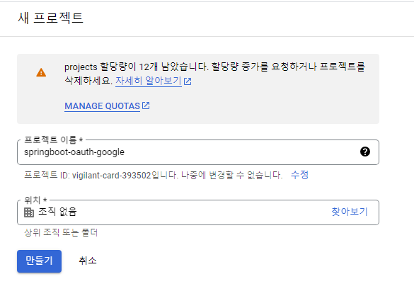
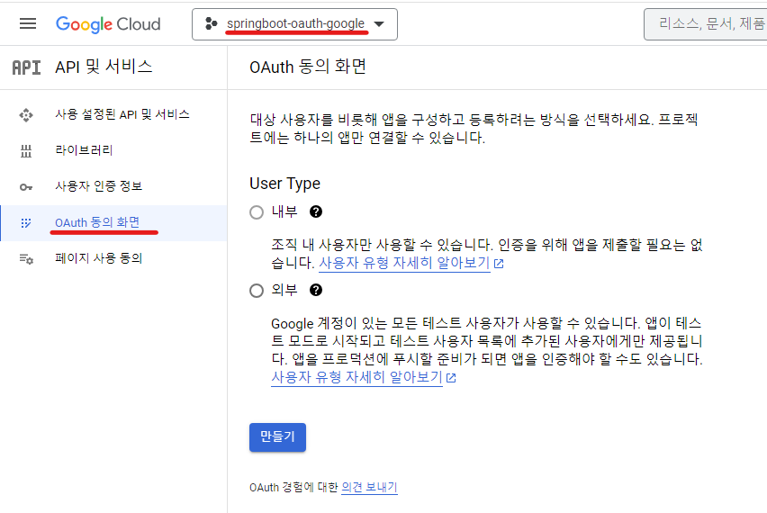
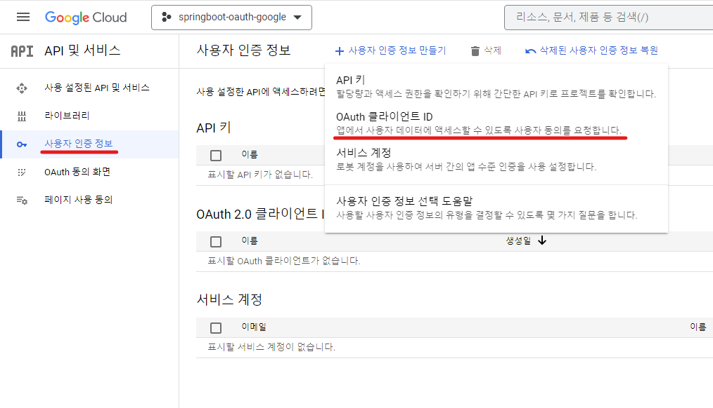
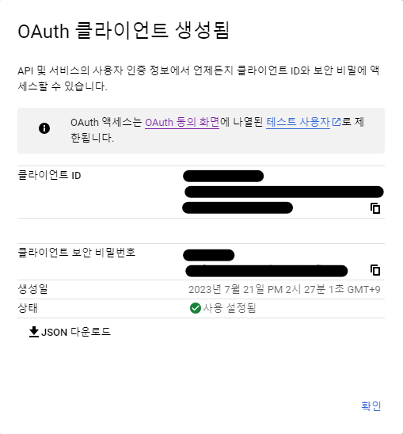
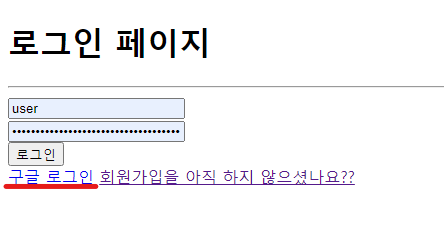
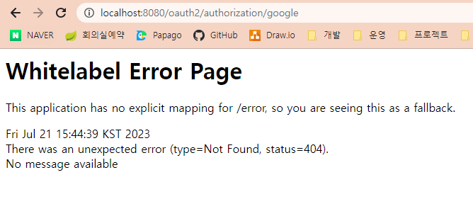
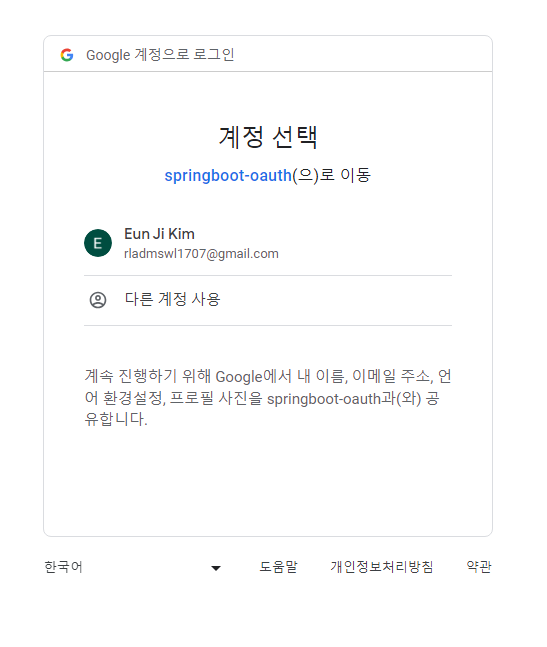
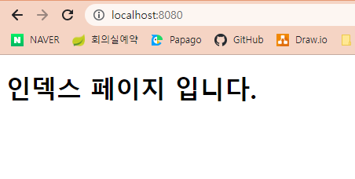
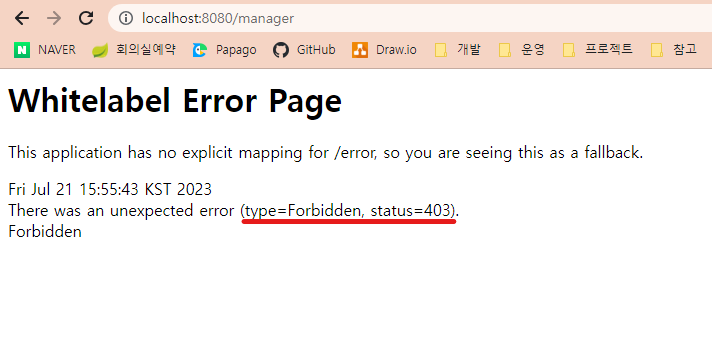
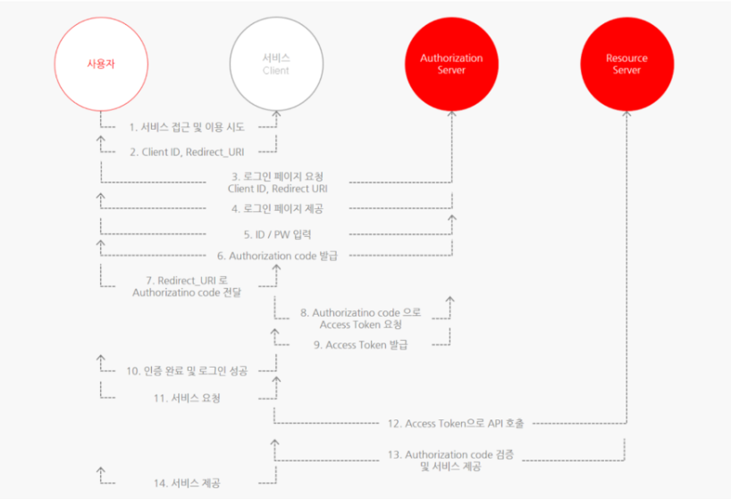

# 6강. 구글 로그인 준비
## 6-1. 구글 API 콘솔에 접속 (https://console.cloud.google.com/)

## 6-2. 새 프로젝트 추가하기    


- 새로 추가한 프로젝트를 이용하여 우리가 만든 사이트에 구글 로그인을 추가할 예정!

## 6-3. OAuth 동의화면 생성하기


1. '외부' 선택 후 '만들기' 클릭
2. 다음 정보입력 후 '저장'
    - (2-1) ✅ 앱 이름
    - (2-2) ✅ 사용자 지원 이메일
    - (2-3) ✅ 개발자 이메일 주소
3. OAuth 동의화면 생성완료

## 6-4. 사용자 인증 정보 만들기


1. '사용자 인증 정보 만들기' -> 'OAuth 클라이언트 ID' 선택
2. 다음 정보 입력후 '만들기' -> 사용자 인증정보 생성완료
    - (2-1) ✅ 애플리케이션 유형 : 웹 애플리케이션
    - (2-2) ✅ 이름 : springboot-oauth (마음대로 작성가능)
    - (2-3) ✅ 승인된 리디렉션 URI : http://localhost:8080/login/oauth2/code/google
        - **리디렉션 URI란?**
        1. 특정 사용자가 우리 사이트에서 구글 로그인을 하고나면 구글 서버에서 인증이 되었다는 코드를 우리에게 보내줌. 
        2. 우리는 해당 코드를 받아서 해당 코드로 Access Token을 요청함. 
        3. Access Token을 받고 나면, 우리 서버가 사용자 대신 구글 서버에 있는 사용자의 개인정보등에 접근할 수 있는 권한을 갖게 됨.
        4. Access Token을 얻기 위해 필요한 것이 (1)에서 언급한 **인증코드** 이며, 리디렉션 URI에는 해당 코드를 받을 수 있는 주소를 입력해주면 된다.
        5. 만약 구글 로그인을 전부 다 직접 구현할 것이라면 해당 URI를 자유롭게 작성해도 괜찮지만, <U>**우리는 OAuth2-Client라는 라이브러리를 사용할 것이므로 해당 주소로 고정임. 다른 주소로는 사용불가 !**</U>
3. 생성된 클라이언트 ID와 클라이언트 보안 비밀번호 따로 저장해두기. 유출안되도록 조심 !

    
---
#### ※ [참고] OAuth2-Client 라이브러리 ※
- 리디렉션 URI 작성규칙 : 도메인주소 + /login/oauth2/code/[google | facebook | ···]
    - 예시) http://localhost:8080/login/oauth2/code/google
- 리디렉션 URI와 매칭하는 컨트롤러 필요없음
    - 예시) 리디렉션 URI = http://localhost:8080/login/oauth2/code/google 일때,
        ```java
        @GetMapping("/login/oauth2/code/google")
        public String login_googleOauth(){
            return "";
        }
        ```
        와 같은 함수 필요없음. (OAuth Client 라이브러리가 자동으로 알아서 다 처리해주기 때문)

---
## 6-5. OAuth2-Client 라이브러리 설정
1. pom.xml에 dependency추가하기
    ```xml
    <dependency>
        <groupId>org.springframework.boot</groupId>
        <artifactId>spring-boot-starter-oauth2-client</artifactId>
    </dependency>
    ```
2. application.yml에 라이브러리 설정정보 추가
    ```yml
    spring:
      security:
        oauth2:
          client:
            registration:
              google:
                client-id: (6-4)에서 발급받은 클라이언트 ID입력
                client-secret: (6-4)에서 발급받은 클라이언트 보안 비밀번호입력
                scope:
                - email
                - profile
    ```
3. loginForm.html에 버튼 추가하기
    ```html
    <body>
    <h1>로그인 페이지</h1>
    <hr/>
    <form action="/login" method="POST">
        <input type="text" name="username" placeholder="Username" /><br />
        <input type="password" name="password" placeholder="Password" /><br />
        <button>로그인</button>
    </form>
    <a href="/oauth2/authorization/google">구글 로그인</a>
    <a href="/joinForm">회원가입을 아직 하지 않으셨나요?</a>
    </body>
    ```
    - '구글 로그인' 버튼 추가
        - oauth2-client 라이브러리 사용중이므로 "/oauth2/authorization/google" 라는 주소로 입력 (변경불가)
4. localhost:8080/loginForm 으로 접속
    - 구글 로그인 버튼 선택

    

    - 404 페이지 확인
    
    

5. SecurityConfig 설정 추가하기
    ```java
    @Configuration
    @EnableWebSecurity
    @EnableGlobalMethodSecurity(securedEnabled = true, prePostEnabled = true)
    public class SecurityConfig{
        @Bean
	    public SecurityFilterChain filterChain(HttpSecurity http) throws Exception{
            http.authorizeRequests()
                ···
                .and()
                .oauth2Login()
                .loginPage("/loginForm");
        }
    }
    ```
6. 다시 localhost:8080/loginForm 으로 접속
    - 구글 로그인 버튼 선택

    

    - 구글 로그인 Form 확인

    

    - 구글 로그인 완료 후 인덱스 페이지로 이동 확인
        - SecurityConfig.class에서 .defaultSuccessUrl("/") 설정 참고

    

    - "/manager" 페이지로 이동

    

    - "/manager" 페이지로 이동시 403페이지를 만날 수 있는데, 이는 구글 로그인은 인증 완료되었지만 해당 로그인계정에 대한 세션정보가 없어서 접근이 불가능한 것! 
    - <U>**(즉, 구글 로그인이 완료된 뒤에 "후처리"가 필요함)**</U>
---
#### ※ [참고] OAuth2.0 로그인 ※
- OAuth란?
    - 카카오 로그인, 페이스북 로그인 등 소셜 로그인시 사용되는 프로토콜
    - 인터넷 사용자들이 비밀번호를 제공하지 않고 다른 웹사이트 상의 자신들의 정보에 대해 웹사이트나 애플리케이션의 접근 권한을 부여할 수 있는 공통적인 수단으로서 사용되는, 접근 위임을 위한 개방형 표준

- 구성요소
    <table>
        <tbody>
            <tr>
                <th>Resource Owner</th>
                <td>웹 서비스를 이용하려는 유저, 자원(개인정보)을  소유하는 자, 사용자. Resource는 개인정보라고 생각하면 됨.</td>
            </tr>
            <tr>
                <th>Client</th>
                <td>자사 또는 개인이 만든 애플리케이션 서버. 클라이언트라는 이름은 client가 Resource server에게 필요한 자원을 요청하고 응답하는 관계이기 때문.</td>
            </tr>
            <tr>
                <th>Authorization Server</th>
                <td>권한을 부여(인증에 사용할 아이템을 제공)해주는 서버. 사용자는 이 서버로 ID, PW를 넘겨 Authorization Code를 발급 받을 수 있다. Client는 이 서버로 Authorization Code를 넘겨 Token을 발급 받을 수 있다.</td>
            </tr>
            <tr>
                <th>Resource Server</th>
                <td>사용자의 개인정보를 가지고 있는 애플리케이션(Google, Facebook, Kakao 등) 회사 서버. Client는 Token을 이 서버로 넘겨 개인정보를 응답 받을 수 있다.</td>
            </tr>
            <tr>
                <th>Access Token</th>
                <td>자원에 대한 접근 권한을 Resource Owner가 인가하였음을 나타내는 자격증명.</td>
            </tr>
            <tr>
                <th>Refresh Token</th>
                <td>Client는 Authorization Server로 부터 access token(비교적 짧은 만료기간을 가짐)과 refresh token(비교적 긴 만료기간을 가짐)을 함께 부여 받는다. access token은 보안상 만료기간이 짧기 때문에 얼마 지나지 않아 만료되면 사용자는 로그인을 다시 시도해야 한다. 그러나 refresh token이 있다면 access token이 만료될 때 refresh token을 통해 access token을 재발급 받아 재로그인 할 필요없게끔 한다.</td>
            </tr>
        </tbody>
    </table>

- 작동방식

    

    1. Client(개인서비스)는 Resource Owner(사용자)를 대신해 로그인함. 이때 필요한 정보를 Resource Server(Kakao, Naver, …)에서 얻어 서로 비교하여 유효성을 판단한다.
    2. Client가 유저의 로그인정보/ 자원을 Resource Server에 요청하여 대신 로그인하는 것.
    3. 이를 위해 Client는 다음 단계들을 가진다.
        - Resource Owner로부터 동의(허용)
        - Resource Server로부터 Client 신원확인
        
- [[참고]OAuth 2.0개념](https://inpa.tistory.com/entry/WEB-%F0%9F%93%9A-OAuth-20-%EA%B0%9C%EB%85%90-%F0%9F%92%AF-%EC%A0%95%EB%A6%AC)
---


# 7강. 구글 회원 프로필 정보 받아보기
# 8강. Authentication객체가 가질 수 있는 2가지 타입
# 9강. 구글 로그인 및 자동 회원가입 진행 완료
# 10강. 페이스북 로그인 완료
# 11강. 네이버 로그인 완료