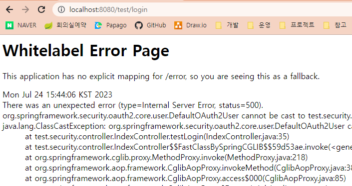
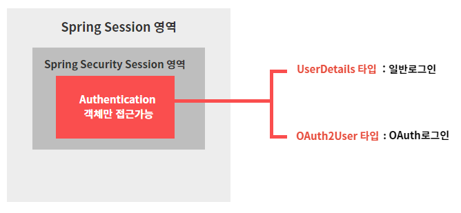
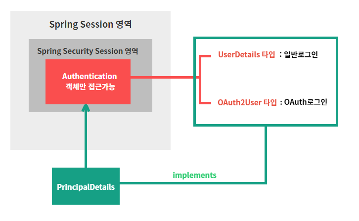

# 6강. 구글 로그인 준비
## 6-1. 구글 API 콘솔에 접속 (https://console.cloud.google.com/)

## 6-2. 새 프로젝트 추가하기    


- 새로 추가한 프로젝트를 이용하여 우리가 만든 사이트에 구글 로그인을 추가할 예정!

## 6-3. OAuth 동의화면 생성하기


1. '외부' 선택 후 '만들기' 클릭
2. 다음 정보입력 후 '저장'
    - (2-1) ✅ 앱 이름
    - (2-2) ✅ 사용자 지원 이메일
    - (2-3) ✅ 개발자 이메일 주소
3. OAuth 동의화면 생성완료

## 6-4. 사용자 인증 정보 만들기


1. '사용자 인증 정보 만들기' -> 'OAuth 클라이언트 ID' 선택
2. 다음 정보 입력후 '만들기' -> 사용자 인증정보 생성완료
    - (2-1) ✅ 애플리케이션 유형 : 웹 애플리케이션
    - (2-2) ✅ 이름 : springboot-oauth (마음대로 작성가능)
    - (2-3) ✅ 승인된 리디렉션 URI : http://localhost:8080/login/oauth2/code/google
        - **리디렉션 URI란?**
        1. 특정 사용자가 우리 사이트에서 구글 로그인을 하고나면 구글 서버에서 인증이 되었다는 코드를 우리에게 보내줌. 
        2. 우리는 해당 코드를 받아서 해당 코드로 Access Token을 요청함. 
        3. Access Token을 받고 나면, 우리 서버가 사용자 대신 구글 서버에 있는 사용자의 개인정보등에 접근할 수 있는 권한을 갖게 됨.
        4. Access Token을 얻기 위해 필요한 것이 (1)에서 언급한 **인증코드** 이며, 리디렉션 URI에는 해당 코드를 받을 수 있는 주소를 입력해주면 된다.
        5. 만약 구글 로그인을 전부 다 직접 구현할 것이라면 해당 URI를 자유롭게 작성해도 괜찮지만, <U>**우리는 OAuth2-Client라는 라이브러리를 사용할 것이므로 해당 주소로 고정임. 다른 주소로는 사용불가 !**</U>
3. 생성된 클라이언트 ID와 클라이언트 보안 비밀번호 따로 저장해두기. 유출안되도록 조심 !

    
---
#### ※ [참고] OAuth2-Client 라이브러리 ※
- 리디렉션 URI 작성규칙 : 도메인주소 + /login/oauth2/code/[google | facebook | ···]
    - 예시) http://localhost:8080/login/oauth2/code/google
- 리디렉션 URI와 매칭하는 컨트롤러 필요없음
    - 예시) 리디렉션 URI = http://localhost:8080/login/oauth2/code/google 일때,
        ```java
        @GetMapping("/login/oauth2/code/google")
        public String login_googleOauth(){
            return "";
        }
        ```
        와 같은 함수 필요없음. (OAuth Client 라이브러리가 자동으로 알아서 다 처리해주기 때문)
- 소셜 로그인 완료시, 코드(인증)를 받는게 아니라 "엑세스토큰+사용자프로필정보"를 바로 받아오므로 사용이 간편( > 7-2-3. 파라미터로 받아오는 userRequest )

---
## 6-5. OAuth2-Client 라이브러리 설정
1. pom.xml에 dependency추가하기
    ```xml
    <dependency>
        <groupId>org.springframework.boot</groupId>
        <artifactId>spring-boot-starter-oauth2-client</artifactId>
    </dependency>
    ```
2. application.yml에 라이브러리 설정정보 추가
    ```yml
    spring:
      security:
        oauth2:
          client:
            registration:
              google:
                client-id: (6-4)에서 발급받은 클라이언트 ID입력
                client-secret: (6-4)에서 발급받은 클라이언트 보안 비밀번호입력
                scope:
                - email
                - profile
    ```
3. loginForm.html에 버튼 추가하기
    ```html
    <body>
    <h1>로그인 페이지</h1>
    <hr/>
    <form action="/login" method="POST">
        <input type="text" name="username" placeholder="Username" /><br />
        <input type="password" name="password" placeholder="Password" /><br />
        <button>로그인</button>
    </form>
    <a href="/oauth2/authorization/google">구글 로그인</a>
    <a href="/joinForm">회원가입을 아직 하지 않으셨나요?</a>
    </body>
    ```
    - '구글 로그인' 버튼 추가
        - oauth2-client 라이브러리 사용중이므로 "/oauth2/authorization/google" 라는 주소로 입력 (변경불가)
4. localhost:8080/loginForm 으로 접속
    - 구글 로그인 버튼 선택

    

    - 404 페이지 확인
    
    

5. SecurityConfig 설정 추가하기
    ```java
    @Configuration
    @EnableWebSecurity
    @EnableGlobalMethodSecurity(securedEnabled = true, prePostEnabled = true)
    public class SecurityConfig{
        @Bean
	    public SecurityFilterChain filterChain(HttpSecurity http) throws Exception{
            http.authorizeRequests()
                ···
                .and()
                .oauth2Login()
                .loginPage("/loginForm");
        }
    }
    ```
6. 다시 localhost:8080/loginForm 으로 접속
    - 구글 로그인 버튼 선택

    

    - 구글 로그인 Form 확인

    

    - 구글 로그인 완료 후 인덱스 페이지로 이동 확인
        - SecurityConfig.class에서 .defaultSuccessUrl("/") 설정 참고

    

    - "/manager" 페이지로 이동

    

    - "/manager" 페이지로 이동시 403페이지를 만날 수 있는데, 이는 구글 로그인은 인증 완료되었지만 해당 로그인계정에 대한 세션정보가 없어서 접근이 불가능한 것! 
    - <U>**(즉, 구글 로그인이 완료된 뒤에 "후처리"가 필요함)**</U>
---
#### ※ [참고] OAuth2.0 로그인 ※
- OAuth란?
    - 카카오 로그인, 페이스북 로그인 등 소셜 로그인시 사용되는 프로토콜
    - 인터넷 사용자들이 비밀번호를 제공하지 않고 다른 웹사이트 상의 자신들의 정보에 대해 웹사이트나 애플리케이션의 접근 권한을 부여할 수 있는 공통적인 수단으로서 사용되는, 접근 위임을 위한 개방형 표준

- 구성요소
    <table>
        <tbody>
            <tr>
                <th>Resource Owner</th>
                <td>웹 서비스를 이용하려는 유저, 자원(개인정보)을  소유하는 자, 사용자. Resource는 개인정보라고 생각하면 됨.</td>
            </tr>
            <tr>
                <th>Client</th>
                <td>자사 또는 개인이 만든 애플리케이션 서버. 클라이언트라는 이름은 client가 Resource server에게 필요한 자원을 요청하고 응답하는 관계이기 때문.</td>
            </tr>
            <tr>
                <th>Authorization Server</th>
                <td>권한을 부여(인증에 사용할 아이템을 제공)해주는 서버. 사용자는 이 서버로 ID, PW를 넘겨 Authorization Code를 발급 받을 수 있다. Client는 이 서버로 Authorization Code를 넘겨 Token을 발급 받을 수 있다.</td>
            </tr>
            <tr>
                <th>Resource Server</th>
                <td>사용자의 개인정보를 가지고 있는 애플리케이션(Google, Facebook, Kakao 등) 회사 서버. Client는 Token을 이 서버로 넘겨 개인정보를 응답 받을 수 있다.</td>
            </tr>
            <tr>
                <th>Access Token</th>
                <td>자원에 대한 접근 권한을 Resource Owner가 인가하였음을 나타내는 자격증명.</td>
            </tr>
            <tr>
                <th>Refresh Token</th>
                <td>Client는 Authorization Server로 부터 access token(비교적 짧은 만료기간을 가짐)과 refresh token(비교적 긴 만료기간을 가짐)을 함께 부여 받는다. access token은 보안상 만료기간이 짧기 때문에 얼마 지나지 않아 만료되면 사용자는 로그인을 다시 시도해야 한다. 그러나 refresh token이 있다면 access token이 만료될 때 refresh token을 통해 access token을 재발급 받아 재로그인 할 필요없게끔 한다.</td>
            </tr>
        </tbody>
    </table>

- 작동방식

    

    1. Client(개인서비스)는 Resource Owner(사용자)를 대신해 로그인함. 이때 필요한 정보를 Resource Server(Kakao, Naver, …)에서 얻어 서로 비교하여 유효성을 판단한다.
    2. Client가 유저의 로그인정보/ 자원을 Resource Server에 요청하여 대신 로그인하는 것.
    3. 이를 위해 Client는 다음 단계들을 가진다.
        - Resource Owner로부터 동의(허용)
        - Resource Server로부터 Client 신원확인
        
- [[참고]OAuth 2.0개념](https://inpa.tistory.com/entry/WEB-%F0%9F%93%9A-OAuth-20-%EA%B0%9C%EB%85%90-%F0%9F%92%AF-%EC%A0%95%EB%A6%AC)
---


# 7강. 구글 회원 프로필 정보 받아보기
## 7-1. 소셜로그인 작동순서
1. 코드받기(인증) : Redirect_URI
2. 엑세스토큰받기(접근권한)
3. 사용자프로필 정보 갖고오기
4. (4-1) 그 정보를 토대로 회원가입을 자동으로 진행
5. (4-2) 또는 갖고 온 사용자프로필 정보 외에 추가적인 정보가 필요할 경우에는 자동 회원가입이 아니라 추가적인 회원가입 창을 만들어 필요한 정보를 수집해야 함

## 7-2. 구글 로그인 후처리
1. **SecurityConfig 설정 추가**
    ```java
    .userInfoEndpoint()
    .userService(null);
    ```
- userService() 내에 들어갈 수 있는 타입은 OAuth2UserServic\<OAuth2UserRequest, OAuth2User\> 타입이다. 아직 만들어둔게 없으니 우선 null로 채워두자.

2. **메인패키지-config 밑에 oauth패키지 생성**
3. **PrincipalOauth2UserService 클래스 생성**
    ```java
    import org.springframework.security.oauth2.client.userinfo.DefaultOAuth2UserService;
    import org.springframework.stereotype.Service;

    @Service
    public class PrincipalOauth2UserService extends DefaultOAuth2UserService{
        // 구글로그인이 완료된 후, 구글로부터 받은 userRequest 데이터에 대한 후처리가 되는 함수
        // userRequest 데이터에는 로그인한 사용자에 대한 AccessToken과 사용자프로필정보가 함께 들어있음.
        @Override
        public OAuth2User loadUser(OAuth2UserRequest userRequest) throws OAuth2AuthenticationException {
            // 일단 받아오는 userRequest가 무엇인지 다 찍어보자
            System.out.println("getClientRegistration : " + userRequest.getClientRegistration());
            System.out.println("getAccessTokenValue : " + userRequest.getAccessToken().getTokenValue());
            System.out.println("getAttributes : " + super.loadUser(userRequest).getAttributes());
            
            return super.loadUser(userRequest);
        }
    }
    ```

4. **SecurityConfig 설정 수정**
    ```java
    @Authwired
    private PrincipalOauth2UserService principalOauth2UserService;

    @Bean
    public SecurityFilterChain filterChain(HttpService http) throws Exception{
        http.authorizeRequest()
            ···
            .userInfoEndPoint()
            .userService(principalOauth2UserService);
    }
    ```

5. **localhost:8080/loginForm 접속 후 구글로그인 진행**
    ```bash
    getClientRegistration : ClientRegistration{registrationId='google', clientId='330067917305-rmbfjubajdiqelvoehsp1ripqoa8k1fn.apps.googleusercontent.com', clientSecret='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', clientAuthenticationMethod=org.springframework.security.oauth2.core.ClientAuthenticationMethod@4fcef9d3, authorizationGrantType=org.springframework.security.oauth2.core.AuthorizationGrantType@5da5e9f3, redirectUri='{baseUrl}/{action}/oauth2/code/{registrationId}', scopes=[email, profile], providerDetails=org.springframework.security.oauth2.client.registration.ClientRegistration$ProviderDetails@21acbace, clientName='Google'}
    getAccessTokenValue : ya29.a0AbVbY6NNwkW8ANtgT33Ieu6aOv3b4sXh5PSziOuRoCbs8Vqz8ewMI78wpK7-Mg4fgDhBpAnMkg_CSdPOtgbNGAcIBCpZTLNpMYjLLNrUCLlsshEthCSWl7SBIXreK5dKlwT9jmU1SDjsIBmuGKlOle5qxTecaCgYKAa0SARESFQFWKvPlgSOTrjBE01eyJg4RNiL7RA0163
    getAttributes : {sub=109696850338476008763, name=Eun Ji Kim, given_name=Eun Ji, family_name=Kim, picture=https://lh3.googleusercontent.com/a/AAcHTtfbjzXXvWBeUAKeNktxrPmH4OO1ySfz4obudeY3Y2YI=s96-c, email=rladmswl1707@gmail.com, email_verified=true, locale=ko}
    ```
- getClientRegistration : 우리 서버의 기본적인 정보(regustrationId, clientId, clientSecret, ···)
    - registrationId로 어떤 OAuth로 로그인 했는지 확인가능
- getAccessTokenValue : AccessToken 값. 이미 사용자 프로필 정보를 받아왔으므로 사실 더 이상 필요한 정보는 아님
- getAttributes : 사용자프로필정보
    - sub : 구글회원가입시 내 id (primary key와 비슷한 개념)
    - name / given_name / family_name : 이름
    - picture : 사용자 프로필 사진
    - email : 사용자 이메일
    - email_verified : 이메일 만료여부
    - locale : 언어

**6. 회원가입 구상**
- 받아온 사용자 프로필정보를 이용하여 회원가입을 어떻게 시킬지 구상하기
    ```bash
    // 구글 서버로부터 받아온 사용자프로필정보
    getAttributes : {
        sub=109696850338476008763, 
        name=Eun Ji Kim, 
        given_name=Eun Ji, 
        family_name=Kim, 
        picture=https://lh3.googleusercontent.com/a/AAcHTtfbjzXXvWBeUAKeNktxrPmH4OO1ySfz4obudeY3Y2YI=s96-c, 
        email=rladmswl1707@gmail.com, 
        email_verified=true, 
        locale=ko}
    ```
    ```java
    // User Entity
    public class User {
        @Id
        @GeneratedValue(strategy = GenerationType.IDENTITY)
        private int id;
        private String username;
        private String password;
        private String email;
        private String role;
        @CreationTimestamp
        private Timestamp createDate;
    }
    ```

- 회원가입정보는 아래와 같이 구상한다.
    - username = "google_109696850338476008763"
    - password = "암호화(겟인데어)"
    - email = "rladmswl1707@gmail.com"
    - role = "ROLE_USER"
    - <U>**그런데, 이렇게 저장했을경우 해당 회원이 OAuth로그인을 통해 로그인한 것인지 알아보기 힘드므로 User엔티티에 필드를 추가해준다.**</U>

    ```java
    public class User {
        ···
        private String provider;
        private String providerId;
        ···
    }
    ```

- 그리고 회원가입정보 내용을 추가해준다.
    - username = "google_109696850338476008763" ("google_" + sub)
    - password = "암호화(겟인데어)"
    - email = "rladmswl1707@gmail.com" (email)
    - role = "ROLE_USER"
    - <U>**provider = "google"**</U>
    - <U>**providerId = "109696850338476008763"**</U> (sub)

- 이제 사용자가 구글 로그인을 완료하면 사용자의 프로필정보인 getAttributes를 이용하여 강제 회원가입을 진행시킬 것이다.
    ```java
    import org.springframework.security.oauth2.client.userinfo.DefaultOAuth2UserService;
    import org.springframework.stereotype.Service;

    @Service
    public class PrincipalOauth2UserService extends DefaultOAuth2UserService{
        @Override
        public OAuth2User loadUser(OAuth2UserRequest userRequest) throws OAuth2AuthenticationException {
            ···
            // 로그인 후처리 진행
            // 받아온 getAttributes정보를 이용하여 회원가입을 강제로 진행해볼 예정
            
            return super.loadUser(userRequest);
        }
    }
    ```


# 8강. Authentication객체가 가질 수 있는 2가지 타입
## 8-1. 7강 내용 정리
```java
// PrincipalOauth2UserService.class

@Service
public class PrincipalOauth2UserService extends DefaultOAuth2UserService{
	
	// 구글로부터 받은 userRequest 데이터에 대한 후처리가 되는 함수
	@Override
	public OAuth2User loadUser(OAuth2UserRequest userRequest) throws OAuth2AuthenticationException {
		System.out.println("getClientRegistration : " + userRequest.getClientRegistration()); 
		System.out.println("getAccessTokenValue : " + userRequest.getAccessToken().getTokenValue());
		System.out.println("getAttributes : " + super.loadUser(userRequest).getAttributes());
		
        // 추가해두기
		OAuth2User oauth2User = super.loadUser(userRequest);
		
		return super.loadUser(userRequest);
	}
}
```
- OAuth로그인 진행과정
    1. 구글로그인 버튼클릭
    2. 구글로그인창 생성
    3. 구글로그인 완료
    4. code를 리턴(OAuth-client라이브러리 이용)
    5. AccessToken 요청
    6. AccessToken 받음 <U>**: 여기까지가 userRequest정보에 해당함**</U>
    7. userRequest정보는 어떻게 사용해야하나 ? (로그인 후처리)
    8. DefaultOAuth2UserService의 loadUser() 함수를 호출
    9. loadUser(userRequest) 를 이용해서 구글로부터 회원프로필을 받아옴 <U>**: 이것이 loadUser()함수의 역할**</U>

## 8-2. 일반로그인 vs OAuth로그인 비교 테스트
- ## 8-2-1. IndexController에 메소드 추가 : testLogin()
    ```java
    @GetMapping("/test/login")
	public @ResponseBody String testLogin(
			Authentication authentication, 
			@AuthenticationPrincipal UserDetails userDetails) { 
		System.out.println("============ /test/login ============");
		PrincipalDetails principalDetails = (PrincipalDetails) authentication.getPrincipal(); // 다운캐스팅
		System.out.println("authentication : " + principalDetails.getUser());
		
		System.out.println("userDetails : " + userDetails.getUsername());
		
		return "세션 정보 확인하기";
	}
    ```
    - ### testLogin()
        - **일반로그인**시 사용되는 메소드
        - 
            ```java
            파라미터 : Authentication authentication // DI(의존성주입)

            PrincipalDetails principalDetails = (PrincipalDetails) authentication.getPrincipal(); 
		    System.out.println("authentication : " + principalDetails.getUser());
            ```            
            - authentication.getPrincipal() 리턴타입이 Object이므로 앞서 만들어두었던 PrincipalDetails클래스로 형변환(다운캐스팅)을 해준다.
            - 형변환이 가능한 이유는 authentication안에 들어갈 수 있는건 UserDetails타입이라는 것을 앞서 배웠었다. 그렇기에 UserDetails를 상속받고 있는 PrincipalDetails로 형변환이 가능한 것!
            - 다운캐스팅한 authentication.getPrncipal() 정보를 principalDetails변수에 담아, .getUser()로 찍어본다.
            - 이때 .getUser()는 PrincipalDetails클래스를 생성할때 필드로 넣어뒀던 private User user; 의 getter 메소드임.
            - **정리**
                - 파라미터로 받는 Authentication객체 안에 principal을 조회하고자 한다.
                - authentication.getPrincipal()의 리턴타입은 Object이므로 PrincipalDetails로 다운캐스팅을 해준다.
                - 다운캐스팅한 principal정보를 .getUser()를 통해 조회한다.
        - 
            ```java
            파라미터 : @AuthenticationPrincipal UserDetails userDetails

            System.out.println("userDetails : " + userDetails.getUsername());
            ```
            - @AuthenticationPrincipal 어노테이션을 이용하면 세션정보에 접근할 수 있다.
            - @AuthenticationPrincipal는 UserDetails타입을 갖고 있음. 이때 우리는 UserDetails타입을 상속받은 PrincipalDetails가 있으므로, UserDetails를 PrincipalDetails로 대체 가능 !
            - UserDetails를 PrincipalDetails로 대체하면, userDetails.getUsername()이 아니라 userDetails.getUser()가 가능함 !
            - 
                ```java
                @GetMapping("/test/login")
                public @ResponseBody String testLogin(
                        Authentication authentication, 
                        @AuthenticationPrincipal PrincipalDetails userDetails) { // UserDetails를 PrincipalDetails로 변경
                    ···
                    System.out.println("userDetails : " + userDetails.getUser()); // getUsername()이 아니라 getUser()가 가능해짐!
                }
                ```
        - ※정리※
            - <U>일반사용자 로그인시,</U> 로그인한 사용자의 정보를 확인하는 방법 2가지
            - (1) Authentication객체를 Dependency Injection하여 PrincipalDetails로 다운캐스팅하여 User Object를 조회할 수 있다.
            - (2) @AuthenticationPrincipal 어노테이션을 통해서 User Object를 조회할 수 있다.
        - 최종코드
            ```java
            @GetMapping("/test/login")
            public @ResponseBody String testLogin(
                    Authentication authentication, // DI (의존성주입)
                    @AuthenticationPrincipal PrincipalDetails userDetails) { 
                System.out.println("============ /test/login ============");
                // 방법 1.
                PrincipalDetails principalDetails = (PrincipalDetails) authentication.getPrincipal(); // 다운캐스팅
                System.out.println("authentication : " + principalDetails.getUser());
                
                // 방법 2.
                System.out.println("userDetails : " + userDetails.getUser());
                
                return "세션 정보 확인하기";
            }
            ```
            ```bash
            ============ /test/login ============
            authentication : User(id=1, username=ssar, password=$2a$10$lV/vBJlBevj/foDZNy3peeCXmSAGUmSIKqyA.oxx7jBABaQiz5N.m, email=test@abc.com, role=ROLE_USER, provider=null, providerId=null, createDate=2023-07-14 16:26:21.551)
            userDetails : User(id=1, username=ssar, password=$2a$10$lV/vBJlBevj/foDZNy3peeCXmSAGUmSIKqyA.oxx7jBABaQiz5N.m, email=test@abc.com, role=ROLE_USER, provider=null, providerId=null, createDate=2023-07-14 16:26:21.551)
            ```
            - 방법1을 사용하든, 방법2를 사용하든 똑같은 유저Object를 가져오는 것을 확인할 수 있다.
        - 그렇다면, <U>구글로그인</U>을 한 후에 localhost:8080/test/login으로 접근해보자.

            
        
            ```
            [에러로그]
            java.lang.ClassCastException: org.springframework.security.oauth2.core.user.DefaultOAuth2User cannot be cast to test.security.config.auth.PrincipalDetails
            ```
            - 에러로그를 확인해보면 OAuth로그인시에는 UserDetails(PrincipalDetails) 타입으로 캐스팅이 불가능하다고 뜬다.
            - 그렇다면, OAuth로그인시 해당 로그인 유저정보를 조회할 메소드를 하나 더 만들어주자.
- ## 8-2-2. IndexController에 메소드 추가 : testOAuthLogin()
    ```java
    @GetMapping("/test/oauth/login")
    public @ResponseBody String testOAuthLogin(
            Authentication authentication,
            @AuthenticationPrincipal OAuth2User oauth) {
        System.out.println("============ /test/oauth/login ============");
        // 방법 1.
        OAuth2User oauth2User = (OAuth2User) authentication.getPrincipal(); 
        System.out.println("authentication : " + oauth2User.getAttributes());

        // 방법 2.
        System.out.println("oauth2User : " + oauth.getAttributes());
        
        return "OAuth 세션 정보 확인하기";
    }
    ```
    - ### testOAuthLogin()
        - **oauth로그인**시 사용되는 메소드
        - 
            ```java
            파라미터 : Authentication authentication // DI (의존성주입)

            OAuth2User oauth2User = (OAuth2User) authentication.getPrincipal(); 
            System.out.println("authentication : " + oauth2User.getAttributes());
            ```
            - Oauth로그인시에 authentication이 UserDetails(principalDetails)타입으로 캐스팅이 불가능했으므로, OAuth2User타입으로 다운캐스팅 해준다.
            - 다운캐스팅한 principal정보를 .getAttributes()로 꺼내어 조회한다.
        - 
            ```java
            파라미터 : @AuthenticationPrincipal OAuth2User oauth

            System.out.println("oauth2User : " + oauth.getAttributes());
            ```
            - @AuthenticationPrincipal 어노테이션을 이용해서 OAuth2User타입으로 세션정보를 받아온다.
            - 받아온 세션정보를 .getAttributes()로 꺼내어 조회한다.
        - ※정리※
            - <U>Oauth로그인시,</U> 로그인한 사용자의 정보를 확인하는 방법 2가지
            - (1) Authentication객체를 Dependency Injection하여 OAuth2User로 다운캐스팅하여 User Object를 조회할 수 있다.
            - (2) @AuthenticationPrincipal 어노테이션을 통해서 User Object를 조회할 수 있다.
            - 
                ```bash
                ============ /test/oauth/login ============
                authentication : {sub=109696850338476008763, name=Eun Ji Kim, given_name=Eun Ji, family_name=Kim, picture=https://lh3.googleusercontent.com/a/AAcHTtfbjzXXvWBeUAKeNktxrPmH4OO1ySfz4obudeY3Y2YI=s96-c, email=rladmswl1707@gmail.com, email_verified=true, locale=ko}
                oauth2User : {sub=109696850338476008763, name=Eun Ji Kim, given_name=Eun Ji, family_name=Kim, picture=https://lh3.googleusercontent.com/a/AAcHTtfbjzXXvWBeUAKeNktxrPmH4OO1ySfz4obudeY3Y2YI=s96-c, email=rladmswl1707@gmail.com, email_verified=true, locale=ko}
                ```
                어떤 방법을 사용하든 똑같은 유저Object를 가져오는 것을 확인할 수 있다.
- ### 8-2-3. testLogin() vs testOauthLogin()
    - 최종코드
        ```java
        @GetMapping("/test/login")
        public @ResponseBody String testLogin(
                Authentication authentication, // DI (의존성주입)
                @AuthenticationPrincipal PrincipalDetails userDetails) { 
            System.out.println("============ /test/login ============");
            // 방법1.
            PrincipalDetails principalDetails = (PrincipalDetails) authentication.getPrincipal(); // 다운캐스팅
            System.out.println("authentication : " + principalDetails.getUser());
            
            // 방법2.
            System.out.println("userDetails : " + userDetails.getUser());
            
            return "세션 정보 확인하기";
        }
        
        @GetMapping("/test/oauth/login")
        public @ResponseBody String testOAuthLogin(
                Authentication authentication, // DI (의존성주입)
                @AuthenticationPrincipal OAuth2User oauth) {
            System.out.println("============ /test/oauth/login ============");
            // 방법1.
            OAuth2User oauth2User = (OAuth2User) authentication.getPrincipal(); // 다운캐스팅
            System.out.println("authentication : " + oauth2User.getAttributes());
            
            // 방법2.
            System.out.println("oauth2User : " + oauth.getAttributes());
            
            return "OAuth 세션 정보 확인하기";
        }
        ```
    - 비교하기
        - testLogin()은 authentication을 받아서(DI) UserDetails(PrincipalDetails)로 다운캐스팅 해주었고,
            - → Authentication객체에 UserDetails타입이 들어갈 수 있다
        - testOAuthLogin()은 authentication을 받아서(DI) OAuth2User로 다운캐스팅 해주었다.
            - → Authentication객체에 OAuth2User타입이 들어갈 수 있다
    - 결론
        - Authentication객체에는 UserDetails타입과 OAuth2User타입 모두가 들어갈 수 있다.
        
        
        
        1. 서버가 갖고 있는 세션 영역 내에서, 스프링 시큐리티는 자신만의 세션을 따로 갖고 있다.
        2. 시큐리티가 관리하는 세션 안에 들어갈 수 있는 타입은 Authentication객체밖에 없다.
            - 시큐리티 세션안에 Authentication객체가 들어온 순간이 바로 로그인이 완료된 것 !
            - 로그인과 동시에 세션안에 Authentication객체가 들어갔으니(스프링 컨테이너가 Authentication을 관리하기 시작), 로그인한 사용자가 "/test/login" 또는 "/test/oauth/login" 요청을 하면, 방금 우리가 컨트롤러에 작성해둔 것처럼 Authentication을 DI할 수 있음.
        3. Authentication객체 안에 들어갈 수 있는 2개의 타입
            - UserDetails 타입 : 일반적인 로그인을 할때 만들어짐
            - OAuth2User 타입 : OAuth로그인(소셜로그인)을 할때 만들어짐
- ### 8-2-4. PrincipalDetails 수정
    - 일반적인 로그인을 했을때는 @AuthenticationPrincipal PrincipalDetails userDetails 이 필요하고, OAuth로그인을 했을때는 @AuthenticationPrincipal OAuth2User oauth가 필요한 상황. 
    - 메소드를 각 로그인 상황에 맞게 2개씩 만들기에는 번거롭고... 어떻게 해결할까?
    - Authentication 안에 들어갈 수 있는 UserDetails와 OAuth2User 모두를 상속받는 클래스를 만들어서, 해당 클래스 객체를 Authentication에 넣어주면 됨 !
        - 우리는 이미 UserDetails를 상속받는 PrincipalDetails클래스가 있으므로, 해당 클래스를 아래 코드와 같이 수정한다.
        - 또한 Authentication안에 PrincipalDetails클래스 객체를 넣어주는 건, PrincipalDetailsService클래스의 loadUserByUsername() 함수가 호출될때 자동으로 진행되니까 신경쓸필요 없음.(section0의 4-3-3 참고)
        ```java
        @Data
        public class PrincipalDetails implements UserDetails, OAuth2User{
            ···
            // OAuth2User 인터페이스 메소드 재정의
            @Override
            public Map<String, Object> getAttributes() {
                return null;
            }

            @Override
            public String getName() {
                return null;
            }
        }
        ```
        
        

        - OAuth2User를 함께 implements해주고
        - OAuth2User인터페이스의 메소드들을 override해준다.
        - <U>**이제 일반로그인이든 OAuth로그인이든 PrincipalDetails타입으로 묶어서 받을 수 있음.**</U>
# 9강. 구글  로그인 및 자동 회원가입 진행 완료
# 10강. 페이스북 로그인 완료
# 11강. 네이버 로그인 완료