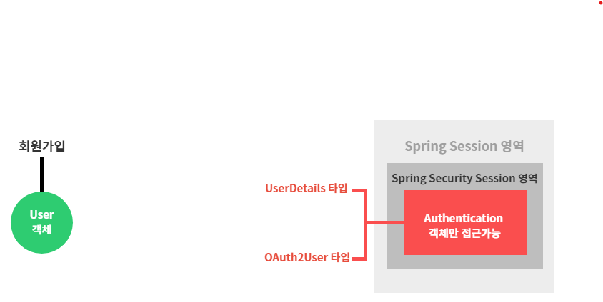
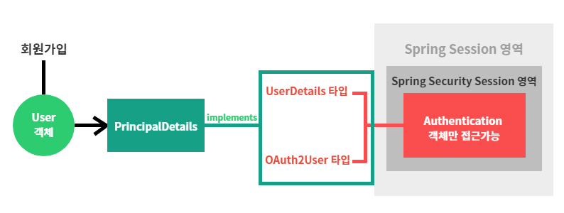
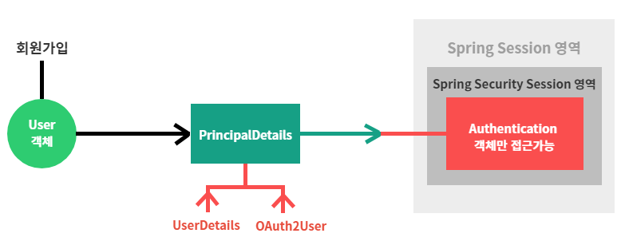
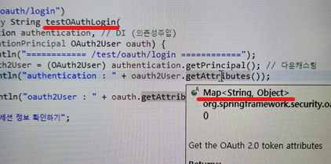
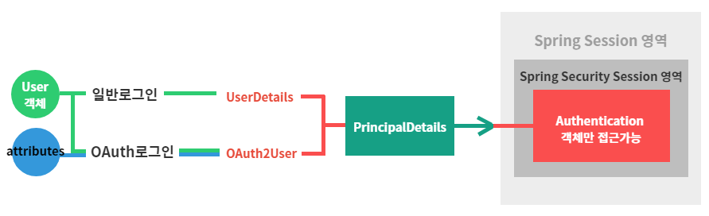
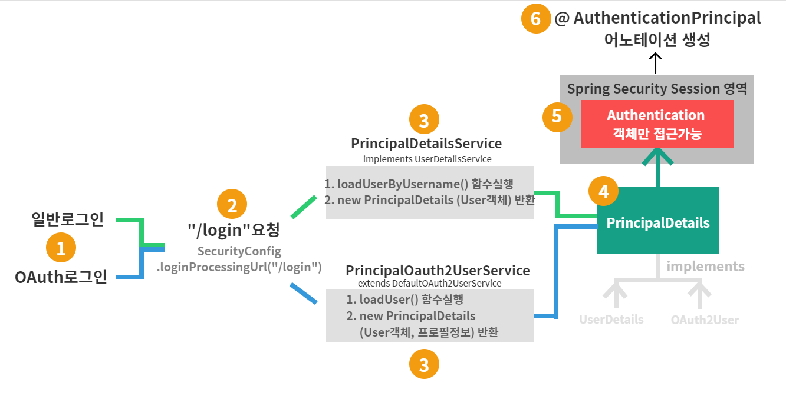

# 9강. 구글 로그인 및 자동 회원가입 진행 완료
## 9-1. PrincipalDetails 클래스의 목적
### 9-1-1. 그림1



1. Security Session 영역에는 Authentication객체만 접근이 가능하다.
2. Authentication객체는 UserDetails타입(일반로그인)과 OAuth2User타입(oauth로그인)만 접근이 가능하다.
3. 회원가입(또는 로그인)을 위해서는 User객체가 필요하다.
4. 사용자의 정보가 담긴 User객체는 UserDetails또는 OAuth2User타입이 아니므로, Authentication객체만 접근가능한 Security세션안에 들어갈 수 없다.

### 9-1-2. 그림2


1. UserDetails와 OAuth2User를 implements한 PrincipalDetails 클래스를 생성한다.
2. 해당 클래스에 User객체를 담아준다. (아래 코드 참고)
    ```java
    @Data
    public class PrincipalDetails implements UserDetails, OAuth2User{

        private User user; 
        
        public PrincipalDetails(User user) {
            this.user = user;
        }
        
        @Override
        public Collection<? extends GrantedAuthority> getAuthorities() {
            Collection<GrantedAuthority> collect = new ArrayList<>(); 
            
            return collect;
        }

        ···
    }
    ```

### 9-1-3. 그림3


1. 생성한 PrincipalDetails 클래스는 User객체를 갖고 있다.
2. 또한 PrincipalDetails 클래스는 UserDetails, OAuth2User 타입 모두에 해당하므로, Authentication객체만 접근가능한 Security Session에 접근이 가능하다.
3. 이제 우리는 User객체를 가지고 Security Session에 드나둘 수 있는 PrincipalDetails클래스만 활용하면 된다.

## 9-2. 구글(OAuth)로그인 및 회원가입 사용자 프로필 정보 가공하기
### 9-2-1. 구글서버로부터 전달받은 사용자 프로필 타입 : Map<String, Object>
- 구글로그인시, 구글서버로부터 받아오는 사용자 프로필 정보는 Map<String, Object> 타입이다.
    1. IndexController - testOauthLogin()메소드에서 oauth로그인시 사용자 프로필정보를 받아오는 .getAttributes() 의 리턴타입을 보면 Map<String, Object>이다.
    

    2. 아래 콘솔에 찍힌 유저정보역시 Map<String, Object> 타입으로 출력되는 것을 확인할 수 있다.
         ```
        {
         sub=109696850338476008763, // 구글pk
         name=Eun Ji Kim, 
         given_name=Eun Ji, 
         family_name=Kim, 
         picture=https://lh3.googleusercontent.com/a /AAcHTtfbjzXXvWBeUAKeNktxrPmH4OO1ySfz4obudeY3Y2YI=s96-c, 
         email=rladmswl1707@gmail.com, 
         email_verified=true, 
         locale=ko // 지역
        }
        ```
    3. 또한 8강에서 PrincipalDetails에 OAuth2User인터페이스를 implements했을때 오버라이드된 기본메소드 중 getAttributes()를 살펴보면, 해당 메소드 또한 리턴타입이 Map<String, Object>이다.
        ```java
        @Override
        public Map<String, Object> getAttributes() {
            return null;
        }
        ```
- 이처럼 Map<String, Object> 타입으로 전달받은 사용자 프로필 정보를 이용하여 구글 로그인 및 자동회원가입을 진행해본다.

### 9-2-2. 구글로그인 및 자동회원가입 설계
- 우리가 만들고자 하는 구글로그인 및 자동회원가입 기능은 다음과 같다.
    1. 사용자의 구글 로그인 요청 시에 구글 서버로부터 전달받은 사용자 프로필 정보를 이용하여, DB에 해당 사용자가 있는지 조회
        - 1-1. (== null) : 최초로그인O, → (2)번으로 이동
        - 1-2. (!= null) : 최초로그인X, → (3)번으로 이동
    2. 최초 구글로그인시
        - 2-1. 구글서버로부터 전달받은 사용자 프로필 정보를 DB에 저장 : 자동회원가입
        - 2-2. 해당 프로필정보로 로그인 완료
        - 2-3. 로그인과 동시에 해당 사용자 프로필 정보를 Security Session에 넣어줌
    3. 최초가 아닌 구글로그인시
        - 3-1. 해당 프로필정보로 로그인 완료
        - 3-2. 로그인과 동시에 해당 사용자 프로필 정보를 Security Session에 넣어줌

### 9-2-3. Map<String, Object> 사용자 프로필 정보 가공하기
- 우선은 구글서버로부터 전달받은 Map<String, Object>타입의 사용자 프로필 정보를 DB에 저장하기 위해 이를 가공해야할 필요성이 있다.

1. PrincipalDetails.class 추가
    ```java
    @Data
    public class PrincipalDetails implements UserDetails, OAuth2User{

        private Map<String, Object> attributes;

        // OAuth로그인시 사용할 생성자
        public PrincipalDetails(User user, Map<String, Object> attributes){
            this.user = user;
            this.attributes = attributes;
        }

        // OAuth2User 인터페이스 메소드 재정의
        @Override
        public Map<String, Object> getAttributes() {
            return attributes;
        }

        @Override
        public String getName() {
            return null;
        }
    }
    ```
    - 우선 Map<String, Object>타입의 attributes 필드를 추가해주고
    - OAuth2User 인터페이스를 implements했을때 오버라이드된 메서드 getAttributes()에 attributes를 반환해준다.
    - 또한 OAuth로그인시 사용할 생성자를 추가해준다.
        - 이제 일반로그인, OAuth로그인 모두 SecuritySession에 PrincipalDetails객체를 넣어줄텐데, 그러기 위해선 각 로그인에 사용되는 생성자가 별도로 존재해야 한다.
        - 해당 생성자를 추가해주면 PrincipalDetails클래스에는 2개의 생성자(일반로그인시 사용하는 생성자와 OAuth로그인시 사용하는 생성자)가 존재하게 된다.
            ```java
            @Data
            public class PrincipalDetails implements UserDetails, OAuth2User{

                private User user; 
	            private Map<String, Object> attributes;

                // 일반로그인시 사용
                public PrincipalDetails(User user) { 
                    this.user = user;
                }

                // OAuth로그인시 사용
                public PrincipalDetails(User user, Map<String, Object> attributes) { 
                    this.user = user;
                    this.attributes = attributes;
                }
            }
            ```
    - 이를 정리하자면 다음과 같다.
        
        
        
        - 일반로그인시에는 User정보(DB에 저장되어 있는)를 PrincipalDetails객체에 담아서 SecuritySession에 넣어주고
        - OAuth로그인시에는 
            1. 구글로부터 받은 attributes(사용자 프로필정보, Map<String, Object>타입)정보와, 
            2. 이를 기반으로 생성한 User정보   
            이렇게 2개의 정보를 PrincipalDetails객체에 담아서 SecuritySession에 넣어준다.

2. 사용자 프로필 정보 가공 및 DB에 저장하기
- User.class
    ```java
    @Entity
    @Data
    @NoArgsConstructor
    public class User {

        // OAuth로그인 사용자 회원가입
        @Builder
        public User(String username, String password, String email, String role, String provider, String providerId, Timestamp createDate) {
            this.username = username;
            this.password = password;
            this.email = email;
            this.role = role;
            this.provider = provider;
            this.providerId = providerId;
            this.createDate = createDate;
        }
    }
    ```
    - OAuth로그인시 자동회원가입에 사용할 생성자를 만들어준다. 회원가입이므로 id필드는 제외시킨다.
    - 기본생성자 없이 새로운 생성자를 추가할 경우 에러가 발생하므로, @NoArgsContstructor 어노테이션을 붙여 기본생성자를 만들어준다.

- PrincipalOauth2UserService.class
    ```java
    @Service
    public class PrincipalOauth2UserService extends DefaultOAuth2UserService{
        
        @Autowired
        private BCryptPasswordEncoder bCryptPasswordEncoder;
        
        @Autowired
        private UserRepository userRepsoitory;
        
        // 구글로부터 받은 userRequest 데이터에 대한 후처리가 되는 함수
        // 함수 종료시 @AuthenticationPrincipal 어노테이션이 만들어진다.
        @Override
        public OAuth2User loadUser(OAuth2UserRequest userRequest) throws OAuth2AuthenticationException {
            System.out.println("getClientRegistration : " + userRequest.getClientRegistration());
            System.out.println("getAccessTokenValue : " + userRequest.getAccessToken().getTokenValue());
            
            OAuth2User oauth2User = super.loadUser(userRequest);
            System.out.println("getAttributes : " + oauth2User.getAttributes());
            
            // 이제 회원가입을 강제로 진행해볼 예정
            // 사용자 프로필정보를 DB에 저장하기 위해 가공해준다.
            String provider = userRequest.getClientRegistration().getClientId(); // google
            String providerId = oauth2User.getAttribute("sub"); // 109696850338476008763, google의 pk
            String username = provider+"_"+providerId; // google_109696850338476008763
            String password = bCryptPasswordEncoder.encode("겟인데어");
            String email = oauth2User.getAttribute("email");
            String role = "ROLE_USER";
            
            // 최초 로그인인지 확인
            User userEntity = userRepsoitory.findByUsername(username);
            if(userEntity == null) {
                System.out.println("구글 로그인이 최초입니다.");
                userEntity = User.builder()
                                    .username(username)
                                    .password(password)
                                    .email(email)
                                    .role(role)
                                    .provider(provider)
                                    .providerId(providerId)
                                    .build();
                userRepsoitory.save(userEntity);
            }else {
                System.out.println("구글 로그인을 이미 한 적이 있습니다. 당신은 자동회원가입이 되어 있습니다.");
            }
            
            return new PrincipalDetails(userEntity, oauth2User.getAttributes());
        }
    }
    ```
    - Map<String, object> 타입으로 저장되어있는 사용자 프로필정보를 DB에 저장하기 위해 가공해준다.
    - 최초 로그인 여부를 확인하여, 최초 로그인시에는 자동회원가입과 로그인을 함께 진행하고 그렇지 않다면 로그인만 진행한다.
    - loadUser() 메소드의 반환타입은 OAuth2User이다. 그러므로 우리는 OAuth2User를 implements하고 있는 PrincipalDetails를 생성하여 User객체와 구글 서버로부터 전달받은 attributes를 담아 반환해준다.
    - 반환된 new PrincipalDetails(userEntity, oauth2User.getAttributes()) 는 Authentication객체 안으로 들어가게 된다.

- IndexController.class
    ```java
    // OAuth 로그인을 해도 PrincipalDetails 타입으로 받을 수 있고
    // 일반 로그인을 해도 PrincipalDetails 타입으로 받을 수 있다. 각 로그인별 메소드 분기할 필요 없음.
    @GetMapping("/user")
    public @ResponseBody String user(@AuthenticationPrincipal PrincipalDetails principalDetails) {
        System.out.println("principalDetails : " + principalDetails.getUser());
        return "user";
    }
    ```
    1. "/user"요청시에 @AuthenticationPrincipal 어노테이션으로 세션정보에 접근하여 PrincipalDetails객체를 받아온다.
    2. PrincipalDetails 객체 안에 사용자 정보를 sysout으로 조회해본다.
    3. <U>PrincipalDetailsService의 loadUserByUsername()</U> 메서드와 <U>PrincipalOauth2UserService의 loadUser()</U> 메서드 각각 일반로그인과 OAuth로그인시 사용되는 서비스구현체이며, 동시에 PrincipalDetails객체를 반환한다.
    4. 그러므로 일반로그인이든 OAuth로그인이든 Principal객체안에 유저정보가 들어가는 건 동일하며, 어떤 로그인이든 "/user"로 접속했을때 sysout이 콘솔에 찍혀있어야 한다.
    5. 결과는 다음과 같다.

3. @AuthenticationPrincipal 어노테이션 실행순서

    
    
    1. 사용자가 로그인을 요청한다.
    2. SecurityConfig.class에 loginProcessingUrl로 설정해둔 "/login"이 요청된다.
    3. 일반로그인, Oauth로그인별 각각의 함수가 실행된다.
        - 3-1. 일반로그인시에는 UserDetailsService를 implements하고 있는 PrincipalDetailsService의 loadUserByUsername() 함수가 실행된다.
            - 실행된 함수는 PrincipalDetails객체에 User객체를 담아 리턴한다.
        - 3-2. OAuth로그인시에는 DefaultOAuth2UserService를 상속받고있는 PrincipalOauth2UserService의 loadUser() 함수가 실행된다.
            - 실행된 함수는 PrincipalDetails객체에 User객체와 구글 서버가 보내준 사용자 프로필 정보를 함께 담아 리턴한다.
        - 해당 함수들이 동작하는 이유는 스프링 시큐리티는 loginProcessingUrl로 설정해둔 요청이 실행되었을때(="/login") <U>UserDetailsService 타입으로 IoC되어 있는 loadUserByUsername()함수</U>와, <U>OAuth2UserService 타입으로 IoC되어 있는 loadUser() 함수</U>를 자동으로 실행시키기 때문이다.
    4. loadUserByUsername()함수 또는 loadUser()함수가 리턴한 PrincipalDetails객체는 UserDetails와 OAuth2User 인터페이스를 상속받고 있으므로, SecuritySession에 접근이 가능하다.
    5. 생성된 PrincipalDetails객체는 유저정보와 (구글로그인시) 구글 서버로부터 받은 프로필정보를 들고 SecuritySession에 들어간다.
    6. 세션에 '로그인한 사용자 정보'가 들어온후, @AuthenticationPrincipal 어노테이션이 생성된다.
        - 생성된 해당 어노테이션을 이용하면 세션정보에 접근해서 사용자 정보를 가져올 수 있다.
        - 예시)
            ```java
            // IndexController

            @GetMapping("/user")
            public @ResponseBody String user(@AuthenticationPrincipal PrincipalDetails principalDetails) {
                System.out.println("principalDetails : " + principalDetails.getUser());
                return "user";
            }
            ```
    ---
    - ※ PrincipalDetailsService와 PrincipalOauth2UserService의 존재이유 ※
        - 두 서비스의 loadUserByUsername()함수가 리턴하는 UserDetails객체와 loadUser()함수가 리턴하는 OAuth2User객체는 Authentication객체에 저장된다.
        - 그러므로 우리는 해당 메소드들의 리턴타입을 PrincipalDetails로 바꿔주기 위해
        UserDetailsService를 상속받은 PrincipalDetailsService와 DefaultOAuth2UserService를 상속받은 PrincipalOauth2UserService를 구현한 것이다.
        - 또한 PrincipalOauth2UserService 같은 경우에는, 구글 로그인이 최초일때 자동회원가입 로직도 추가해주기 위해 구현한 이유도 있다.
    ---