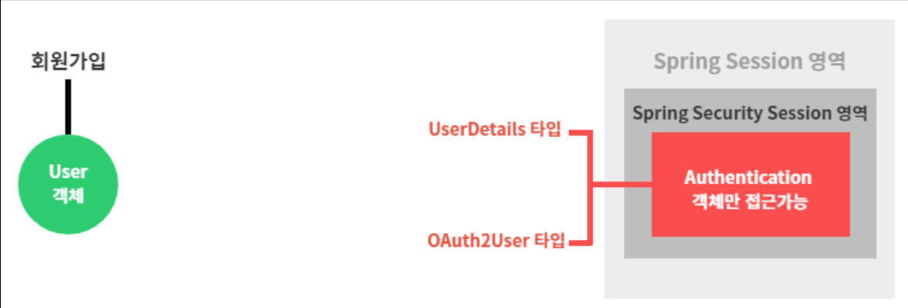

# 9강. 구글 로그인 및 자동 회원가입 진행 완료
## 9-1. PrincipalDetails 클래스의 목적
### 9-1-1. 그림1



1. Security Session 영역에는 Authentication객체만 접근이 가능하다.
2. Authentication객체는 UserDetails타입(일반로그인)과 OAuth2User타입(oauth로그인)만 접근이 가능하다.
3. 회원가입(또는 로그인)을 위해서는 User객체가 필요하다.
4. 사용자의 정보가 담긴 User객체는 UserDetails또는 OAuth2User타입이 아니므로, Authentication객체만 접근가능한 Security세션안에 들어갈 수 없다.

### 9-1-2. 그림2


1. UserDetails와 OAuth2User를 implements한 PrincipalDetails 클래스를 생성한다.
2. 해당 클래스에 User객체를 담아준다. (아래 코드 참고)
    ```java
    @Data
    public class PrincipalDetails implements UserDetails, OAuth2User{

        private User user; 
        
        public PrincipalDetails(User user) {
            this.user = user;
        }
        
        @Override
        public Collection<? extends GrantedAuthority> getAuthorities() {
            Collection<GrantedAuthority> collect = new ArrayList<>(); 
            
            return collect;
        }

        ···
    }
    ```

### 9-1-3. 그림3


1. 생성한 PrincipalDetails 클래스는 User객체를 갖고 있다.
2. 또한 PrincipalDetails 클래스는 UserDetails, OAuth2User 타입 모두에 해당하므로, Authentication객체만 접근가능한 Security Session에 접근이 가능하다.
3. 이제 우리는 User객체를 가지고 Security Session에 드나둘 수 있는 PrincipalDetails클래스만 활용하면 된다.

## 9-2. 구글(OAuth)로그인 및 회원가입 사용자 프로필 정보 가공하기
### 9-2-1. 구글서버에서 전달받은 사용자 프로필 타입 : Map<String, Object>
- 구글로그인시, 구글서버로부터 받아오는 사용자 프로필 정보는 Map<String, Object> 타입이다.
    1. IndexController - testOauthLogin()메소드에서 oauth로그인시 사용자 프로필정보를 받아오는 .getAttributes() 의 리턴타입을 보면 Map<String, Object>이다.
    

    2. 아래 콘솔에 찍힌 유저정보역시 Map<String, Object> 타입으로 출력되는 것을 확인할 수 있다.
         ```
        {
         sub=109696850338476008763, // 구글pk
         name=Eun Ji Kim, 
         given_name=Eun Ji, 
         family_name=Kim, 
         picture=https://lh3.googleusercontent.com/a /AAcHTtfbjzXXvWBeUAKeNktxrPmH4OO1ySfz4obudeY3Y2YI=s96-c, 
         email=rladmswl1707@gmail.com, 
         email_verified=true, 
         locale=ko // 지역
        }
        ```
    3. 또한 8강에서 PrincipalDetails에 OAuth2User인터페이스를 implements했을때 오버라이드된 기본메소드 중 getAttributes()를 살펴보면, 해당 메소드 또한 리턴타입이 Map<String, Object>이다.
        ```java
        @Override
        public Map<String, Object> getAttributes() {
            return null;
        }
        ```
- 이처럼 Map<String, Object> 타입으로 전달받은 사용자 프로필 정보를 이용하여 구글 로그인 및 자동회원가입을 진행해본다.

### 9-2-2. 구글로그인 및 자동회원가입 설계
- 우리가 만들고자 하는 구글로그인 및 자동회원가입 기능은 다음과 같다.
    1. 사용자의 구글 로그인 요청 시에 구글 서버로부터 전달받은 사용자 프로필 정보를 이용하여, DB에 해당 사용자가 있는지 조회
        - 1-1. == null : 최초로그인O, (2)번으로 이동
        - 1-2. != null : 최초로그인X, (3)번으로 이동
    2. 최초 구글로그인시
        - 2-1. 구글서버로부터 전달받은 사용자 프로필 정보를 DB에 저장 : 자동회원가입
        - 2-2. 해당 프로필정보로 로그인 완료
        - 2-3. 로그인과 동시에 해당 사용자 프로필 정보를 Security Session에 넣어줌
    3. 최초가 아닌 구글로그인시
        - 3-1. 해당 프로필정보로 로그인 완료
        - 3-2. 로그인과 동시에 해당 사용자 프로필 정보를 Security Session에 넣어줌

### 9-2-3. Map<String, Object> 사용자 프로필 정보 가공하기
- 우선은 구글서버로부터 전달받은 Map<String, Object>타입의 사용자 프로필 정보를 DB에 저장하기 위해 이를 가공해야할 필요성이 있다.

1. PrincipalDetails.class 추가
    ```java
    @Data
    public class PrincipalDetails implements UserDetails, OAuth2User{

        private Map<String, Object> attributes;

        // OAuth로그인시 사용할 생성자
        public PrincipalDetails(User user, Map<String, Object> attributes){
            this.user = user;
            this.attributes = attributes;
        }

        // OAuth2User 인터페이스 메소드 재정의
        @Override
        public Map<String, Object> getAttributes() {
            return attributes;
        }

        @Override
        public String getName() {
            return null;
        }
    }
    ```
    - 우선 Map<String, Object>타입의 attributes 필드를 추가해주고
    - OAuth2User 인터페이스를 implements했을때 오버라이드된 메서드 getAttributes()에 attributes를 반환해준다.
    - 또한 OAuth로그인시 사용할 생성자를 추가해준다.
        - 이제 일반로그인, OAuth로그인 모두 SecuritySession에 PrincipalDetails객체를 넣어줄텐데, 그러기 위해선 각 로그인에 사용되는 생성자가 별도로 존재해야 한다.
        - 해당 생성자를 추가해주면 PrincipalDetails클래스에는 2개의 생성자(일반로그인시 사용하는 생성자와 OAuth로그인시 사용하는 생성자)가 존재하게 된다.
            ```java
            @Data
            public class PrincipalDetails implements UserDetails, OAuth2User{

                private User user; 
	            private Map<String, Object> attributes;

                // 일반로그인시 사용
                public PrincipalDetails(User user) { 
                    this.user = user;
                }

                // OAuth로그인시 사용
                public PrincipalDetails(User user, Map<String, Object> attributes) { 
                    this.user = user;
                    this.attributes = attributes;
                }
            }
            ```
    - 이를 정리하자면 다음과 같다.
        
        
        
        - 일반로그인시에는 User정보(DB에 저장되어 있는)를 PrincipalDetails객체에 담아서 SecuritySession에 들어가고
        - OAuth로그인시에는 
            1. 구글로부터 받은 attributes(사용자 프로필정보, Map<String, Object>타입)정보와, 
            2. 이를 기반으로 생성한 User정보   
            이렇게 2개의 정보를 PrincipalDetails객체에 담아서 SecuritySession에 들어간다. 

2. 